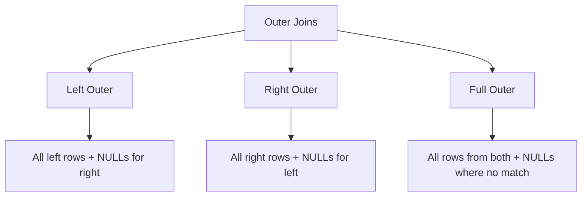

# :material-set-all: Outer Joins

Outer joins return all rows from one or both sides of a join, filling NULLs for columns from the side that had no matching row.


### :material-sitemap: Overview



---

## 📌 Syntax

### LEFT OUTER JOIN

```sql
SELECT *
FROM left_table AS l
LEFT OUTER JOIN right_table AS r
    ON l.key = r.key;

-- OUTER keyword is optional
SELECT *
FROM left_table AS l
LEFT JOIN right_table AS r
    ON l.key = r.key;
```

### RIGHT OUTER JOIN

```sql
SELECT *
FROM left_table AS l
RIGHT JOIN right_table AS r
    ON l.key = r.key;
```

### FULL OUTER JOIN

```sql
SELECT *
FROM left_table AS l
FULL OUTER JOIN right_table AS r
    ON l.key = r.key;
```

### LEFT SEMI JOIN

```sql
-- Returns left-side columns only for rows that have a match in the right side
SELECT *
FROM left_table AS l
LEFT SEMI JOIN right_table AS r
    ON l.key = r.key;

-- Equivalent WHERE EXISTS pattern
SELECT *
FROM left_table AS l
WHERE EXISTS (
    SELECT 1 FROM right_table AS r WHERE l.key = r.key
);
```

### LEFT ANTI JOIN

```sql
-- Returns left-side columns only for rows that have NO match in the right side
SELECT *
FROM left_table AS l
LEFT ANTI JOIN right_table AS r
    ON l.key = r.key;

-- Equivalent LEFT JOIN + IS NULL pattern
SELECT l.*
FROM left_table AS l
LEFT JOIN right_table AS r
    ON l.key = r.key
WHERE r.key IS NULL;
```

---

## 🔍 Behavior

| Join Type | Left Rows | Right Rows | NULLs Introduced |
|-----------|-----------|------------|------------------|
| `LEFT JOIN` | All | Matched only | Right-side columns are NULL for unmatched left rows |
| `RIGHT JOIN` | Matched only | All | Left-side columns are NULL for unmatched right rows |
| `FULL OUTER JOIN` | All | All | Both sides get NULLs where there is no match |
| `LEFT SEMI JOIN` | Matched only (no right columns) | Not returned | None |
| `LEFT ANTI JOIN` | Unmatched only (no right columns) | Not returned | None |

1. NULLs in join key columns are never matched by standard equality (`=`). Use `<=>` when key columns may contain NULLs.
2. `LEFT SEMI JOIN` is more efficient than `INNER JOIN` when only left-side columns are needed — no right-side data is materialised.
3. `LEFT ANTI JOIN` is the idiomatic way to find rows in one table that do not exist in another.

---

## 🧪 Practical Examples

### Setup

```sql
CREATE TABLE orders (
    order_id    INT,
    customer_id INT,
    amount      DOUBLE
) USING DELTA;

INSERT INTO orders VALUES
    (1, 101, 250.00),
    (2, 102, 175.50),
    (3, 104, 310.00),
    (4, 105,  89.99);

CREATE TABLE customers (
    customer_id INT,
    name        STRING
) USING DELTA;

INSERT INTO customers VALUES
    (101, 'Alice'),
    (102, 'Bob'),
    (103, 'Charlie'),
    (104, 'Diana');
-- Note: customer 105 is in orders but not in customers.
--       customer 103 (Charlie) is in customers but has no orders.
```

### Example 1 — LEFT JOIN: All Orders with Customer Name or NULL

```sql
SELECT
    o.order_id,
    o.amount,
    c.name AS customer_name
FROM orders AS o
LEFT JOIN customers AS c
    ON o.customer_id = c.customer_id
ORDER BY o.order_id;
-- Result:
-- order_id  amount  customer_name
-- 1         250.00  Alice
-- 2         175.50  Bob
-- 3         310.00  Diana
-- 4          89.99  NULL          <- customer 105 not in customers table
```

### Example 2 — RIGHT JOIN: All Customers with Orders or NULL

```sql
SELECT
    c.customer_id,
    c.name,
    o.order_id,
    o.amount
FROM orders AS o
RIGHT JOIN customers AS c
    ON o.customer_id = c.customer_id
ORDER BY c.customer_id;
-- Result:
-- customer_id  name     order_id  amount
-- 101          Alice    1         250.00
-- 102          Bob      2         175.50
-- 103          Charlie  NULL      NULL    <- Charlie has no orders
-- 104          Diana    3         310.00
```

### Example 3 — FULL OUTER JOIN: All Rows from Both Sides

```sql
SELECT
    COALESCE(o.customer_id, c.customer_id) AS customer_id,
    c.name,
    o.order_id,
    o.amount
FROM orders AS o
FULL OUTER JOIN customers AS c
    ON o.customer_id = c.customer_id
ORDER BY customer_id;
-- Result:
-- customer_id  name     order_id  amount
-- 101          Alice    1         250.00
-- 102          Bob      2         175.50
-- 103          Charlie  NULL      NULL    <- customer with no orders
-- 104          Diana    3         310.00
-- 105          NULL     4          89.99  <- order with unknown customer
```

### Example 4 — NULL Handling After Outer Join Using COALESCE

```sql
SELECT
    o.order_id,
    o.amount,
    COALESCE(c.name, 'Unknown Customer') AS customer_name
FROM orders AS o
LEFT JOIN customers AS c
    ON o.customer_id = c.customer_id
ORDER BY o.order_id;
-- Result:
-- order_id  amount  customer_name
-- 1         250.00  Alice
-- 2         175.50  Bob
-- 3         310.00  Diana
-- 4          89.99  Unknown Customer
```

### Example 5 — Anti-Join Pattern: Orders with No Matching Customer

```sql
SELECT o.order_id, o.customer_id, o.amount
FROM orders AS o
LEFT JOIN customers AS c
    ON o.customer_id = c.customer_id
WHERE c.customer_id IS NULL;
-- Result:
-- order_id  customer_id  amount
-- 4         105           89.99
```

### Example 6 — LEFT SEMI JOIN: Customers Who Have Placed Orders

```sql
-- Returns only left-side (customers) columns; no right-side data exposed.
SELECT c.customer_id, c.name
FROM customers AS c
LEFT SEMI JOIN orders AS o
    ON c.customer_id = o.customer_id
ORDER BY c.customer_id;
-- Result:
-- customer_id  name
-- 101          Alice
-- 102          Bob
-- 104          Diana
-- (Charlie excluded — no orders)
```

### Example 7 — LEFT ANTI JOIN: Customers Who Have Never Ordered

```sql
SELECT c.customer_id, c.name
FROM customers AS c
LEFT ANTI JOIN orders AS o
    ON c.customer_id = o.customer_id;
-- Result:
-- customer_id  name
-- 103          Charlie
```

---

## Join Type Comparison

| Join Type | Left rows preserved | Right rows preserved | Right columns returned | NULLs on left | NULLs on right |
|-----------|:-------------------:|:--------------------:|:----------------------:|:-------------:|:--------------:|
| INNER JOIN | Matched only | Matched only | Yes | No | No |
| LEFT JOIN | All | Matched only | Yes | No | Yes |
| RIGHT JOIN | Matched only | All | Yes | Yes | No |
| FULL OUTER JOIN | All | All | Yes | Yes | Yes |
| LEFT SEMI JOIN | Matched only | Not returned | No | No | N/A |
| LEFT ANTI JOIN | Unmatched only | Not returned | No | No | N/A |

---

## 🧠 When to Use

| Scenario | Recommended Join Type |
|----------|-----------------------|
| Keep all left rows, optional right match | `LEFT JOIN` |
| Keep all right rows, optional left match | `RIGHT JOIN` |
| Keep all rows from both sides | `FULL OUTER JOIN` |
| Check existence in another table | `LEFT SEMI JOIN` |
| Find rows absent from another table | `LEFT ANTI JOIN` |
| Replace NULL with a default after join | `LEFT JOIN` + `COALESCE` |
| Join on a nullable key column | Any join with `ON a.key <=> b.key` |
