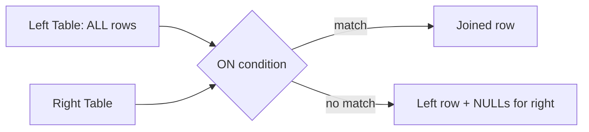
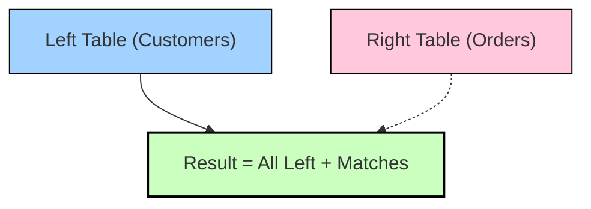

# :material-set-all: 🌟 Left Outer Join in Spark SQL

A **Left Outer Join** returns:

- ✅ **All rows from the left table**
- ✅ **Matching rows from the right table**
- ❌ **If no match:** right-side columns are filled with `NULL`

> **In plain English:**  
> _“Give me everything from the left side, and add matching info from the right if it exists.”_


### :material-sitemap: Overview



---

## 📝 SQL Syntax in Spark

```sql
SELECT A.*, B.*
FROM A
LEFT OUTER JOIN B
  ON A.id = B.id;
```

_Short form: `LEFT JOIN`_

---

## 📊 Example

**Left Table (`Customers`)**

| id | name  |
|----|-------|
| 1  | Alice |
| 2  | Bob   |
| 3  | Carol |

**Right Table (`Orders`)**

| id | product |
|----|---------|
| 2  | Laptop  |
| 3  | Phone   |

**Query:**

```sql
SELECT c.id, c.name, o.product
FROM Customers c
LEFT JOIN Orders o
  ON c.id = o.id;
```

**Result:**

| id | name  | product |
|----|-------|---------|
| 1  | Alice | NULL    |
| 2  | Bob   | Laptop  |
| 3  | Carol | Phone   |

> - Alice (`id=1`) appears, but since she has no order, `product = NULL`.
> - **All customers are retained** (left side).

---

## ⚙️ Physical Execution in Spark

- **Equi-joins** (`A.id = B.id`):  
  - Sort-Merge Join  
  - Shuffle Hash Join  
  - Broadcast Hash Join (best if right side is small)
- **Non-equi joins** (`<`, `>`, `BETWEEN`):  
  - Falls back to Nested Loop Joins

---

## 🌍 Real-World Use Cases

- **Customers vs Orders:** Keep all customers, even those without orders.
- **Employees vs Departments:** Show employees, even if some aren’t assigned.
- **Logs vs Reference Table:** Keep all logs, even if reference lookup fails.
- **ETL Pipelines:** Detect “missing mappings” by checking for `NULL` values on the right side.

---

## 🚀 Performance Considerations

- **Broadcast Join Optimization:**  
  If the right table is small (dimension/lookup), broadcast it:

  ```python
  from pyspark.sql.functions import broadcast
  df_left.join(broadcast(df_right), "id", "left")
  ```

- **Shuffles:**  
  If both sides are large, Spark may use a shuffle-heavy Sort-Merge Join.
- **Skew:**  
  If some join keys are very frequent, some partitions may become bottlenecks.

---

## 🎨 Diagram (Venn Style)



---

## 🔎 Quick Comparison

| Join Type   | Keeps All Left? | Keeps All Right? | Keeps Matches? |
|-------------|:---------------:|:----------------:|:--------------:|
| Inner Join  | ❌              | ❌               | ✅             |
| Left Join   | ✅              | ❌               | ✅             |
| Right Join  | ❌              | ✅               | ✅             |
| Full Join   | ✅              | ✅               | ✅             |

---

## ✅ Summary

A **Left Outer Join** is best when your left table is the main dataset you don’t want to lose rows from, but you only enrich it with data from the right side if it exists.
