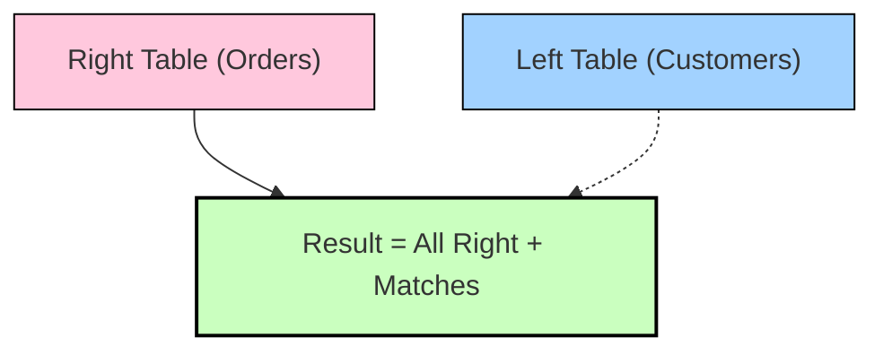

# 🌟 Right Outer Join in Spark SQL

A **Right Outer Join** returns:

- ✅ **All rows from the right table**
- ✅ **Matching rows from the left table**
- ❌ **If no match:** fills left-side columns with `NULL`.

> **Tip:** It’s the mirror image of a Left Outer Join.  
> **Question it answers:**  
> _“Give me everything from the right side, and add left-side info if it exists.”_

---

## SQL Syntax in Spark

```sql
SELECT A.*, B.*
FROM A
RIGHT OUTER JOIN B
  ON A.id = B.id;
```

**Alias:** `RIGHT JOIN`

---

## DataFrame API

```python
df_left.join(df_right, df_left.id == df_right.id, "right")
```

---

## Example

**Left Table (`Customers`)**

| id | name  |
|----|-------|
| 1  | Alice |
| 2  | Bob   |
| 3  | Carol |

**Right Table (`Orders`)**

| id | product |
|----|---------|
| 2  | Laptop  |
| 3  | Phone   |
| 4  | Tablet  |

**Query:**

```sql
SELECT c.id, c.name, o.product
FROM Customers c
RIGHT JOIN Orders o
  ON c.id = o.id;
```

**Result:**

| id | name  | product |
|----|-------|---------|
| 2  | Bob   | Laptop  |
| 3  | Carol | Phone   |
| 4  | NULL  | Tablet  |

> **Key Observations:**
>
> - Orders without customers (`id=4`, Tablet) still appear (left-side `NULL`).
> - All orders are kept (right side preserved).

---

## Physical Execution in Spark

- **Equi-joins (`=`):**
  - **Broadcast Hash Join (BHJ):** if left side is small
  - **Shuffle Hash Join (SHJ)**
  - **Sort-Merge Join (SMJ)**
- **Non-equi joins (`<`, `>`, `BETWEEN`):**
  - Falls back to **nested loop joins** (broadcast or shuffle-replicate)

---

## Real-World Use Cases

- **Orders vs Customers:** Show all orders, even if some customers are missing (data mismatch)
- **Transactions vs Accounts:** Keep all transactions, even those without a valid account (fraud detection)
- **Logs vs Reference Data:** Retain all logs, even if reference lookup fails
- **ETL Auditing:** Detect rows that don’t have a matching dimension record

---

## Performance Considerations

- Spark **does not allow broadcast** on the preserved side (right) for Right Outer Joins.
- If the right table is large, a right join may be expensive (causes shuffles).
- **Tip:** Sometimes easier to rewrite a right join as a left join by swapping table order.

**Example Rewrite:**

```sql
-- Right Join
SELECT *
FROM A
RIGHT JOIN B
  ON A.id = B.id;

-- Equivalent Left Join
SELECT *
FROM B
LEFT JOIN A
  ON B.id = A.id;
```

---

## Diagram (Venn-style)



---

## Quick Comparison (vs Left Join)

| Join Type  | Keeps All Left? | Keeps All Right? | Matches? |
|------------|:---------------:|:----------------:|:--------:|
| Left Join  | ✅              | ❌               | ✅       |
| Right Join | ❌              | ✅               | ✅       |
| Full Join  | ✅              | ✅               | ✅       |

---

## ✅ Summary

- **Right Outer Join = all rows from right + matching rows from left**
- Useful when the right table is the “main” dataset you don’t want to lose
- Can always be rewritten as a Left Join for easier optimization
