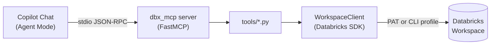

# :material-server-network: Databricks Copilot MCP Server

A local [Model Context Protocol](https://modelcontextprotocol.io/) server that exposes
Unity Catalog metadata, `system.*` / `information_schema.*` observability queries, and
catalog grant management as tools for GitHub Copilot Chat (Agent Mode) in VS Code.

______________________________________________________________________

## :material-sitemap: Architecture



The server runs as a local subprocess (`uv run dbx-copilot-mcp`), launched and supervised
by VS Code via `.mcp.json`. It never sends credentials to the Copilot model — the
`WorkspaceClient` built in `clients/databricks_client.py` is the only place authentication
happens, and it stays entirely within the local process.

!!! warning "stdio transport — never log to stdout"

    The server communicates over stdio. Any stray `print()` or a logger configured with
    `stream=sys.stdout` would corrupt the JSON-RPC stream and break the connection.
    `server.py` configures `logging.basicConfig` with its (stderr) default deliberately —
    keep it that way in any new tool module.

______________________________________________________________________

## :material-rocket-launch: Quick Start

```bash
# From spark-sql/ (repo root of this package)
uv sync
cp config/.env.example .env        # fill in DATABRICKS_HOST / TOKEN / WAREHOUSE_ID
                                    # (or set DATABRICKS_CONFIG_PROFILE to use ~/.databrickscfg)
uv run dbx-copilot-mcp             # sanity-check the server starts
```

VS Code picks up the server automatically via `.mcp.json` (command: `uv run dbx-copilot-mcp`).
Reload the window (or restart the MCP server from the Copilot Chat tools panel) after
editing `.env` or `.mcp.json`.

______________________________________________________________________

## :material-earth: Environments (`APP_ENV`)

The server resolves `dev` / `staging` / `prod` the same way `make dab-*` does:
`config/settings.py` loads `.env` (base) then layers `.env.$(APP_ENV)` on top via
`spark_sql.util.cli_env.load_env_layers`, defaulting to `dev` when `APP_ENV` is unset.
The resolved value is exposed as `settings.app_env`.

```bash
APP_ENV=dev     uv run dbx-copilot-mcp
APP_ENV=staging uv run dbx-copilot-mcp
APP_ENV=prod    uv run dbx-copilot-mcp
```

!!! note "GUI-launched editors don't inherit shell exports"

    `.mcp.json` forwards `APP_ENV` via `${env:APP_ENV}` — export it in the
    shell/session your editor launches from to control which target the server picks up.
    Leave it unset to default to `dev`.

______________________________________________________________________

## :material-key-outline: Authentication

Two mutually exclusive options, resolved in `clients/databricks_client.py`:

| Method         | Env var(s)                            | Notes                                                                                                                                                          |
| -------------- | ------------------------------------- | -------------------------------------------------------------------------------------------------------------------------------------------------------------- |
| Config profile | `DATABRICKS_CONFIG_PROFILE`           | Named profile from `~/.databrickscfg` (e.g. via `databricks configure --profile <name>` or `databricks auth login --profile <name>`). Takes priority when set. |
| Host + PAT     | `DATABRICKS_HOST`, `DATABRICKS_TOKEN` | Used only when `DATABRICKS_CONFIG_PROFILE` is not set.                                                                                                         |

`query_system_table` additionally needs a SQL warehouse to run against. Set either
`DATABRICKS_WAREHOUSE_ID` directly, or `DATABRICKS_WAREHOUSE_NAME` — the server resolves
the name to an ID on demand via the SQL Warehouses API (`tools/warehouses.py`), so only
one of the two is required.

!!! tip "Secrets never leave the local process"

    Whichever method you use, the PAT/profile is read once by `clients/databricks_client.py`
    to build a `WorkspaceClient` and is never included in a tool's return value or forwarded
    to the model.

______________________________________________________________________

## :material-toolbox-outline: Tools

| Tool                        | Description                                                                                                  |
| --------------------------- | ------------------------------------------------------------------------------------------------------------ |
| `list_catalogs`             | List Unity Catalog catalogs                                                                                  |
| `list_schemas`              | List schemas in a catalog                                                                                    |
| `list_tables`               | List tables in a schema                                                                                      |
| `list_warehouses`           | List SQL warehouses with their ID, name, and state                                                           |
| `get_warehouse_id`          | Resolve a SQL warehouse display name to its ID                                                               |
| `query_system_table`        | Read-only SQL against `system.*` / `information_schema.*` (`SELECT`/`SHOW`/`DESCRIBE`/`WITH`/`EXPLAIN` only) |
| `show_grants`               | Show privilege assignments on a catalog                                                                      |
| `grant_catalog_privileges`  | Grant specific privileges to a principal (least-privilege — avoid `ALL_PRIVILEGES`)                          |
| `revoke_catalog_privileges` | Revoke specific privileges from a principal                                                                  |

Each tool is a thin `@mcp.tool()` wrapper in `server.py` around an implementation in
`tools/<name>.py`; the wrapper owns the docstring the model sees, the implementation owns
the Databricks SDK call.

### :material-shield-check-outline: `query_system_table` safety

`tools/system_tables.py` enforces a read-only allow-list before any SQL reaches the
warehouse — statements must start with `SELECT`, `SHOW`, `DESCRIBE`, `WITH`, or `EXPLAIN`
(case-insensitive). Anything else raises a `ValueError` before execution. Mutations
(grants) intentionally go through typed SDK calls in `tools/grants.py` instead of
free-form SQL.

```text
system.access.audit             -- who did what, when
system.billing.usage            -- DBU consumption
system.access.table_lineage     -- upstream/downstream table dependencies
information_schema.volumes      -- catalog volume metadata
```

______________________________________________________________________

## :material-file-tree-outline: Layout

```text
server.py           # FastMCP app — registers @mcp.tool() wrappers
config/settings.py   # pydantic-settings, reads .env / .env.$(APP_ENV)
clients/             # WorkspaceClient factory (the only place auth happens)
tools/               # One module per capability: catalogs, schemas, tables,
                     # warehouses (list + name→id resolution),
                     # system_tables (read-only SQL), grants
```

______________________________________________________________________

## :material-flask-outline: Testing

```bash
uv run task test_mcp
```

Tests live in `tests/test_tools.py` and mock `WorkspaceClient` via `pytest-mock` — no
tool test should hit a real Databricks workspace.

______________________________________________________________________

## :material-alert-circle-outline: Troubleshooting

| Symptom                                                                                                   | Likely Cause                                                                                                                                                      | Fix                                                                                                                     |
| --------------------------------------------------------------------------------------------------------- | ----------------------------------------------------------------------------------------------------------------------------------------------------------------- | ----------------------------------------------------------------------------------------------------------------------- |
| `resolve: ~/.databrickscfg has no <profile> profile configured`                                           | `DATABRICKS_CONFIG_PROFILE` points at a profile missing from `~/.databrickscfg`, or the profile uses `auth_type = databricks-cli` without an active OAuth session | Run `databricks auth login --host <workspace-url> --profile <profile>` and complete the browser login                   |
| `query_system_table` raises `Neither databricks_warehouse_id nor databricks_warehouse_name is configured` | Neither env var set                                                                                                                                               | Set `DATABRICKS_WAREHOUSE_ID` or `DATABRICKS_WAREHOUSE_NAME`                                                            |
| `No warehouse named '<name>' was found in the workspace`                                                  | `DATABRICKS_WAREHOUSE_NAME` doesn't match any warehouse the principal can see                                                                                     | Check the exact (case-sensitive) name in the SQL Warehouses UI, or call `list_warehouses`                               |
| Copilot Chat shows the server as disconnected                                                             | Stray `stdout` write corrupted the JSON-RPC stream, or `.mcp.json` env vars are empty strings                                                                     | Check `server.py`/tool logging goes to stderr only; confirm `APP_ENV` etc. are exported in the editor's launching shell |
| Changes to `.env` don't take effect                                                                       | VS Code hasn't restarted the MCP subprocess                                                                                                                       | Reload the window or restart the server from the Copilot Chat tools panel                                               |

______________________________________________________________________

## :material-lightbulb-outline: When to Use

- Ask Copilot Chat to explore Unity Catalog structure (`list_catalogs` → `list_schemas` →
    `list_tables`) instead of running `databricks-cli`/SQL by hand.
- Delegate `system.*` observability questions (billing, audit, lineage) to
    `query_system_table` instead of writing ad-hoc SQL in a notebook.
- Use `grant_catalog_privileges` / `revoke_catalog_privileges` for quick, least-privilege
    access changes without leaving the editor.
