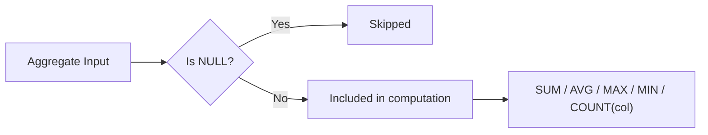

# :material-null: NULL in Aggregate Functions

Aggregate functions silently skip NULL values — only `COUNT(*)` counts every row regardless of NULLs.

---

## :material-sitemap: Overview



---

## :material-table: NULL Behaviour by Function

| Function | Skips NULLs | Returns NULL on all-NULL input | Returns `0` on empty set |
|----------|:-----------:|:------------------------------:|:------------------------:|
| `COUNT(*)` | No | No — returns `0` | Yes |
| `COUNT(col)` | Yes | No — returns `0` | Yes |
| `SUM(col)` | Yes | Yes | NULL |
| `AVG(col)` | Yes | Yes | NULL |
| `MAX(col)` | Yes | Yes | NULL |
| `MIN(col)` | Yes | Yes | NULL |
| `EVERY` / `ANY` / `SOME` | Yes | Yes | NULL |

---

## :material-flask-outline: Examples

### Sample table

```sql
CREATE TABLE person (id INT, name STRING, age INT);
INSERT INTO person VALUES
    (100, 'Joe',      30),
    (200, 'Marry',    NULL),
    (300, 'Mike',     18),
    (400, 'Fred',     50),
    (500, 'Albert',   NULL),
    (600, 'Michelle', 30),
    (700, 'Dan',      50);
```

### COUNT(\*) vs COUNT(col)

```sql
SELECT
    COUNT(*)   AS total_rows,   -- 7: counts every row including NULLs
    COUNT(age) AS age_count     -- 5: skips the 2 NULL ages
FROM person;
```

### SUM, AVG, MAX, MIN — NULLs excluded

```sql
SELECT
    SUM(age) AS age_sum,    -- 178  (30+18+50+30+50)
    AVG(age) AS age_avg,    -- 35.6 (178 / 5 non-NULL rows)
    MAX(age) AS age_max,    -- 50
    MIN(age) AS age_min     -- 18
FROM person;
```

### COUNT on an empty result set

```sql
SELECT COUNT(*) AS cnt FROM person WHERE 1 = 0;  -- 0
SELECT MAX(age) AS mx  FROM person WHERE 1 = 0;  -- NULL
```

### GROUP BY with NULL values

`GROUP BY` treats all NULL values as one group.

```sql
SELECT age, COUNT(*) AS cnt
FROM person
GROUP BY age
ORDER BY age;
-- age=18   cnt=1
-- age=30   cnt=2
-- age=50   cnt=2
-- age=NULL cnt=2   ← both NULLs grouped together
```

### Conditional aggregation with FILTER

```sql
SELECT
    COUNT(*) FILTER (WHERE age IS NOT NULL) AS known_ages,
    COUNT(*) FILTER (WHERE age IS NULL)     AS unknown_ages,
    SUM(age) FILTER (WHERE age > 30)        AS senior_total
FROM person;
```

### Avoiding divide-by-zero after NULL exclusion

```sql
SELECT
    SUM(amount) / NULLIF(COUNT(amount), 0) AS safe_avg
FROM orders;
```

---

## :material-magnify: Behavior Notes

1. `COUNT(*)` is the only aggregate that does not skip NULLs.
2. `AVG` divides by the count of non-NULL values — not by total row count.
3. Use `COUNT(col)` instead of `COUNT(*)` when you want to count only rows with a known value.
4. Wrap denominators in `NULLIF(..., 0)` to prevent division-by-zero when all inputs are NULL.

