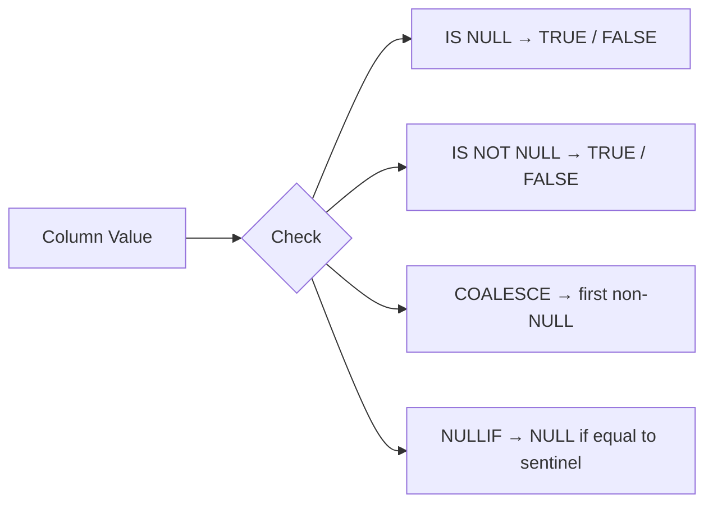

# :material-null: NULL Checks

`IS NULL` and `IS NOT NULL` are the only reliable predicates for detecting NULL.
Never use `= NULL` — it always returns NULL (unknown), not TRUE.

---

## :material-sitemap: Overview



---

## :material-table: NULL-Handling Functions

| Function / Predicate | Returns | Example |
|----------------------|---------|---------|
| `col IS NULL` | `TRUE` if col is NULL | `WHERE age IS NULL` |
| `col IS NOT NULL` | `TRUE` if col is not NULL | `WHERE email IS NOT NULL` |
| `COALESCE(a, b, ...)` | First non-NULL argument | `COALESCE(phone, mobile, 'N/A')` |
| `NULLIF(a, b)` | NULL if `a = b`, else `a` | `NULLIF(discount, 0)` |
| `IFNULL(a, b)` | `b` if `a` is NULL, else `a` | `IFNULL(country, 'Unknown')` |
| `NVL(a, b)` | Alias for `IFNULL` | `NVL(middle_name, '')` |
| `NVL2(a, b, c)` | `b` if `a` not NULL, else `c` | `NVL2(email, 'has email', 'no email')` |
| `ISNULL(a)` | `TRUE` if `a` is NULL | `ISNULL(deleted_at)` |
| `ISNOTNULL(a)` | `TRUE` if `a` is not NULL | `ISNOTNULL(email)` |

---

## :material-flask-outline: Examples

### Find rows with missing data

```sql
SELECT * FROM users WHERE email IS NULL;

SELECT name, age FROM person WHERE age IS NULL;
```

### Exclude rows with missing data

```sql
SELECT * FROM users WHERE email IS NOT NULL;

SELECT name, age FROM person WHERE age IS NOT NULL;
```

### Replace NULL with a default

```sql
-- COALESCE: pick the first non-NULL from a fallback chain
SELECT
    user_id,
    COALESCE(phone, mobile, work_phone, 'No phone') AS contact_number
FROM users;
```

### Turn a sentinel value into NULL

```sql
-- NULLIF: treat 0 as "unknown" so aggregates skip it
SELECT
    product_id,
    SUM(amount) / NULLIF(COUNT(units), 0) AS avg_unit_price
FROM order_lines
GROUP BY product_id;
```

### Conditional label based on NULL

```sql
SELECT
    user_id,
    NVL2(last_login, 'Active', 'Never logged in') AS status
FROM users;
```

### Filter after outer join for anti-join pattern

```sql
-- Customers with no orders (anti-join via LEFT JOIN + IS NULL)
SELECT c.customer_id, c.name
FROM customers c
LEFT JOIN orders o ON c.customer_id = o.customer_id
WHERE o.order_id IS NULL;
```

### Delta table NOT NULL constraint

```sql
-- Enforce NOT NULL at write time
ALTER TABLE products
ALTER COLUMN price SET NOT NULL;

-- Verify
DESCRIBE TABLE EXTENDED products;
```

---

## :material-alert-circle: Common Mistakes

| Mistake | Problem | Fix |
|---------|---------|-----|
| `WHERE col = NULL` | Always returns NULL — no rows matched | `WHERE col IS NULL` |
| `WHERE col != NULL` | Always returns NULL | `WHERE col IS NOT NULL` |
| `COALESCE(col, '')` on numeric | Empty string causes cast error | Use `COALESCE(col, 0)` for numerics |
| `NULLIF(col, 0)` on strings | Valid — turns `'0'` into NULL | Ensure types match |

---

## :material-magnify: Behavior Notes

1. `IS NULL` / `IS NOT NULL` always return `TRUE` or `FALSE` — never NULL.
2. `COALESCE` evaluates arguments left-to-right and stops at the first non-NULL.
3. `NULLIF(a, b)` is shorthand for `CASE WHEN a = b THEN NULL ELSE a END`.
4. Delta Lake enforces `NOT NULL` constraints at write time; reads are unaffected.

