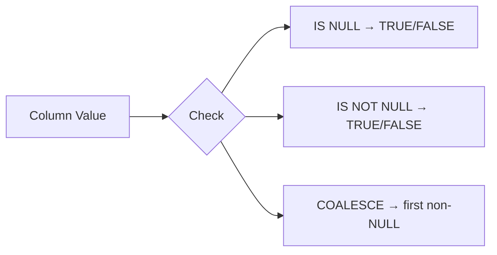

# :material-null: NULL Checks

Checking NULLs explicitly prevents silent filtering mistakes caused by
three-valued logic.

### :material-sitemap: Overview



---

## 📌 Core Checks

```sql
SELECT * FROM users WHERE email IS NULL;
SELECT * FROM users WHERE email IS NOT NULL;
```

---

## 🔍 Useful Functions

| Function | Purpose |
|----------|---------|
| `IS NULL` | Match NULL values |
| `IS NOT NULL` | Exclude NULL values |
| `NULLIF(a, b)` | Return NULL if a = b |
| `COALESCE(a, b, ...)` | First non-NULL value |

---

## 🧪 Practical Example

```sql
SELECT user_id,
       COALESCE(country, 'unknown') AS country
FROM users
WHERE email IS NOT NULL;
```

---

## 🧠 When to Use

| Scenario | Pattern |
|----------|---------|
| Find missing values | `IS NULL` |
| Enforce presence | `IS NOT NULL` |
| Replace NULLs | `COALESCE` |
| Turn a sentinel into NULL | `NULLIF` |
