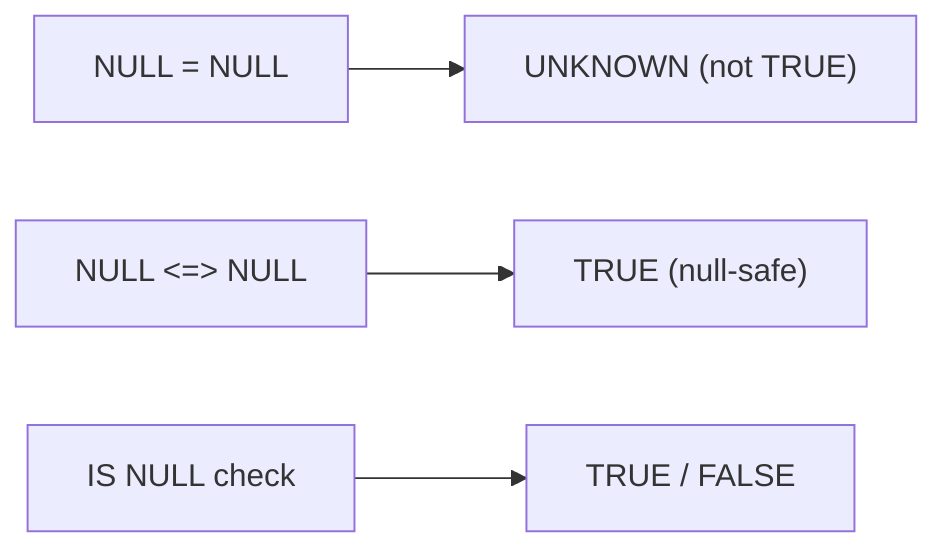

# :material-null: NULL in Comparison Operators

Comparing any value with NULL produces NULL (unknown), not TRUE or FALSE — standard equality and relational operators cannot determine whether an unknown value satisfies a condition.

### :material-sitemap: Overview



---

## 📌 Operators

| Operator | Name | NULL behaviour |
|----------|------|----------------|
| `=` | Equal | Returns NULL if either operand is NULL |
| `!=` / `<>` | Not equal | Returns NULL if either operand is NULL |
| `>` | Greater than | Returns NULL if either operand is NULL |
| `<` | Less than | Returns NULL if either operand is NULL |
| `>=` | Greater than or equal | Returns NULL if either operand is NULL |
| `<=` | Less than or equal | Returns NULL if either operand is NULL |
| `<=>` | Null-safe equal | Returns FALSE if one operand is NULL; TRUE if both are NULL |

---

## 🔍 Behavior

### Three-Valued Logic

SQL uses three-valued logic: TRUE, FALSE, and NULL (unknown). Any standard comparison with a NULL operand yields NULL — the result is indeterminate, not FALSE.

**Complete NULL truth table:**

| Left Operand | Right Operand | `>` | `>=` | `=` | `<` | `<=` | `<=>` |
|--------------|---------------|-----|------|-----|-----|------|-------|
| NULL         | Any value     | NULL | NULL | NULL | NULL | NULL | FALSE |
| Any value    | NULL          | NULL | NULL | NULL | NULL | NULL | FALSE |
| NULL         | NULL          | NULL | NULL | NULL | NULL | NULL | TRUE  |

### Why `= NULL` Never Works

Because `NULL = NULL` evaluates to NULL (not TRUE), a `WHERE col = NULL` clause discards every row — even rows where `col` is NULL. Always use `IS NULL` or `IS NOT NULL` to test for NULL.

### The `<=>` Null-Safe Equal Operator

`<=>` is the only comparison operator that never returns NULL. It treats two NULLs as equal and any NULL-vs-non-NULL comparison as FALSE. It is particularly useful in `JOIN` conditions where key columns may contain NULLs.

---

## 🧪 Practical Examples

### `>` Operator — NULL Propagation

```sql
SELECT 5 > NULL       AS expression_output; -- Result: NULL
SELECT NULL > NULL    AS expression_output; -- Result: NULL
SELECT NULL > 5       AS expression_output; -- Result: NULL
```

### `=` Operator — NULL Equality Trap

```sql
-- Standard equality: NULL = NULL is NULL, not TRUE
SELECT NULL = NULL    AS expression_output; -- Result: NULL

-- Correct way to check for NULL
SELECT NULL IS NULL   AS expression_output; -- Result: TRUE
```

### `<=>` Null-Safe Equal Operator

```sql
-- One NULL operand returns FALSE (not NULL)
SELECT 5 <=> NULL     AS expression_output; -- Result: FALSE

-- Both NULL operands return TRUE
SELECT NULL <=> NULL  AS expression_output; -- Result: TRUE

-- Behaves like = when neither operand is NULL
SELECT 5 <=> 5        AS expression_output; -- Result: TRUE
SELECT 5 <=> 6        AS expression_output; -- Result: FALSE
```

### Filtering Rows — `= NULL` vs `IS NULL`

```sql
-- WRONG: returns no rows because age = NULL evaluates to NULL, never TRUE
SELECT * FROM person WHERE age = NULL;

-- CORRECT: returns rows where age is unknown
SELECT * FROM person WHERE age IS NULL;
-- Result:
-- 200  Marry   NULL
-- 500  Albert  NULL
```

### Using `<=>` in a Self-Join

```sql
-- Standard join excludes rows where age IS NULL on either side
SELECT p1.name, p2.name
FROM person p1
JOIN person p2
    ON p1.age = p2.age AND p1.id < p2.id;
-- Persons with NULL age are excluded entirely

-- Null-safe join treats NULL ages as equal
SELECT p1.name, p2.name
FROM person p1
JOIN person p2
    ON p1.age <=> p2.age AND p1.id < p2.id;
-- Result includes:
-- Marry / Albert  (both age=NULL, treated as equal)
-- Joe   / Michelle (both age=30)
-- Fred  / Dan     (both age=50)
```

---

## 🧠 When to Use

| Scenario | Recommended Pattern |
|----------|---------------------|
| Test whether a column is NULL | `col IS NULL` / `col IS NOT NULL` |
| JOIN on a column that may contain NULLs | `a <=> b` |
| Compare two nullable columns for equality | `a <=> b` |
| Standard comparison (no NULLs expected) | `=`, `!=`, `>`, `<`, `>=`, `<=` |
| Avoid this pattern | `col = NULL` — always evaluates to NULL |
