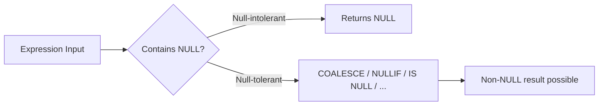

# :material-null: NULL in Expressions

Spark expressions fall into two categories: **null-intolerant** (return NULL when any input is NULL) and **null-tolerant** (handle NULL inputs gracefully).

---

## :material-sitemap: Overview



---

## :material-table: Null-Intolerant Expressions

Return NULL whenever **any** argument is NULL. Most built-in functions fall into this category.

| Expression | Example | Result when arg is NULL |
|------------|---------|------------------------|
| String concat (`\|\|` / `CONCAT`) | `CONCAT('John', NULL)` | NULL |
| Arithmetic (`+`, `-`, `*`, `/`) | `NULL + 5` | NULL |
| `UPPER` / `LOWER` | `UPPER(NULL)` | NULL |
| `TO_DATE` / `DATE_FORMAT` | `TO_DATE(NULL)` | NULL |
| `CAST` | `CAST(NULL AS INT)` | NULL |
| `LENGTH` | `LENGTH(NULL)` | NULL |
| `SUBSTR` | `SUBSTR(NULL, 1)` | NULL |

```sql
SELECT CONCAT('John', NULL)   AS r1;  -- NULL
SELECT UPPER(NULL)            AS r2;  -- NULL
SELECT TO_DATE(NULL)          AS r3;  -- NULL
SELECT NULL + 5               AS r4;  -- NULL
```

---

## :material-table: Null-Tolerant Expressions

These expressions are designed to handle NULL inputs and may return a non-NULL result.

| Expression | Behaviour | Example |
|------------|-----------|---------|
| `COALESCE(a, b, ...)` | First non-NULL argument | `COALESCE(NULL, 0)` → `0` |
| `NULLIF(a, b)` | NULL if `a = b`, else `a` | `NULLIF(0, 0)` → NULL |
| `IFNULL(a, b)` | `b` if `a` is NULL, else `a` | `IFNULL(NULL, 'N/A')` → `'N/A'` |
| `NVL(a, b)` | Alias for `IFNULL` | `NVL(NULL, -1)` → `-1` |
| `NVL2(a, b, c)` | `b` if `a` not NULL, else `c` | `NVL2(NULL, 'yes', 'no')` → `'no'` |
| `ISNULL(a)` | TRUE if `a` is NULL | `ISNULL(NULL)` → `true` |
| `ISNOTNULL(a)` | TRUE if `a` is not NULL | `ISNOTNULL(5)` → `true` |
| `ISNAN(a)` | TRUE if `a` is NaN (not NULL) | `ISNAN(double('NaN'))` → `true` |
| `NANVL(a, b)` | `b` if `a` is NaN, else `a` | `NANVL(NaN, 0.0)` → `0.0` |
| `IN(a, list)` | NULL if `a` is NULL or list contains NULL with no match | `NULL IN (1, 2)` → NULL |
| `CONCAT_WS(sep, ...)` | Skips NULL arguments | `CONCAT_WS(',', 'a', NULL, 'b')` → `'a,b'` |

---

## :material-flask-outline: Practical Examples

### COALESCE fallback chain

```sql
SELECT
    user_id,
    COALESCE(phone, mobile, work_phone, 'No contact') AS best_phone
FROM users;
```

### NULLIF to avoid division-by-zero

```sql
SELECT
    product_id,
    SUM(revenue) / NULLIF(SUM(units), 0) AS revenue_per_unit
FROM sales
GROUP BY product_id;
```

### NVL2 for conditional labelling

```sql
SELECT
    customer_id,
    NVL2(email, 'Email available', 'No email') AS email_status
FROM customers;
```

### CONCAT_WS skips NULLs

```sql
-- Safe string assembly — NULLs omitted, no double separators
SELECT CONCAT_WS(', ', first_name, middle_name, last_name) AS full_name
FROM employees;
```

### CASE WHEN for complex null handling

```sql
SELECT
    order_id,
    CASE
        WHEN shipped_at IS NOT NULL THEN 'Shipped'
        WHEN confirmed_at IS NOT NULL THEN 'Confirmed'
        ELSE 'Pending'
    END AS status
FROM orders;
```

---

## :material-magnify: Behavior Notes

1. `CONCAT` propagates NULL — use `CONCAT_WS` when any argument may be NULL.
2. `COALESCE` short-circuits — arguments after the first non-NULL are not evaluated.
3. `NaN` and `NULL` are distinct in Spark — `ISNAN` and `ISNULL` test for different conditions.
4. `IN (list)` returns NULL (not FALSE) when the value is NULL or the list contains NULL without a match — this is the source of the classic `NOT IN` NULL trap.

