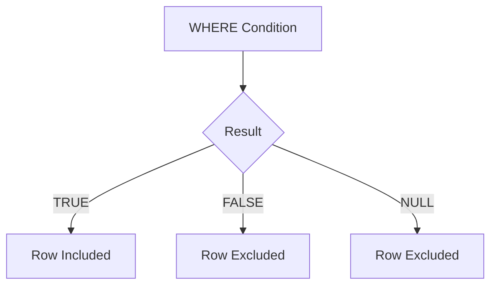

# :material-null: NULL in Filter Conditions

Filter conditions in `WHERE`, `HAVING`, and `JOIN ON` clauses discard rows where the condition evaluates to NULL — only rows where the condition is TRUE are kept.

### :material-sitemap: Overview



---

## :material-pin: Core Patterns

| Goal | Pattern |
|------|---------|
| Exclude NULLs (default) | `WHERE col > 0` |
| Include NULLs explicitly | `WHERE col > 0 OR col IS NULL` |
| Select only NULL rows | `WHERE col IS NULL` |
| Null-safe join | `ON a.key <=> b.key` |
| HAVING with NULLs | Aggregate result compared normally; NULL groups appear in output |

---

## :material-magnify: Behavior

### Three-Valued Logic in WHERE

A `WHERE` clause evaluates each row to TRUE, FALSE, or NULL. Only TRUE rows pass the filter. A NULL result — caused by comparing with a NULL column — silently drops the row without an error.

### `IS NULL` vs `= NULL`

`col = NULL` always returns NULL (never TRUE), so it never selects any rows. Use `IS NULL` to reliably test for the absence of a value.

```sql
-- WRONG: returns 0 rows even when age IS NULL
SELECT * FROM person WHERE age = NULL;

-- CORRECT
SELECT * FROM person WHERE age IS NULL;
```

### HAVING with NULL Groups

`GROUP BY` places all NULL values into a single group. `HAVING` then evaluates that group's aggregate result using the same three-valued logic.

### JOIN with NULL Keys

A standard `JOIN ON a.key = b.key` never matches rows where `key` is NULL on either side, because `NULL = NULL` is NULL (not TRUE). Use `<=>` to match NULL-keyed rows.

---

## :material-flask-outline: Practical Examples

### WHERE — NULLs Silently Excluded

```sql
-- Persons with unknown (NULL) age do not satisfy age > 0 (result is NULL),
-- so they are filtered out.
SELECT * FROM person WHERE age > 0;
-- Result:
-- 100  Joe       30
-- 300  Mike      18
-- 400  Fred      50
-- 600  Michelle  30
-- 700  Dan       50
```

### WHERE — Including NULLs Explicitly

```sql
-- Use OR age IS NULL to retain rows where age is unknown.
SELECT * FROM person WHERE age > 0 OR age IS NULL;
-- Result:
-- 100  Joe       30
-- 200  Marry     NULL
-- 300  Mike      18
-- 400  Fred      50
-- 500  Albert    NULL
-- 600  Michelle  30
-- 700  Dan       50
```

### GROUP BY / HAVING — NULL Groups

```sql
-- Persons with unknown (NULL) age are grouped together.
-- HAVING max(age) > 18 cannot be satisfied by the NULL group,
-- so the NULL group is excluded from the result.
SELECT age, COUNT(*) AS cnt
FROM person
GROUP BY age
HAVING MAX(age) > 18;
-- Result:
-- age=30  cnt=2
-- age=50  cnt=2
```

### JOIN — NULL Keys Excluded by Standard Equality

```sql
-- Standard equality: NULL ages on either side are excluded from matches.
SELECT p1.name AS name1, p2.name AS name2, p1.age
FROM person p1
JOIN person p2
    ON p1.age = p2.age
   AND p1.name = p2.name;
-- Result: only rows where both sides have a known, matching age
-- 100  Joe       Joe       30
-- 300  Mike      Mike      18
-- 400  Fred      Fred      50
-- 600  Michelle  Michelle  30
-- 700  Dan       Dan       50
-- (Marry and Albert are excluded because age IS NULL)
```

### JOIN — Null-Safe Equality Includes NULL Keys

```sql
-- Using <=> treats NULL = NULL as TRUE, so persons with unknown
-- age are matched against each other.
SELECT p1.name AS name1, p2.name AS name2, p1.age
FROM person p1
JOIN person p2
    ON p1.age <=> p2.age
   AND p1.name = p2.name;
-- Result includes Marry and Albert (both age=NULL, <=> returns TRUE)
-- 100  Joe       Joe       30
-- 200  Marry     Marry     NULL
-- 300  Mike      Mike      18
-- 400  Fred      Fred      50
-- 500  Albert    Albert    NULL
-- 600  Michelle  Michelle  30
-- 700  Dan       Dan       50
```

---

## :material-brain: When to Use

| Scenario | Recommended Pattern |
|----------|---------------------|
| Discard NULLs from results | Standard comparison: `WHERE col > 0` |
| Retain NULLs in results | `WHERE col > 0 OR col IS NULL` |
| Find rows with missing data | `WHERE col IS NULL` |
| Exclude rows with missing data | `WHERE col IS NOT NULL` |
| Join on a nullable key | `ON a.key <=> b.key` |
| Filter NULL groups in HAVING | `HAVING col IS NOT NULL` before grouping, or `HAVING MAX(col) IS NOT NULL` |
