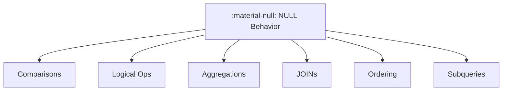

# :material-null: NULL Semantics

NULL represents an unknown or missing value; most expressions propagate NULL when any input is NULL.

### :material-sitemap: Overview



---

## :material-pin: Core Concepts

A table consists of rows, and each row contains columns. When the value of a column for a given row is not known at the time the row comes into existence, SQL represents it as NULL. NULL is not zero, not an empty string — it is the absence of any known value.

### Setup

All examples on this page use the following `person` table:

```sql
CREATE TABLE person (
    id   INT,
    name VARCHAR(50),
    age  INT
);

INSERT INTO person VALUES (100, 'Joe',      30);
INSERT INTO person VALUES (200, 'Marry',    NULL);
INSERT INTO person VALUES (300, 'Mike',     18);
INSERT INTO person VALUES (400, 'Fred',     50);
INSERT INTO person VALUES (500, 'Albert',   NULL);
INSERT INTO person VALUES (600, 'Michelle', 30);
INSERT INTO person VALUES (700, 'Dan',      50);
```

---

## :material-magnify: Comparison Operators

Spark supports the standard comparison operators `>`, `>=`, `=`, `<`, `<=`. When one or both operands are NULL, the result is NULL (unknown) — never TRUE or FALSE.

| Left Operand | Right Operand | `>` | `>=` | `=` | `<` | `<=` | `<=>` |
|--------------|---------------|-----|------|-----|-----|------|-------|
| NULL         | Any value     | NULL | NULL | NULL | NULL | NULL | FALSE |
| Any value    | NULL          | NULL | NULL | NULL | NULL | NULL | FALSE |
| NULL         | NULL          | NULL | NULL | NULL | NULL | NULL | TRUE  |

### Null-Safe Equal Operator (`<=>`)

`<=>` compares two values for equality without propagating NULL. It returns TRUE when both operands are NULL and FALSE when exactly one is NULL — it never returns NULL itself.

```sql
SELECT 5 > NULL          AS expression_output; -- Result: NULL
SELECT NULL = NULL        AS expression_output; -- Result: NULL
SELECT 5 <=> NULL         AS expression_output; -- Result: FALSE
SELECT NULL <=> NULL      AS expression_output; -- Result: TRUE
```

---

## :material-magnify: Logical Operators

AND, OR, and NOT follow three-valued logic (TRUE, FALSE, NULL/unknown). A NULL input does not always produce a NULL result — short-circuit rules apply.

| Left  | Right | OR    | AND   |
|-------|-------|-------|-------|
| TRUE  | NULL  | TRUE  | NULL  |
| FALSE | NULL  | NULL  | FALSE |
| NULL  | TRUE  | TRUE  | NULL  |
| NULL  | FALSE | NULL  | FALSE |
| NULL  | NULL  | NULL  | NULL  |

| Operand | NOT  |
|---------|------|
| NULL    | NULL |

```sql
SELECT (TRUE OR NULL)    AS expression_output; -- Result: TRUE
SELECT (NULL OR FALSE)   AS expression_output; -- Result: NULL
SELECT NOT(NULL)         AS expression_output; -- Result: NULL
```

---

## :material-magnify: Expressions

### Null-Intolerant Expressions

Return NULL whenever any argument is NULL. Most built-in functions fall into this category.

```sql
SELECT concat('John', NULL)  AS expression_output; -- Result: NULL
SELECT positive(NULL)        AS expression_output; -- Result: NULL
SELECT to_date(NULL)         AS expression_output; -- Result: NULL
```

### Null-Tolerant Expressions

These expressions can accept NULL operands and may return a non-NULL result:

| Expression | Behaviour |
|------------|-----------|
| `COALESCE(a, b, ...)` | Returns the first non-NULL argument |
| `NULLIF(a, b)` | Returns NULL if `a = b`, otherwise returns `a` |
| `IFNULL(a, b)` | Returns `b` if `a` is NULL, otherwise returns `a` |
| `NVL(a, b)` | Alias for IFNULL |
| `NVL2(a, b, c)` | Returns `b` if `a` is not NULL, otherwise returns `c` |
| `ISNULL(a)` / `ISNOTNULL(a)` | Predicate: TRUE if `a` IS NULL / IS NOT NULL |
| `ISNAN(a)` | TRUE if `a` is NaN (distinct from NULL) |
| `IN(a, list)` | Returns NULL if `a` is NULL or the list contains NULL and no element matched |

---

## :material-magnify: NULL in Aggregations

Aggregate functions silently skip NULL values. Only `COUNT(*)` counts every row including those with NULLs.

```sql
-- The person table has 2 NULL ages; 5 rows have known ages.
SELECT
    COUNT(*)   AS total_rows,  -- Result: 7  (counts every row)
    COUNT(age) AS age_count,   -- Result: 5  (skips NULLs)
    SUM(age)   AS age_sum,     -- Result: 178
    AVG(age)   AS age_avg,     -- Result: 35.6  (avg of 5 non-NULL values)
    MAX(age)   AS age_max,     -- Result: 50
    MIN(age)   AS age_min      -- Result: 18
FROM person;
```

`GROUP BY` treats all NULL values as belonging to the same group:

```sql
SELECT age, COUNT(*) AS cnt
FROM person
GROUP BY age
ORDER BY age;
-- Result:
-- age=18   cnt=1
-- age=30   cnt=2
-- age=50   cnt=2
-- age=NULL cnt=2
```

---

## :material-brain: Best Practices

| Scenario | Recommended Pattern |
|----------|---------------------|
| Check for NULL | `col IS NULL` / `col IS NOT NULL` — never `col = NULL` |
| Replace NULL with a default | `COALESCE(col, default_value)` |
| NULL-safe equality in joins | `a <=> b` |
| Produce NULL conditionally | `NULLIF(col, sentinel_value)` |
| Count only non-NULL values | `COUNT(col)` not `COUNT(*)` |
| Filter rows with unknown age | `WHERE age IS NULL` |
