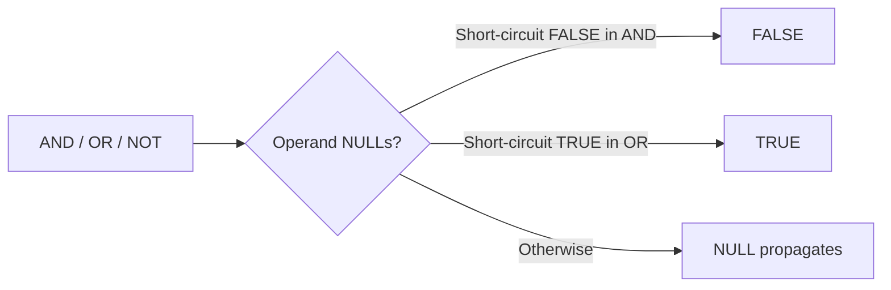

# :material-null: NULL in Logical Operators

AND, OR, and NOT follow three-valued logic — a NULL input means "unknown", and the result depends on whether the known operand can short-circuit the evaluation.

### :material-sitemap: Overview



---

## 📌 Truth Tables

### AND

| Left  | Right | Result |
|-------|-------|--------|
| TRUE  | TRUE  | TRUE   |
| TRUE  | FALSE | FALSE  |
| TRUE  | NULL  | NULL   |
| FALSE | TRUE  | FALSE  |
| FALSE | FALSE | FALSE  |
| FALSE | NULL  | FALSE  |
| NULL  | TRUE  | NULL   |
| NULL  | FALSE | FALSE  |
| NULL  | NULL  | NULL   |

### OR

| Left  | Right | Result |
|-------|-------|--------|
| TRUE  | TRUE  | TRUE   |
| TRUE  | FALSE | TRUE   |
| TRUE  | NULL  | TRUE   |
| FALSE | TRUE  | TRUE   |
| FALSE | FALSE | FALSE  |
| FALSE | NULL  | NULL   |
| NULL  | TRUE  | TRUE   |
| NULL  | FALSE | NULL   |
| NULL  | NULL  | NULL   |

### NOT

| Operand | Result |
|---------|--------|
| TRUE    | FALSE  |
| FALSE   | TRUE   |
| NULL    | NULL   |

---

## 🔍 Behavior

1. **Short-circuit with AND** — if one operand is FALSE, the result is FALSE regardless of the other operand. `FALSE AND NULL` returns FALSE, not NULL.
2. **Short-circuit with OR** — if one operand is TRUE, the result is TRUE regardless of the other operand. `TRUE OR NULL` returns TRUE, not NULL.
3. **NULL propagates otherwise** — when the known operand cannot determine the final result, NULL (unknown) is returned.
4. **NOT NULL is NULL** — negating an unknown value yields another unknown value.
5. **WHERE clauses discard NULL results** — a condition that evaluates to NULL behaves like FALSE in a filter; the row is excluded.

---

## 🧪 Practical Examples

### AND — Short-Circuit on FALSE

```sql
-- FALSE short-circuits: result is FALSE regardless of NULL
SELECT (FALSE AND NULL)  AS expression_output; -- Result: FALSE
SELECT (NULL AND FALSE)  AS expression_output; -- Result: FALSE

-- TRUE cannot short-circuit: NULL propagates
SELECT (TRUE AND NULL)   AS expression_output; -- Result: NULL
SELECT (NULL AND TRUE)   AS expression_output; -- Result: NULL

-- Both NULL: result is NULL
SELECT (NULL AND NULL)   AS expression_output; -- Result: NULL
```

### OR — Short-Circuit on TRUE

```sql
-- TRUE short-circuits: result is TRUE regardless of NULL
SELECT (TRUE OR NULL)    AS expression_output; -- Result: TRUE
SELECT (NULL OR TRUE)    AS expression_output; -- Result: TRUE

-- FALSE cannot short-circuit: NULL propagates
SELECT (FALSE OR NULL)   AS expression_output; -- Result: NULL
SELECT (NULL OR FALSE)   AS expression_output; -- Result: NULL

-- Both NULL: result is NULL
SELECT (NULL OR NULL)    AS expression_output; -- Result: NULL
```

### NOT — NULL Stays NULL

```sql
SELECT NOT(NULL)         AS expression_output; -- Result: NULL
SELECT NOT(TRUE)         AS expression_output; -- Result: FALSE
SELECT NOT(FALSE)        AS expression_output; -- Result: TRUE
```

### Practical Filter Using OR to Retain NULLs

```sql
-- Without OR IS NULL: Marry and Albert (age=NULL) are excluded
-- because NULL > 0 evaluates to NULL (not TRUE).
SELECT name FROM person WHERE age > 0;
-- Result: Joe, Mike, Fred, Michelle, Dan

-- With OR IS NULL: NULLs are explicitly included.
SELECT name FROM person WHERE age > 0 OR age IS NULL;
-- Result: Joe, Marry, Mike, Fred, Albert, Michelle, Dan
```

---

## 🧠 When to Use

| Scenario | Recommended Pattern |
|----------|---------------------|
| Ensure a NULL column does not exclude rows | `WHERE col > 0 OR col IS NULL` |
| Guard against NULL in AND chain | Place the most likely FALSE condition first |
| Guard against NULL in OR chain | Place the most likely TRUE condition first |
| Negate a nullable boolean | `NOT col IS TRUE` (avoids NOT NULL = NULL pitfall) |
| Check if at least one condition is met, ignoring NULLs | `COALESCE(condition_col, FALSE)` |
