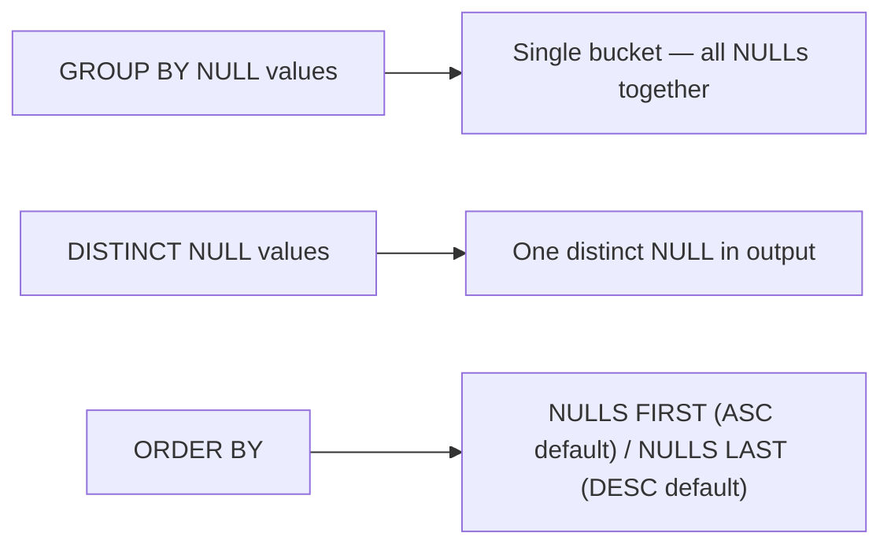

# :material-null: NULL in GROUP BY and DISTINCT

For grouping and deduplication, Spark treats all NULL values as **equal** — even though `NULL = NULL` evaluates to NULL in comparisons.

---

## :material-sitemap: Overview



---

## :material-table: Behaviour Summary

| Operation | NULL behaviour |
|-----------|----------------|
| `GROUP BY col` | All NULLs land in one group |
| `SELECT DISTINCT col` | Produces at most one NULL in output |
| `ORDER BY col ASC` | NULLs sort first (default) |
| `ORDER BY col DESC` | NULLs sort last (default) |
| `ORDER BY col ASC NULLS LAST` | NULLs pushed to end |

---

## :material-flask-outline: Examples

### Sample data

```sql
CREATE TABLE person (id INT, name STRING, age INT);
INSERT INTO person VALUES
    (100, 'Joe',      30),
    (200, 'Marry',    NULL),
    (300, 'Mike',     18),
    (400, 'Fred',     50),
    (500, 'Albert',   NULL),
    (600, 'Michelle', 30),
    (700, 'Dan',      50);
```

### GROUP BY — NULLs grouped together

```sql
SELECT age, COUNT(*) AS cnt
FROM person
GROUP BY age
ORDER BY age;
-- age=18   cnt=1
-- age=30   cnt=2
-- age=50   cnt=2
-- age=NULL cnt=2   ← both NULL ages in one group
```

### DISTINCT — one NULL in result

```sql
SELECT DISTINCT age FROM person ORDER BY age;
-- 18, 30, 50, NULL  ← single NULL row
```

### ORDER BY with explicit NULLS placement

```sql
-- NULLs first (default for ASC)
SELECT age, name FROM person ORDER BY age ASC;

-- NULLs last (explicit)
SELECT age, name FROM person ORDER BY age ASC NULLS LAST;

-- NULLs last for DESC
SELECT age, name FROM person ORDER BY age DESC NULLS LAST;
```

### Counting non-NULL vs NULL per group

```sql
SELECT
    age,
    COUNT(*)        AS total,
    COUNT(age)      AS non_null_age   -- always 0 when age IS NULL
FROM person
GROUP BY age;
```

---

## :material-magnify: Behavior Notes

1. NULL grouping is conformant with the SQL standard and consistent with most databases.
2. `GROUP BY` NULL-grouping is distinct from comparison `NULL = NULL` (which returns NULL) — it is a structural identity check.
3. `DISTINCT` on multiple columns treats `(NULL, 'x')` and `(NULL, 'y')` as different rows — only the NULL column itself is deduplicated.
4. Window functions with `PARTITION BY` also treat NULLs as one partition value.

