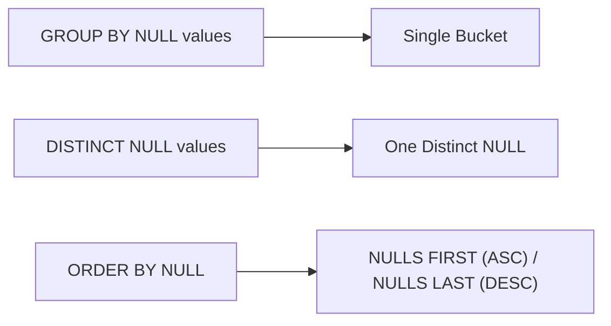

# :material-null: Aggregate Operator (GROUP BY, DISTINCT)

Two NULL values are not equal.

### :material-sitemap: Overview

However, for the purpose of grouping and distinct processing, the two or more values with NULL data are grouped together into the same bucket.

This behaviour is conformant with SQL standard and with other enterprise database management systems.

## `NULL` values are put in one bucket in `GROUP BY` processing

    SELECT 
        age,
        count(*)
    FROM 
        person 
    GROUP 
        BY age;

## All `NULL` ages are considered one distinct value in `DISTINCT` processing

    SELECT DISTINCT age FROM person;

## Columns other than `NULL`

Values other than Null are sorted in descending and `NULL` values are shown at the last.

    SELECT 
        age,
        name 
    FROM 
        person 
    ORDER BY 
        age DESC NULLS LAST;
