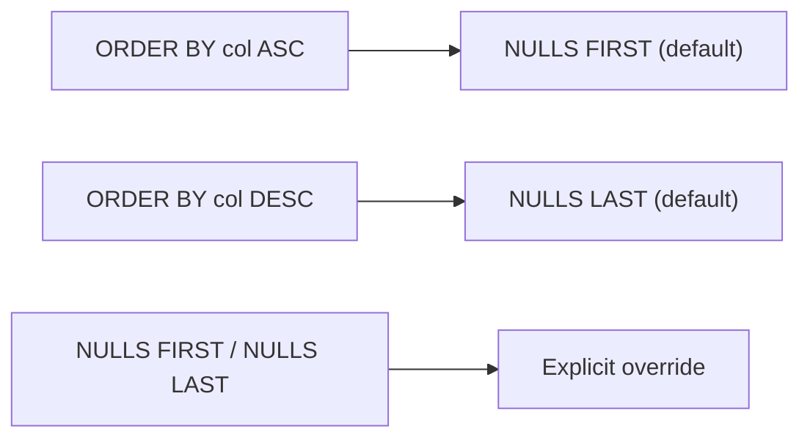

# :material-null: NULL Ordering

By default, Spark SQL sorts NULLs **first** in ascending order and **last** in descending order. Override this with `NULLS FIRST` / `NULLS LAST`.

---

## :material-sitemap: Overview



---

## :material-table: Default Behaviour

| Direction | Default NULL placement |
|-----------|----------------------|
| `ASC` | NULLS FIRST |
| `DESC` | NULLS LAST |

---

## :material-code-tags: Syntax

```sql
ORDER BY col [ASC | DESC] [NULLS FIRST | NULLS LAST]
```

---

## :material-flask-outline: Examples

### Push NULLs to the end in ascending order

```sql
SELECT name, age FROM person
ORDER BY age ASC NULLS LAST;
-- 18, 30, 30, 50, 50, NULL, NULL
```

### Pull NULLs to the front in descending order

```sql
SELECT name, age FROM person
ORDER BY age DESC NULLS FIRST;
-- NULL, NULL, 50, 50, 30, 30, 18
```

### Multiple columns — mixed NULL placement

```sql
SELECT region, revenue FROM sales
ORDER BY region ASC NULLS LAST,
         revenue DESC NULLS LAST;
```

### NULLS LAST for "most recent first" with nullable dates

```sql
SELECT user_id, last_login
FROM users
ORDER BY last_login DESC NULLS LAST;
-- Active users first, never-logged-in users at the end
```

### Window function ordering with NULLS LAST

```sql
SELECT
    customer_id,
    order_date,
    ROW_NUMBER() OVER (
        PARTITION BY customer_id
        ORDER BY order_date DESC NULLS LAST
    ) AS rn
FROM orders;
```

---

## :material-compare: Compare Default vs Explicit

| Query | NULL rows appear |
|-------|-----------------|
| `ORDER BY age ASC` | First (default) |
| `ORDER BY age ASC NULLS LAST` | Last |
| `ORDER BY age DESC` | Last (default) |
| `ORDER BY age DESC NULLS FIRST` | First |

---

## :material-magnify: Behavior Notes

1. The same `NULLS FIRST` / `NULLS LAST` syntax works inside `OVER (ORDER BY ...)` for window functions.
2. In Databricks Delta Lake, `OPTIMIZE ZORDER BY` ignores NULLs and places them in a consistent internal position.
3. When sorting on multiple columns, each column can have its own `NULLS FIRST` / `NULLS LAST` directive.

