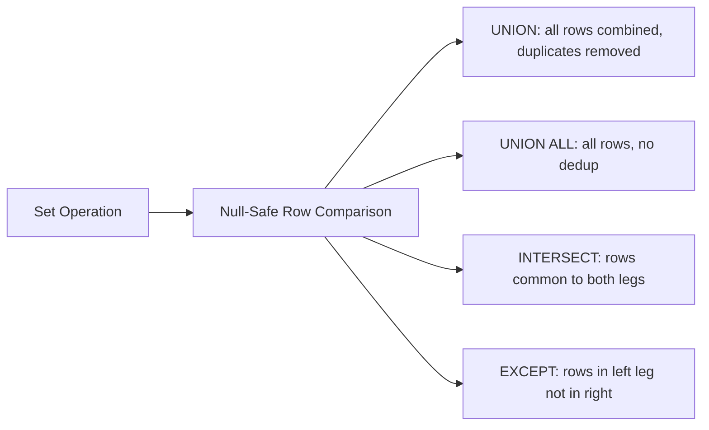

# :material-null: NULL in Set Operations

Set operations (`UNION`, `INTERSECT`, `EXCEPT`) use **null-safe equality** to compare rows — two NULL values in the same column position are considered equal for the purpose of deduplication and set membership.

---

## :material-sitemap: Overview



---

## :material-table: NULL Behaviour Summary

| Operator | NULL treatment |
|----------|----------------|
| `UNION` | Deduplicates using null-safe equality — two NULLs in the same position → one row |
| `UNION ALL` | No deduplication — all NULLs from both legs appear |
| `INTERSECT` | A NULL row appears only if it exists in **both** legs |
| `EXCEPT` | A NULL row is removed from the left if it also appears in the right |

---

## :material-flask-outline: Examples

### Sample data

```sql
CREATE TABLE person (id INT, name STRING, age INT);
INSERT INTO person VALUES
    (100, 'Joe',      30),
    (200, 'Marry',    NULL),
    (300, 'Mike',     18),
    (400, 'Fred',     50),
    (500, 'Albert',   NULL),
    (600, 'Michelle', 30),
    (700, 'Dan',      50);

CREATE VIEW unknown_age AS
    SELECT * FROM person WHERE age IS NULL;
-- unknown_age: Marry (NULL), Albert (NULL)
```

### INTERSECT — rows common to both legs (null-safe)

```sql
SELECT name, age FROM person
INTERSECT
SELECT name, age FROM unknown_age;
-- Result: Marry (NULL), Albert (NULL)
-- NULLs matched null-safely across both legs
```

### EXCEPT — remove right-leg rows from left (null-safe)

```sql
SELECT age, name FROM person
EXCEPT
SELECT age, name FROM unknown_age;
-- Result: all person rows EXCEPT the two NULL-age rows
-- NULLs are matched and excluded
```

### UNION — combine and deduplicate (null-safe)

```sql
SELECT name, age FROM person
UNION
SELECT name, age FROM unknown_age;
-- unknown_age rows already exist in person → no duplicates added
-- A (name, NULL) row appears once per unique name
```

### UNION ALL — retain all rows including NULL duplicates

```sql
SELECT age FROM person
UNION ALL
SELECT age FROM unknown_age;
-- NULL appears 4 times: 2 from person + 2 from unknown_age
```

### Practical: reconcile two tables

```sql
-- Rows in staging but not in production (NULL-safe comparison)
SELECT customer_id, email
FROM staging_customers
EXCEPT
SELECT customer_id, email
FROM prod_customers;
```

---

## :material-magnify: Behavior Notes

1. Set operations compare **full rows** — every column is checked, including NULL columns, using null-safe equality.
2. This is different from `WHERE col = NULL` (which always returns NULL); set-op deduplication uses `<=>` semantics.
3. `UNION ALL` never deduplicates — use it when you want all NULL rows from both sides.
4. `INTERSECT ALL` and `EXCEPT ALL` (bag semantics) are not supported in all Spark versions; use `INTERSECT` / `EXCEPT` (set semantics) by default.

