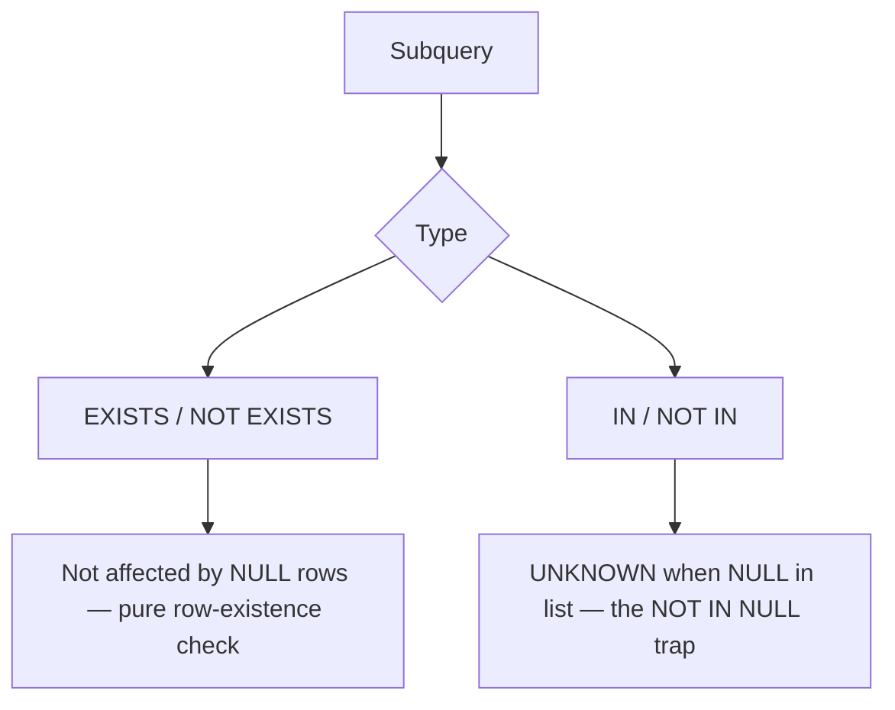

# :material-null: NULL in Subqueries

NULL values inside subqueries affect `EXISTS`, `NOT EXISTS`, `IN`, and `NOT IN` in very different — and sometimes surprising — ways.

---

## :material-sitemap: Overview



---

## :material-table: Behaviour Summary

| Expression | NULL in subquery result | Effect |
|------------|------------------------|--------|
| `EXISTS (subquery)` | Irrelevant — only tests whether rows exist | No impact from NULLs |
| `NOT EXISTS (subquery)` | Irrelevant | No impact from NULLs |
| `col IN (subquery)` | NULL in list + no match → UNKNOWN | Row excluded silently |
| `col NOT IN (subquery)` | **Any** NULL in list → always UNKNOWN | **All rows excluded** |

---

## :material-magnify: EXISTS / NOT EXISTS

`EXISTS` and `NOT EXISTS` are pure **membership** predicates — they return `TRUE` or `FALSE` based solely on whether the subquery produces at least one row. The column values in that row — including NULLs — do not matter.

```sql
-- EXISTS returns TRUE because the subquery produces 1 row (even though the value is NULL)
SELECT * FROM person WHERE EXISTS (SELECT NULL);
-- Returns all 7 rows

-- NOT EXISTS returns FALSE — subquery produced 1 row
SELECT * FROM person WHERE NOT EXISTS (SELECT NULL);
-- Returns 0 rows

-- NOT EXISTS returns TRUE — subquery produced 0 rows
SELECT * FROM person WHERE NOT EXISTS (SELECT 1 WHERE 1 = 0);
-- Returns all 7 rows
```

!!! tip
    `EXISTS` is often faster than `IN` because Spark can rewrite it as a semi-join without needing null-awareness.

---

## :material-alert-circle: IN / NOT IN — The NULL Trap

`IN` is semantically equivalent to a chain of `OR` equality checks. NULL propagation in `=` and `OR` creates the NULL trap.

### IN with a NULL in the list

```sql
-- Subquery returns only NULL — IN result is always UNKNOWN
SELECT * FROM person
WHERE age IN (SELECT NULL);
-- 0 rows returned (UNKNOWN rows are excluded by WHERE)
```

```sql
-- Subquery returns 50 and NULL — rows with age = 50 match; others get UNKNOWN
SELECT * FROM person
WHERE age IN (SELECT age FROM (VALUES (50), (NULL)) t(age));
-- Fred (50), Dan (50) ← matched
-- Other rows → UNKNOWN (not returned)
```

### NOT IN with a NULL in the list — all rows excluded

```sql
-- The list contains NULL → NOT IN always returns UNKNOWN → no rows returned
SELECT * FROM person
WHERE age NOT IN (SELECT age FROM (VALUES (50), (NULL)) t(age));
-- 0 rows returned — even ages that are not 50!
```

!!! warning
    If the subquery used in `NOT IN` can ever return NULL, **no rows will pass the filter**.
    This is the most common NULL bug in SQL.

---

## :material-check-circle-outline: Safe Alternatives to NOT IN

```sql
-- Option 1: NOT EXISTS (safe — not affected by NULLs)
SELECT * FROM person p
WHERE NOT EXISTS (
    SELECT 1 FROM (VALUES (50), (NULL)) t(age)
    WHERE t.age = p.age
);

-- Option 2: LEFT ANTI JOIN (safe and performant)
SELECT p.*
FROM person p
LEFT ANTI JOIN (VALUES (50), (NULL)) t(age)
    ON p.age = t.age;

-- Option 3: Filter NULLs out of the subquery list first
SELECT * FROM person
WHERE age NOT IN (
    SELECT age FROM other_table WHERE age IS NOT NULL
);
```

---

## :material-flask-outline: Real-World Example

```sql
-- Find customers who have NOT placed any order
-- WRONG: if any order has a NULL customer_id, no customers are returned
SELECT c.customer_id, c.name
FROM customers c
WHERE c.customer_id NOT IN (SELECT customer_id FROM orders);

-- CORRECT: use NOT EXISTS or anti-join
SELECT c.customer_id, c.name
FROM customers c
WHERE NOT EXISTS (
    SELECT 1 FROM orders o WHERE o.customer_id = c.customer_id
);
```

---

## :material-magnify: Behavior Notes

1. `EXISTS` / `NOT EXISTS` are immune to NULLs in the subquery result — always use them for existence checks.
2. `NOT IN` returns `UNKNOWN` (treated as `FALSE` by `WHERE`) for every row when the subquery contains even one NULL.
3. Prefer `LEFT ANTI JOIN` over `NOT IN` for large tables — it is both null-safe and more performant.
4. Always add `WHERE col IS NOT NULL` inside any subquery used with `NOT IN` as a safety net.

