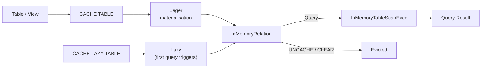

# :material-table-refresh: Cache Commands

---

## :material-sitemap: Cache Lifecycle



---

## :material-code-braces: Syntax

### Eager cache

```sql
-- Materialises the table immediately
CACHE TABLE orders;
```

### Lazy cache

```sql
-- Registers the cache plan; data is loaded on first query
CACHE LAZY TABLE orders;
```

### Cache a query result

```sql
-- Create a named in-memory table from a query
CACHE TABLE active_customers AS
SELECT customer_id, name, region
FROM customers
WHERE status = 'active';

-- Use it in subsequent queries — no re-read from storage
SELECT region, COUNT(*) FROM active_customers GROUP BY region;
SELECT * FROM active_customers WHERE region = 'US' LIMIT 10;
```

### Cache a temporary view

```sql
CREATE OR REPLACE TEMP VIEW monthly_summary AS
SELECT
    DATE_TRUNC('month', order_date) AS month,
    region,
    SUM(amount)                     AS total
FROM orders
GROUP BY 1, 2;

CACHE TABLE monthly_summary;

-- Now used in multiple queries without recomputation
SELECT * FROM monthly_summary WHERE region = 'US';
SELECT month, SUM(total) FROM monthly_summary GROUP BY month;
```

---

## :material-check-all: Checking Cache Status

```sql
-- List all tables in the catalog (in-memory tables appear here)
SHOW TABLES;

-- Detailed view — look for "Is Temporary" and "Type: VIEW"
DESCRIBE EXTENDED monthly_summary;
```

!!! note "No built-in `IS CACHED` SQL function"
    There is no SQL function like `IS_CACHED(table)`. Use the Spark UI
    **Storage** tab to confirm what is cached and how much memory it occupies.

---

## :material-delete-sweep: Removing Caches

```sql
-- Remove a single table / view from cache
UNCACHE TABLE orders;
UNCACHE TABLE IF EXISTS orders;

-- Remove all caches in the current SparkSession
CLEAR CACHE;
```

---

## :material-refresh: Cache Invalidation

Spark **does not** automatically invalidate the cache when underlying data changes.

```sql
-- Pattern: refresh table metadata + re-cache after data change
REFRESH TABLE orders;  -- clears file listing cache
UNCACHE TABLE cached_orders;
CACHE TABLE cached_orders AS SELECT ...;
```

---

## :material-compare: CACHE TABLE vs CACHE LAZY TABLE

| Aspect | `CACHE TABLE` | `CACHE LAZY TABLE` |
|--------|:-------------:|:------------------:|
| Materialises on cache call | Yes | No |
| Materialises on first query | — | Yes |
| Suitable for startup script | No (adds latency) | Yes |
| Guaranteed warm for next query | Yes | No |

---

## :material-information: Behaviour Notes

1. `CACHE TABLE` is **eager** by default — it triggers a Spark job immediately.
2. `CACHE LAZY TABLE` only stores the plan; the first downstream action caches the data.
3. Cached data is stored in **columnar in-memory format** using `InMemoryRelation`.
4. The cache is **session-scoped** — other sessions do not share it.
5. If available memory is exceeded, Spark **evicts** older cache entries (LRU policy).
6. Caching a large table that does not fit in executor memory causes **disk spill**
   or silent eviction — cache selectively using a filtered query.
