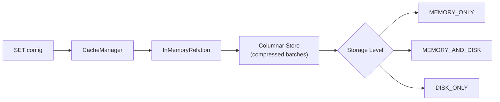

# :material-wrench: Caching Configuration

---

## :material-sitemap: Config Flow



---

## :material-table: Configuration Reference

| Property | Default | Description |
|----------|---------|-------------|
| `spark.sql.inMemoryColumnarStorage.compressed` | `true` | Auto-select compression codec per column based on data statistics |
| `spark.sql.inMemoryColumnarStorage.batchSize` | `10000` | Rows per columnar batch — larger = better throughput, more memory |
| `spark.sql.cache.level` | `MEMORY_AND_DISK` | Default storage level for `CACHE TABLE` (Spark 3.3+) |
| `spark.sql.defaultSizeInBytes` | `1073741824` | Size estimate for tables with no statistics |
| `spark.sql.autoBroadcastJoinThreshold` | `10485760` | Threshold below which cached tables may trigger broadcast |
| `spark.sql.cache.serializer` | built-in | Serializer for cached data (rarely needs changing) |

---

## :material-database: Storage Levels

| Level | RAM | Disk | Serialized | Replicated | Use when |
|-------|:---:|:----:|:----------:|:----------:|---------|
| `MEMORY_ONLY` | Yes | No | No | No | Dataset fits comfortably in RAM |
| `MEMORY_AND_DISK` | Yes | Yes (spill) | No | No | Dataset may exceed RAM |
| `MEMORY_ONLY_SER` | Yes | No | Yes | No | RAM tight — accept CPU cost |
| `MEMORY_AND_DISK_SER` | Yes | Yes | Yes | No | RAM tight + safety net |
| `DISK_ONLY` | No | Yes | Yes | No | Dataset too large for RAM |
| `MEMORY_AND_DISK_2` | Yes | Yes | No | Yes | Fault-tolerant pipelines |

!!! note "SQL vs API"
    `SET spark.sql.cache.level = MEMORY_ONLY` affects SQL `CACHE TABLE`.
    The PySpark `.persist(StorageLevel.MEMORY_ONLY)` API sets the level directly
    on the DataFrame.

---

## :material-code-braces: Applying Configuration in SQL

```sql
-- Enable compression (default: already true)
SET spark.sql.inMemoryColumnarStorage.compressed = true;

-- Larger batches for better vectorised throughput (at the cost of memory)
SET spark.sql.inMemoryColumnarStorage.batchSize = 20000;

-- Cache only in memory (evict rather than spill to disk)
SET spark.sql.cache.level = MEMORY_ONLY;

-- Now cache the table with the above settings in effect
CACHE TABLE orders;
```

---

## :material-tune: Tuning Guide

| Symptom | Cause | Fix |
|---------|-------|-----|
| OOM during CACHE TABLE | Dataset too large for MEMORY_ONLY | Switch to `MEMORY_AND_DISK` |
| Cache is evicted unexpectedly | Other cache entries pressure LRU | Cache only the most reused views |
| Slow first query after CACHE LAZY | Cold materialisation | Use `CACHE TABLE` (eager) for critical paths |
| High CPU on cache read | Decompression overhead | Set `compressed = false` if CPU is the bottleneck |
| Many small batches | Low `batchSize` | Increase to 20000–50000 for analytical workloads |

---

## :material-check-circle-outline: How Columnar Compression Works

When `spark.sql.inMemoryColumnarStorage.compressed = true`, Catalyst inspects
column statistics collected during caching and selects a codec per column:

| Column type | Codec selected |
|-------------|---------------|
| Low cardinality (e.g., region) | Dictionary encoding |
| Integer sequence | Run-length encoding (RLE) |
| High cardinality string | LZ4 / Snappy |
| Floating-point | Pass-through (no compression gain) |

This means storage is often 3–10× smaller than raw row format.
