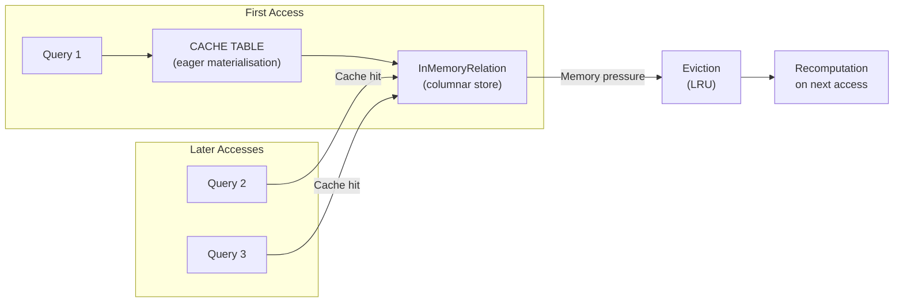

# :material-lightning-bolt: Caching Overview

Caching stores a materialized copy of a query result in memory (and optionally disk)
so that subsequent queries against the same data skip re-computation.

---

## :material-sitemap: How Caching Works



---

## :material-compare: Caching Decision Guide

| Scenario | Cache? | Reason |
|----------|:------:|--------|
| Table read once per job | No | No benefit |
| Table read 3+ times in same session | Yes | Avoids re-scanning storage |
| Large table (> executor memory) | Selective | Cache filtered/aggregated view |
| Table changes frequently | No | Cache becomes stale |
| Streaming source | No | Not applicable |
| Expensive UDF results | Yes | Save UDF re-execution |

---

## :material-code-braces: Quick Reference

```sql
-- Cache a table (eager — materialises immediately)
CACHE TABLE orders;

-- Cache with OPTIONS (lazy — materialises on first query)
CACHE LAZY TABLE orders;

-- Cache a query result as a named table
CACHE TABLE clean_orders AS
SELECT order_id, LOWER(TRIM(region)) AS region, amount
FROM raw_orders
WHERE order_id IS NOT NULL;

-- Remove from cache
UNCACHE TABLE orders;

-- Clear all caches in this session
CLEAR CACHE;
```

---

## :material-book-open-variant: In This Section

| Page | Contents |
|------|----------|
| [Cache Commands](cache.md) | Full syntax, temp view caching, CHECK / CLEAR patterns |
| [Configuration](config.md) | Storage levels, compression, batch size, config reference |
| [Cache Manager](manager.md) | Internal architecture — `CacheManager`, `InMemoryRelation`, eviction |
