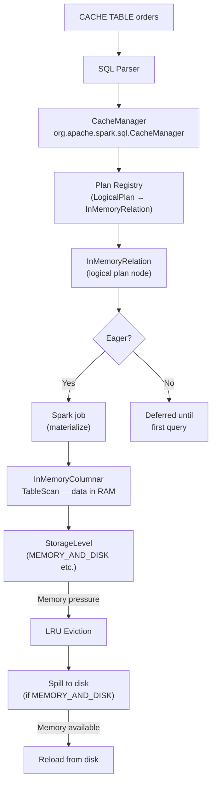

# :material-memory: Cache Manager

The `CacheManager` is the internal Spark component that registers, tracks,
and evicts cached logical plans.

---

## :material-sitemap: Internal Architecture



---

## :material-toy-brick: Internal Components

| Component | Class | Role |
|-----------|-------|------|
| `CacheManager` | `org.apache.spark.sql.CacheManager` | Tracks all cached plans, answers "is this plan cached?" |
| `InMemoryRelation` | `…execution.columnar.InMemoryRelation` | Logical plan node wrapping the cached data |
| `InMemoryTableScanExec` | `…execution.columnar.InMemoryTableScanExec` | Physical operator that reads from the columnar store |
| `CachedBatch` | Internal | A columnar batch (≤ `batchSize` rows) stored in the columnar store |
| `StorageLevel` | `org.apache.spark.storage.StorageLevel` | Defines RAM/disk/serialization/replication policy |

---

## :material-format-list-numbered: Step-by-Step: What Happens on `CACHE TABLE orders`

1. SQL Parser emits a `CacheTableCommand` logical node.
2. `CacheManager.cacheQuery()` is called with the logical plan for `orders`.
3. The plan is wrapped in an `InMemoryRelation` node and registered in the plan registry.
4. If **eager**: a Spark job scans `orders`, converts rows to columnar batches,
   and stores them according to the configured `StorageLevel`.
5. If **lazy**: registration only — no job runs yet.
6. On subsequent queries: `CacheManager.useCachedData()` rewrites matching
   sub-plans with `InMemoryRelation` nodes, so no storage scan happens.

---

## :material-recycle: Eviction Policy

| Trigger | Behaviour |
|---------|-----------|
| `UNCACHE TABLE t` | Immediately removes `t` from the plan registry and drops all in-memory blocks |
| `CLEAR CACHE` | Removes all entries from the plan registry |
| Memory pressure (executor) | LRU — least-recently-used `CachedBatch` blocks are evicted first |
| Session ends | All session-scoped caches are dropped |
| `REFRESH TABLE t` | Clears file listing cache; **does not** evict the `CACHE TABLE` — call `UNCACHE` separately |

---

## :material-magnify: Verifying Cache Hits

Inspect the physical plan — an `InMemoryTableScan` node means data is served
from the cache:

```sql
EXPLAIN FORMATTED
SELECT region, SUM(amount) FROM orders GROUP BY region;

-- With cache:
-- +- InMemoryTableScan [region, amount]      ← cache hit

-- Without cache:
-- +- FileScan parquet [...] orders            ← storage read
```

The **Spark UI → Storage** tab shows each cached RDD/broadcast/table with
memory usage, fraction cached, and storage level.
