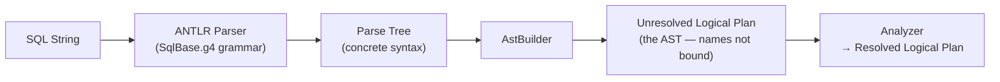
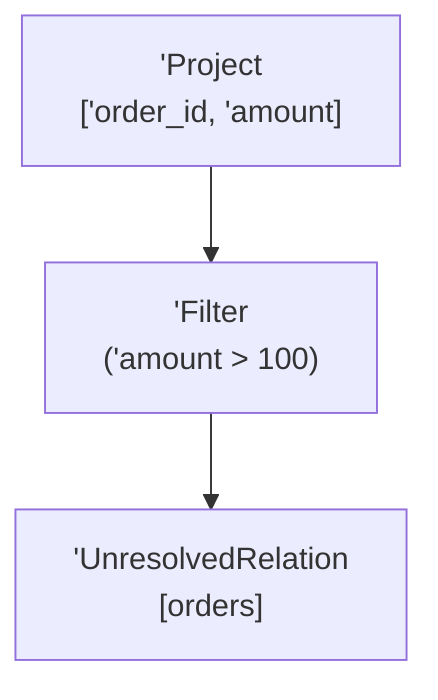

# :material-file-tree: Spark SQL AST

The **Abstract Syntax Tree (AST)** is the first structured representation of a query.
Spark's ANTLR-based parser turns the raw SQL string into a parse tree, and the
`AstBuilder` converts that into an **Unresolved Logical Plan** — the tree you see under
`== Parsed Logical Plan ==`. At this point table and column names are recorded but *not*
validated; unresolved nodes are printed with a leading apostrophe (`'`).

### :material-sitemap: Overview



---

## :material-pin: Why It Matters

1. The parser produces the AST purely from **syntax** — it never touches the catalog.
2. Syntax mistakes surface here as a `ParseException`, *before* any name resolution.
3. The AST is handed to the Analyzer, which binds names and types to produce the
   Resolved Logical Plan.
4. Reading the parsed tree helps you distinguish **parser** problems (bad SQL grammar)
   from **analysis** problems (unknown table/column).

---

## :material-eye: Viewing the AST

There is **no** `EXPLAIN PARSED` mode. The AST is the first section of `EXPLAIN EXTENDED`:

```sql
EXPLAIN EXTENDED
SELECT order_id, amount
FROM orders
WHERE amount > 100;
```

The `== Parsed Logical Plan ==` section is the AST:

```text
== Parsed Logical Plan ==
'Project ['order_id, 'amount]
+- 'Filter ('amount > 100)
   +- 'UnresolvedRelation [orders], [], false
```

Every node carries a leading `'` — the marker for **unresolved**. Compare it with the
next section, where the Analyzer has bound names, types, and the view definition:

```text
== Analyzed Logical Plan ==
order_id: int, amount: decimal(4,1)
Project [order_id#10, amount#12]
+- Filter (amount#12 > cast(cast(100 as decimal(3,0)) as decimal(4,1)))
   +- SubqueryAlias orders
      +- View (`orders`, [order_id#10, region#11, amount#12])
         +- ...
```

Note how `'UnresolvedRelation [orders]` became a real `View`, `'order_id` became
`order_id#10` (a bound attribute with an expression ID), and the literal `100` gained an
explicit `cast`.

---

## :material-file-tree-outline: AST Structure of the Query



The tree reads bottom-up: read `orders`, filter rows, then project two columns — the same
shape as the SQL, but as a manipulable data structure.

---

## :material-format-list-bulleted-type: Common Unresolved AST Nodes

| Node | Meaning | Resolves to |
|------|---------|-------------|
| `'UnresolvedRelation [t]` | A table/view name, not yet looked up | `View` / `LogicalRelation` / `HiveTableRelation` |
| `'UnresolvedAttribute` (`'col`) | A column reference, not yet bound | `AttributeReference` (`col#id`) |
| `'UnresolvedFunction` | A function call, signature not checked | Concrete expression (e.g. `Sum`) |
| `'UnresolvedStar` (`'*`) | `SELECT *` before expansion | Explicit list of `AttributeReference`s |
| `'Project` | The `SELECT` list | `Project` |
| `'Filter` | The `WHERE` predicate | `Filter` |
| `'Aggregate` | `GROUP BY` + aggregates | `Aggregate` |
| `'Join` | A join with its condition | `Join` |

The `'` prefix is your quickest visual cue that a node is still unresolved.

---

## :material-alert-circle-outline: Parse Errors vs Analysis Errors

The stage at which a query fails tells you what kind of mistake it is.

### Parse error — caught while building the AST

```sql
SELECT FROM orders WHERE;
```

```text
[PARSE_SYNTAX_ERROR] Syntax error at or near end of input. SQLSTATE: 42601 (line 1, pos 24)
== SQL ==
SELECT FROM orders WHERE
------------------------^^^
```

A `ParseException` means the grammar itself was violated — the AST could not even be
built. The `^^^` marker points at the offending position.

### Analysis error — caught *after* the AST, during resolution

```sql
SELECT nonexistent FROM orders;
```

```text
[UNRESOLVED_COLUMN.WITH_SUGGESTION] A column ... `nonexistent` cannot be resolved.
Did you mean one of the following? [`region`, `amount`, `order_id`]. SQLSTATE: 42703
```

An `AnalysisException` means the SQL was **grammatically valid** (the AST built fine) but
a name could not be bound against the catalog.

| Symptom | Exception | Stage | Typical cause |
|---------|-----------|-------|---------------|
| `PARSE_SYNTAX_ERROR` | `ParseException` | Parser (AST build) | Missing comma/keyword, unbalanced parens |
| `UNRESOLVED_COLUMN` | `AnalysisException` | Analyzer | Column typo, wrong alias |
| `TABLE_OR_VIEW_NOT_FOUND` | `AnalysisException` | Analyzer | Unknown/misspelt table |

---

## :material-brain: When to Use

| Scenario | Recommendation |
|----------|----------------|
| SQL fails with a syntax error | Read the `PARSE_SYNTAX_ERROR` `^^^` pointer — the AST never built |
| Unsure if a problem is syntax or naming | If `EXPLAIN EXTENDED` prints a Parsed plan, syntax is fine — it's an analysis issue |
| Learning how Spark reads your query | Compare the `== Parsed ==` vs `== Analyzed ==` sections side by side |
| Debugging `SELECT *` expansion | Check whether `'UnresolvedStar` expanded to the columns you expected |

!!! tip "Parsed plan = syntax only"
    If the `== Parsed Logical Plan ==` section prints, your SQL is grammatically valid.
    Any remaining error is an **analysis** problem (names, types, catalog) — look at the
    `== Analyzed Logical Plan ==` stage next. See [Logical Optimization](../logical.md)
    for what happens after resolution.
