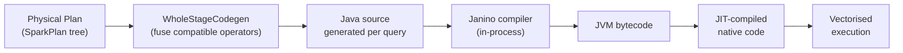

# :material-code-braces: Code Generation

Catalyst uses **Whole-Stage Code Generation (WSCG)** to compile entire query stages
into a single Java method, eliminating virtual function dispatch and enabling the JVM
JIT compiler to produce highly optimised native code.

---

## :material-sitemap: Code Generation Pipeline



---

## :material-compare: Interpreted vs Code-Generated Execution

| Aspect | Interpreted | WholeStageCodegen |
|--------|:-----------:|:-----------------:|
| Virtual calls per row | Many | None (fused) |
| Boxing/unboxing | Yes | Eliminated |
| Pipeline passes | One per operator | One pass for all fused operators |
| JIT friendliness | Low | High |
| Typical speed-up | Baseline | 2–10× |

---

## :material-check-circle-outline: Operators That Support WSCG

| Operator | Codegen support |
|----------|:--------------:|
| `Filter` | Yes |
| `Project` | Yes |
| `HashAggregate` | Yes |
| `BroadcastHashJoin` | Yes |
| `SortMergeJoin` | Yes (probe side) |
| `Sort` | Yes |
| `FileScan` (Parquet/ORC) | Yes — vectorised batch reader |
| `SortAggregate` | No |
| `BroadcastNestedLoopJoin` | No |
| Python UDF | No — exits codegen path |

---

## :material-eye: Identifying WSCG in EXPLAIN

```sql
EXPLAIN FORMATTED
SELECT region, SUM(amount)
FROM orders
WHERE order_date >= '2024-01-01'
GROUP BY region;
```

Look for `WholeStageCodegen (N)` wrapping operators:

```
== Physical Plan ==
AdaptiveSparkPlan (1)
+- HashAggregate (2)
   +- Exchange (3) hashpartitioning(region, 200)
      +- *1 HashAggregate (4)              ← * = inside WSCG stage 1
         +- *1 Filter (5)                  ← fused with (4)
            +- *1 FileScan parquet (6)     ← fused with (4) and (5)
```

The `*1` prefix means all three operators (HashAggregate, Filter, FileScan) are
compiled into a single Java method — zero overhead between them.

---

## :material-wrench: Configuration

```sql
-- Disable WSCG globally (useful for debugging or profiling)
SET spark.sql.codegen.wholeStage = false;

-- Disable codegen for a single query with a hint comment (not directly supported)
-- Instead, set per session:
SET spark.sql.codegen.wholeStage = false;
<your-query>;
SET spark.sql.codegen.wholeStage = true;

-- Vectorised Parquet reader (default on)
SET spark.sql.parquet.enableVectorizedReader = true;

-- Max fields in codegen method (raise if you hit 64-field JVM limit)
SET spark.sql.codegen.maxFields = 100;

-- Fallback on codegen compile error instead of failing
SET spark.sql.codegen.fallback = true;
```

---

## :material-code-json: Viewing Generated Code

```sql
-- Show Java source generated for a query
EXPLAIN CODEGEN
SELECT region, SUM(amount) FROM orders WHERE amount > 100 GROUP BY region;
```

Sample generated snippet (simplified):

```java
// Generated by WholeStageCodegen
void processNext() {
    while (scan.hasNext()) {
        InternalRow row = scan.next();
        long amount = row.getLong(2);
        if (amount > 100) {                    // fused Filter
            UTF8String region = row.getUTF8String(1); // fused Project
            hashAgg.update(region, amount);    // fused HashAggregate
        }
    }
}
```

---

## :material-alert: When Codegen Does Not Help

| Situation | Reason | Fix |
|-----------|--------|-----|
| Python / Scala UDF in query | UDF exits the generated code path | Replace with SQL built-in |
| `SortAggregate` used | Does not support WSCG | Ensure keys fit in memory for `HashAggregate` |
| Very wide schema (> 100 fields) | JVM method size limit | Set `spark.sql.codegen.maxFields = 200` |
| Repeated codegen compile errors | JVM JIT cache saturation | Set `spark.sql.codegen.fallback = true` |
