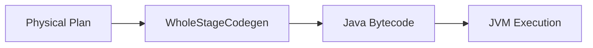

# :material-code-braces: Code Generation

Catalyst uses whole-stage code generation to reduce function call overhead by
compiling query stages into Java bytecode.

### :material-sitemap: Overview



---

## :material-pin: Benefits

| Benefit | Description |
|---------|-------------|
| Fewer virtual calls | Faster execution |
| Fused operators | Fewer passes over data |

---

## :material-flask-outline: Example

```sql
EXPLAIN FORMATTED SELECT SUM(amount) FROM orders;
```

Look for `WholeStageCodegen` in the physical plan.

---

## :material-brain: When to Use

| Scenario | Recommendation |
|----------|----------------|
| CPU-bound queries | Codegen helps |
| Debugging | Disable codegen for readability |
