# :material-atom: Catalyst Optimizer

Catalyst is Spark SQL's extensible query optimiser. It transforms a SQL string through
five distinct phases before any data is read.

---

## :material-sitemap: Full Catalyst Pipeline

```mermaid
flowchart LR
    SQL["SQL / DataFrame\nAPI"] --> P["Parser"]
    P --> ULP["Unresolved\nLogical Plan"]
    ULP --> AN["Analyzer"]
    AN --> RLP["Resolved\nLogical Plan"]
    RLP --> OPT["Optimizer\n(rule-based + CBO)"]
    OPT --> OLP["Optimized\nLogical Plan"]
    OLP --> PP["Physical\nPlanner"]
    PP --> PHYS["Physical Plan\n(SparkPlan)"]
    PHYS --> CG["WholeStage\nCodegen"]
    CG --> JVM["JVM Bytecode"]
    JVM --> RUN["Execution\n(RDD actions)"]
```



---

## :material-list-status: Pipeline Stages

| Stage | Input | Output | Key Actions |
|-------|-------|--------|-------------|
| **Parsing** | SQL string | Unresolved AST | Tokenize, build tree |
| **Analysis** | Unresolved AST | Resolved logical plan | Resolve column names, types, functions |
| **Logical optimization** | Resolved plan | Optimized logical plan | Predicate pushdown, constant folding, column pruning, join reorder |
| **Physical planning** | Optimized logical plan | Physical plans | Choose join/agg strategies |
| **Code generation** | Physical plan | JVM bytecode | Whole-stage codegen, vectorised access |

---

## :material-magnify: Viewing Each Stage

```sql
-- View all stages at once
EXPLAIN EXTENDED SELECT o.order_id, SUM(o.amount)
FROM orders o
WHERE o.region = 'US'
GROUP BY o.order_id;
```

The output sections are:
- `== Parsed Logical Plan ==` — raw AST
- `== Analyzed Logical Plan ==` — types resolved
- `== Optimized Logical Plan ==` — rules applied
- `== Physical Plan ==` — final execution plan

---

## :material-format-list-numbered: In This Section

| Page | Contents |
|------|----------|
| [Logical Optimization](logical.md) | Rule-based rewrites: predicate pushdown, column pruning, constant folding, join reorder |
| [Physical Planning](physical.md) | Join strategy selection, aggregation strategy, scan operators |
| [Code Generation](code-generation.md) | WholeStageCodegen, vectorised execution, disabling for debugging |
| [AST](ast/spark-sql-ast.md) | Abstract Syntax Tree representation |
