# :material-atom: Catalyst Optimizer

Catalyst is Spark SQL's rule-based and cost-based optimizer. It transforms
logical plans into efficient physical plans.

### :material-sitemap: Overview

```mermaid
graph LR
    A[SQL String] --> B["Parser :material-file-tree:"]
    B --> C["Unresolved Logical Plan"]
    C --> D["Analyzer :material-magnify:"]
    D --> E["Resolved Logical Plan"]
    E --> F["Optimizer :material-atom:"]
    F --> G["Optimized Logical Plan"]
    G --> H["Physical Planner :material-server:"]
    H --> I["Physical Plan"]
    I --> J["Code Generation :material-code-braces:"]
    J --> K[Execute]
```



---

## :material-pin: Stages

| Stage | Description |
|-------|-------------|
| Analysis | Resolve columns and types |
| Optimization | Apply rewrite rules |
| Planning | Choose physical operators |

---

## :material-flask-outline: Example

```sql
EXPLAIN FORMATTED SELECT * FROM orders WHERE amount > 100;
```

---

## :material-brain: When to Use

| Scenario | Recommendation |
|----------|----------------|
| Performance tuning | Inspect plans |
| Debugging queries | Use `EXPLAIN` |
