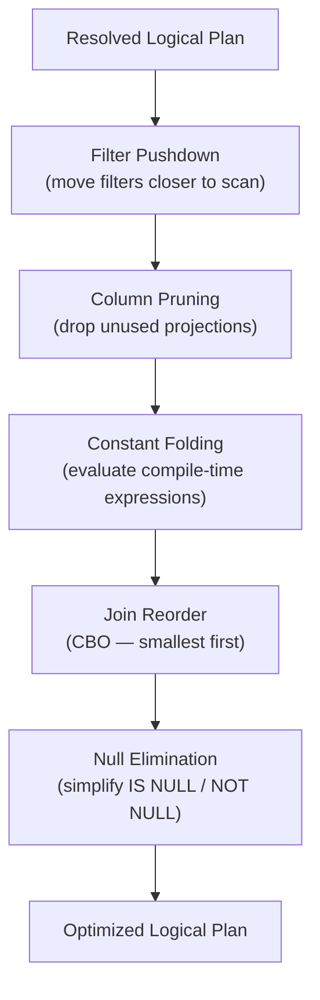

# :material-map-legend: Logical Optimization

After the Analyzer resolves column names and types, the Optimizer applies a set of
**rule-based rewrites** to the logical plan. Each rule transforms the plan tree until
no more rules can fire. The Catalyst framework makes it easy to add custom rules.

---

## :material-sitemap: Rule Application Flow



---

## :material-filter: Rule 1 — Predicate Pushdown

Moves filter conditions as close to the data source as possible.

```sql
-- Original query
SELECT o.order_id, c.name
FROM orders o JOIN customers c ON o.customer_id = c.id
WHERE o.region = 'US' AND c.status = 'active';

-- After pushdown (conceptual rewrite):
-- filters applied to each side BEFORE the join
SELECT o.order_id, c.name
FROM (SELECT * FROM orders WHERE region = 'US') o
JOIN (SELECT * FROM customers WHERE status = 'active') c
  ON o.customer_id = c.id;
```

!!! tip "Parquet benefit"
    For Parquet/ORC/Delta, the filter is further pushed to the file reader
    so unmatched row-groups are skipped before any deserialization.

---

## :material-table-column-remove: Rule 2 — Column Pruning (Projection Pushdown)

Removes columns that are not referenced anywhere in the query.

```sql
-- Only order_id, amount, region are projected — all other columns dropped
SELECT order_id, SUM(amount)
FROM orders
WHERE region = 'US'
GROUP BY order_id;
-- ReadSchema in EXPLAIN will list only: order_id, amount, region
```

---

## :material-calculator: Rule 3 — Constant Folding

Evaluates constant expressions at compile time.

```sql
-- Written by developer
SELECT * FROM orders WHERE amount > 500 * 2;

-- Optimizer rewrites to
SELECT * FROM orders WHERE amount > 1000;

-- Similarly
SELECT 1 + 1 AS two;         -- → literal 2
SELECT UPPER('us') = 'US';   -- → literal true
```

---

## :material-sort-variant: Rule 4 — Join Reorder (CBO)

With `spark.sql.cbo.joinReorder.enabled = true` and collected stats, Catalyst reorders
multi-way joins so the smallest intermediate result comes first.

```sql
-- Enable CBO
SET spark.sql.cbo.enabled = true;
SET spark.sql.cbo.joinReorder.enabled = true;

-- Collect stats for all tables
ANALYZE TABLE orders   COMPUTE STATISTICS FOR ALL COLUMNS;
ANALYZE TABLE products COMPUTE STATISTICS FOR ALL COLUMNS;
ANALYZE TABLE regions  COMPUTE STATISTICS FOR ALL COLUMNS;

-- Catalyst reorders the three-way join based on estimated row counts
SELECT o.order_id, p.name, r.region_name
FROM orders o
JOIN products p ON o.product_id = p.id
JOIN regions  r ON o.region_id  = r.id
WHERE p.category = 'electronics';
```

---

## :material-null: Rule 5 — Null Propagation and Simplification

```sql
-- Optimizer eliminates always-false or always-true conditions
SELECT * FROM orders WHERE NULL = NULL;    -- → always false → empty scan
SELECT * FROM orders WHERE NULL IS NULL;   -- → always true → drop filter

-- IS NOT NULL pulled from join condition
SELECT * FROM a JOIN b ON a.id = b.id;
-- Optimizer adds implicit IS NOT NULL(a.id) IS NOT NULL(b.id)
```

---

## :material-table: Key Logical Optimization Rules

| Rule | Transformation |
|------|---------------|
| `PushDownPredicate` | Move `Filter` below `Join`, `Aggregate`, `Project` |
| `ColumnPruning` | Remove unused `Project` nodes |
| `ConstantFolding` | Evaluate literals at plan time |
| `NullPropagation` | Simplify IS NULL / NOT NULL conditions |
| `BooleanSimplification` | `a AND true` → `a`, `a OR false` → `a` |
| `CombineFilters` | Merge adjacent `Filter` nodes into one |
| `CombineUnions` | Flatten nested `UNION` trees |
| `ReorderJoin` (CBO) | Reorder multi-way joins by estimated row count |
| `EliminateOuterJoin` | Convert LEFT JOIN to INNER when WHERE filters NULLs |

---

## :material-eye: Inspecting Logical Plans

```sql
-- Compare resolved vs optimized plan
EXPLAIN EXTENDED
SELECT SUM(amount * 1.0)
FROM orders
WHERE region = 'US' AND amount > 100 * 5;
```

Look at `== Analyzed Logical Plan ==` vs `== Optimized Logical Plan ==`
to see which rules fired.
