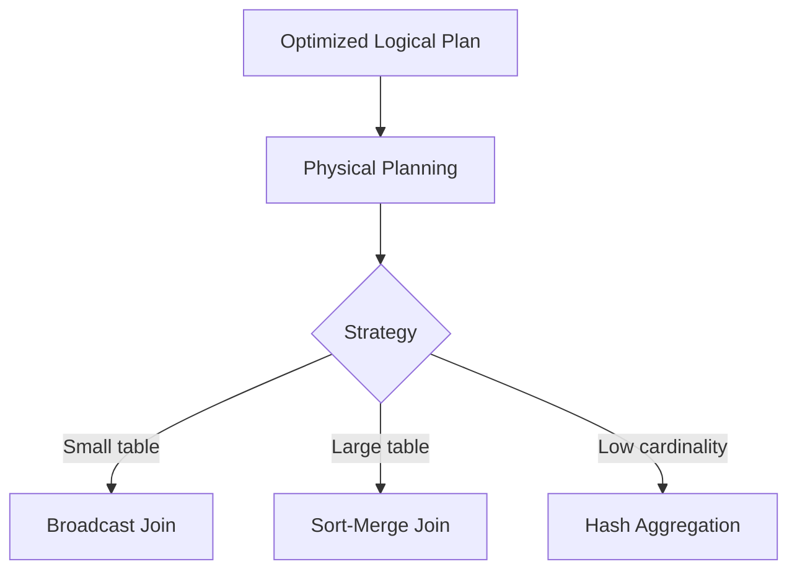

# :material-server: Physical Planning

Physical planning selects concrete execution operators for a logical plan.

### :material-sitemap: Overview



---

## 📌 What It Chooses

| Choice | Examples |
|--------|----------|
| Join strategy | Broadcast, sort-merge |
| Aggregation | Hash agg, sort agg |
| Scan | Parquet/ORC/Delta scan |

---

## 🧪 Example

```sql
EXPLAIN FORMATTED SELECT * FROM orders JOIN customers USING (id);
```

---

## 🧠 When to Use

| Scenario | Recommendation |
|----------|----------------|
| Validate join type | Check physical plan |
| Tuning | Compare strategies |
