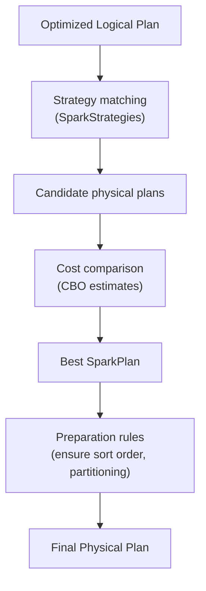
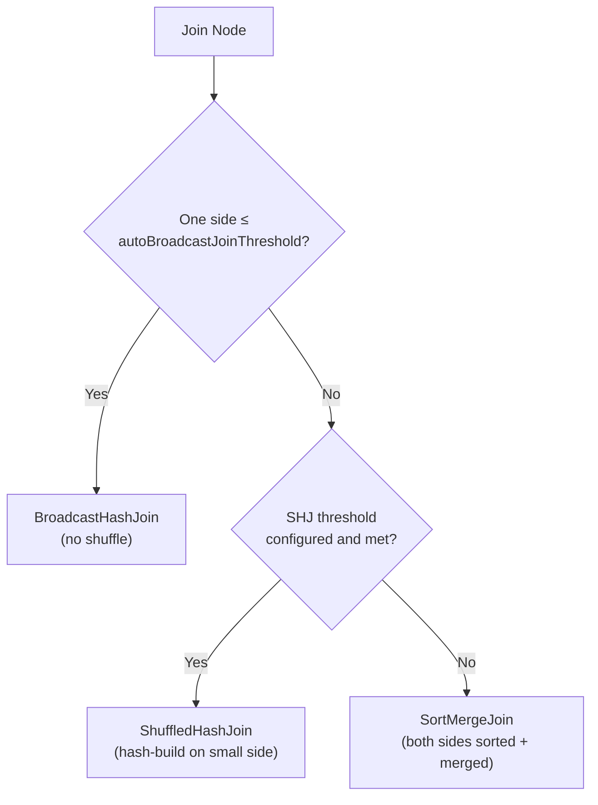
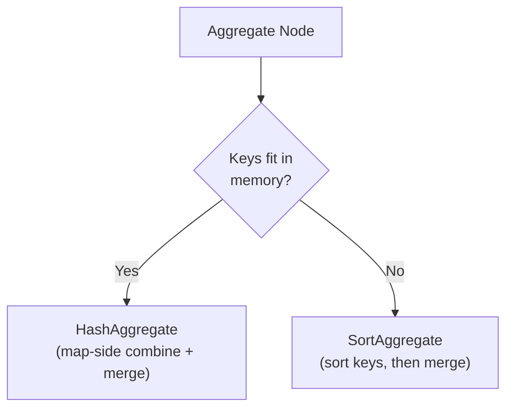

# :material-server: Physical Planning

Physical planning converts the optimized logical plan into one or more candidate
`SparkPlan` trees and selects the best one using cost estimates.

---

## :material-sitemap: Physical Planning Flow



---

## :material-lan-connect: Join Strategy Selection

Catalyst evaluates join strategies in priority order:



| Strategy | Shuffle | Sort | Best for |
|----------|:-------:|:----:|---------|
| BroadcastHashJoin (BHJ) | None | None | Small dimension table |
| ShuffledHashJoin (SHJ) | Both | None | Medium tables, high cardinality |
| SortMergeJoin (SMJ) | Both | Both | Large-large joins |
| BroadcastNestedLoopJoin | None | None | Non-equi joins (small table only) |

```sql
-- Force BHJ
SELECT /*+ BROADCAST(d) */ f.*, d.name
FROM fact f JOIN dim d ON f.dim_id = d.id;

-- Force SMJ
SELECT /*+ MERGE(a, b) */ * FROM a JOIN b ON a.id = b.id;

-- Force SHJ
SELECT /*+ SHUFFLE_HASH(a) */ * FROM a JOIN b ON a.id = b.id;

-- See chosen strategy in EXPLAIN
EXPLAIN FORMATTED
SELECT f.order_id, d.category
FROM fact_orders f JOIN dim_product d ON f.product_id = d.id;
```

---

## :material-sigma: Aggregation Strategy Selection



```sql
-- Check whether Hash or Sort aggregation was chosen
EXPLAIN FORMATTED
SELECT region, COUNT(*) FROM orders GROUP BY region;
-- Look for: HashAggregate (fast) vs SortAggregate (slow)
```

---

## :material-file-search: Scan Operator Selection

| Scan type | Operator | Triggered when |
|-----------|----------|---------------|
| Parquet / Delta | `FileScan parquet` | Parquet-backed table |
| Delta log | `FileScan parquet (Delta)` | Delta table |
| ORC | `FileScan orc` | ORC table |
| CSV / JSON | `FileScan text` | Row-format table |
| In-memory cache | `InMemoryTableScan` | `CACHE TABLE` was called |
| JDBC | `JDBCRelation` | External JDBC source |

```sql
-- Verify scan and pushed filters
EXPLAIN FORMATTED
SELECT order_id FROM orders
WHERE region = 'US' AND order_date >= '2024-01-01';
-- FileScan → PartitionFilters, PushedFilters, ReadSchema
```

---

## :material-wrench: Physical Plan Configuration

```sql
-- Raise broadcast threshold (default 10 MB)
SET spark.sql.autoBroadcastJoinThreshold = 52428800;   -- 50 MB

-- Enable SHJ for tables above broadcast threshold
SET spark.sql.adaptive.maxShuffledHashJoinLocalMapThreshold = 67108864; -- 64 MB

-- Disable broadcast for debugging
SET spark.sql.autoBroadcastJoinThreshold = -1;

-- Verify plan after config change
EXPLAIN FORMATTED SELECT ...;
```

---

## :material-clipboard-list: Reading Physical Plan Output

```
== Physical Plan ==
AdaptiveSparkPlan (1)
+- SortMergeJoin (2) Inner, [customer_id]         ← join strategy
   :- Sort (3) [customer_id ASC]                  ← sort needed for SMJ
   :  +- Exchange (4) hashpartitioning(customer_id, 200)  ← shuffle
   :     +- Filter (5) (region = US)              ← pushed-down filter
   :        +- FileScan parquet (6)                ← actual file read
   :           PartitionFilters: []
   :           PushedFilters: [IsNotNull(region), EqualTo(region,US)]
   :           ReadSchema: struct<customer_id:int,region:string,amount:decimal>
   +- Sort (7) ...
      +- Exchange (8) ...
         +- FileScan parquet (9) ...
```

**Key nodes to look for:**

| Node | Meaning |
|------|---------|
| `BroadcastHashJoin` | Good — small table broadcast, no shuffle |
| `SortMergeJoin` | Both sides shuffled and sorted |
| `Exchange hashpartitioning` | Shuffle for join/agg |
| `Exchange rangepartitioning` | Shuffle for global sort |
| `WholeStageCodegen` | Codegen enabled for this operator group |
| `InMemoryTableScan` | Reading from cache |
