# :material-play-circle: SQL Execution in Spark

Spark SQL transforms a SQL string into distributed computation through a multi-stage
pipeline. Understanding this pipeline helps you write faster queries and interpret
`EXPLAIN` output.

---

## :material-information-outline: Logical Execution Order

The order you write clauses in a `SELECT` statement is **not** the order Spark evaluates them.

```sql
SELECT   country, AVG(salary) AS avg_salary   -- 5. project columns
FROM     employees                             -- 1. scan source
WHERE    age > 30                              -- 2. row-level filter
GROUP BY country                              -- 3. aggregate
HAVING   AVG(salary) > 50000                  -- 4. aggregate filter
ORDER BY avg_salary DESC                      -- 6. sort
LIMIT    10;                                  -- 7. truncate
```

| Step | Clause | What happens |
|------|--------|--------------|
| 1 | `FROM` / `JOIN` | Tables are scanned; joins are planned |
| 2 | `WHERE` | Row-level predicates filter individual rows |
| 3 | `GROUP BY` | Rows are grouped by key columns |
| 4 | `HAVING` | Aggregate predicates filter groups |
| 5 | `SELECT` | Expressions and aliases are evaluated |
| 6 | `ORDER BY` | Rows are sorted — triggers a global shuffle |
| 7 | `LIMIT` | Result set is truncated |

!!! note "Alias visibility"
    Column aliases defined in `SELECT` are **not** visible in `WHERE` or `HAVING` —
    both clauses execute before `SELECT`. Use a CTE or subquery to reference an alias
    in a filter.

---

## :material-sitemap: Query Pipeline Overview

```mermaid
graph LR
    A[SQL String] --> B[Parser]
    B --> C[Unresolved Logical Plan]
    C --> D[Analyzer]
    D --> E[Resolved Logical Plan]
    E --> F[Catalyst Optimizer]
    F --> G[Optimized Logical Plan]
    G --> H[Physical Planner]
    H --> I[Physical Plan]
    I --> J[Code Generation]
    J --> K[Execute on Executors]
    K --> L[Results]
```



Each stage is described in detail in the companion pages:

| Page | Covers |
|------|--------|
| [Query Lifecycle](query_lifecycle.md) | Parse → Analyze → Optimize → Physical Plan → Execute |
| [EXPLAIN Plans](explain.md) | Reading `EXPLAIN` output at every verbosity level |
| [Predicate Pushdown](../predicate_pushdown.md) | Pushing filters to storage and partition pruning |
| [Broadcast Join](../../join/strategy/bhj.md) | Small-table broadcast vs sort-merge join |
| [Shuffling](../shuffling.md) | Repartition, coalesce, and shuffle cost |

---

## :material-flask-outline: End-to-End Example

```sql
SELECT
    country,
    AVG(salary) AS avg_salary
FROM employees
WHERE age > 30
GROUP BY country
HAVING AVG(salary) > 50000
ORDER BY avg_salary DESC
LIMIT 10;
```

Spark executes this as:

1. **Scan** `employees` — reads only `age`, `salary`, `country` columns (projection pushdown).
2. **Filter** `age > 30` — applied at scan time via predicate pushdown.
3. **Partial aggregate** on each executor — local `SUM(salary)`, `COUNT(*)` per `country`.
4. **Shuffle** by `country` — ensures all rows for the same country land on the same executor.
5. **Final aggregate** — computes global `AVG(salary)` per `country`.
6. **Filter** `AVG(salary) > 50000` — HAVING applied after aggregation.
7. **Sort** `avg_salary DESC` — global sort triggers another shuffle.
8. **Limit** 10 — only the first 10 rows are returned to the driver.
