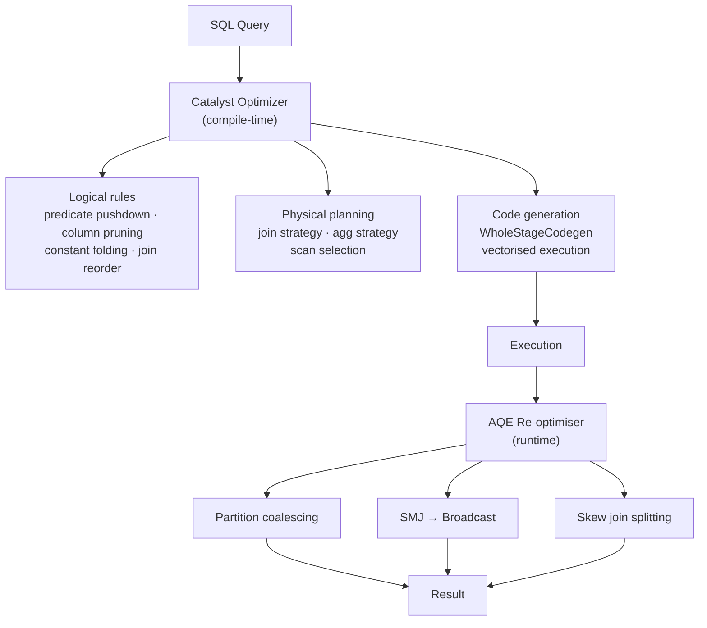

# :material-speedometer: Spark SQL Optimization

Spark SQL optimization operates at multiple levels — from the Catalyst rule engine
that rewrites logical plans, to AQE that adapts plans at runtime, to storage-level
techniques like partitioning and Z-ORDER. This section covers them all.

---

## :material-sitemap: Optimization Layers



---

## :material-compare: Optimization Techniques at a Glance

| Technique | Layer | Impact | Effort |
|-----------|-------|:------:|:------:|
| Predicate pushdown | Catalyst / storage | High | Zero — automatic |
| Column pruning | Catalyst | Medium | Zero — automatic |
| Partition pruning | Storage | High | Low — use partition column in WHERE |
| Broadcast join | Catalyst / AQE | High | Low — hint or threshold config |
| AQE partition coalescing | AQE | Medium | Zero — enabled by default |
| AQE skew join | AQE | High | Zero — enabled by default |
| CACHE TABLE | Memory | High (repeated queries) | Low |
| Shuffle minimisation | Shuffle | High | Medium |
| Z-ORDER (Delta) | Storage | High | Low — OPTIMIZE … ZORDER |
| Statistics (`ANALYZE`) | Catalyst CBO | Medium | Low — run ANALYZE TABLE |
| Bucketing | Storage / join | High | Medium — schema change |

---

## :material-flash: SQL Hints Reference

```sql
-- Broadcast: force small table to be broadcast
SELECT /*+ BROADCAST(dim) */ f.*, dim.name
FROM fact f JOIN dim ON f.id = dim.id;

-- Sort-merge join: force SMJ even if broadcast threshold is met
SELECT /*+ MERGE(orders, customers) */ *
FROM orders JOIN customers ON orders.customer_id = customers.id;

-- Shuffled hash join
SELECT /*+ SHUFFLE_HASH(orders) */ *
FROM orders JOIN customers ON orders.customer_id = customers.id;

-- Repartition before write
SELECT /*+ REPARTITION(200, region) */ * FROM sales;

-- Rebalance (AQE-adaptive)
SELECT /*+ REBALANCE */ * FROM staging;

-- Coalesce output
SELECT /*+ COALESCE(10) */ * FROM daily_agg;
```

---

## :material-alert-circle: Top Performance Anti-Patterns

| Anti-pattern | Problem | Fix |
|--------------|---------|-----|
| `SELECT *` | Reads all columns — wastes I/O | Select only needed columns |
| UDF in `WHERE` | Blocks predicate pushdown | Rewrite as SQL expression |
| High-cardinality `PARTITION BY` | Millions of tiny directories | Partition by date/region, not IDs |
| Skipped `ANALYZE TABLE` | Catalyst makes wrong join choices | Run `ANALYZE TABLE … COMPUTE STATISTICS` |
| Cross join | Cartesian explosion | Always specify join condition |
| `NOT IN (subquery)` with NULLs | Returns 0 rows silently | Use `NOT EXISTS` |
| Repeated identical subquery | Recomputed multiple times | Move to CTE or cached temp view |
| Too many small files | Slow metadata listing | Run `OPTIMIZE` (Delta) or use `REBALANCE` |

---

## :material-book-open-variant: In This Section

| Page | Contents |
|------|----------|
| [Techniques](optimization.md) | Full checklist — I/O, joins, aggregation, skew, storage |
| [Catalyst](catalyst/index.md) | Parser → Analyzer → Optimizer → Planner → Codegen |
| [Caching](caching/index.md) | `CACHE TABLE`, storage levels, config, eviction |
| [Shuffling](shuffling.md) | Shuffle mechanics, cost, minimisation strategies |
| [Profiling](profiling.md) | `EXPLAIN`, Spark UI, metrics, bottleneck identification |
