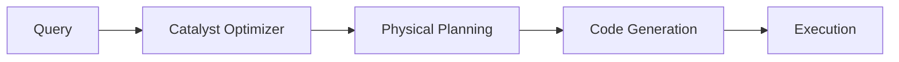

# :material-speedometer: Optimization Overview

Spark SQL optimization focuses on reducing I/O, shuffles, and skew.
The Catalyst optimizer and AQE automatically apply many improvements, but
manual tuning is sometimes required.

### :material-sitemap: Overview



---

## 📌 Common Techniques

| Technique | Benefit |
|----------|---------|
| Predicate pushdown | Read fewer files |
| Partition pruning | Skip partitions |
| Broadcast joins | Avoid shuffle |
| Caching | Reuse computed results |
| Repartitioning | Balance workloads |

---

## 🧪 Example

```sql
SELECT /*+ BROADCAST(dim) */
  f.order_id, dim.region
FROM fact_orders f
JOIN dim_region dim
ON f.region_id = dim.id;
```

---

## 🧠 When to Use

| Scenario | Recommendation |
|----------|----------------|
| Repeated queries | Cache results |
| Small dimension tables | Broadcast join |
| Skewed keys | Repartition or skew hints |

---

### Related Guides

- [Profiling](profiling.md)
- [Shuffling](shuffling.md)
- [Caching](caching/index.md)
- [Catalyst](catalyst/index.md)
