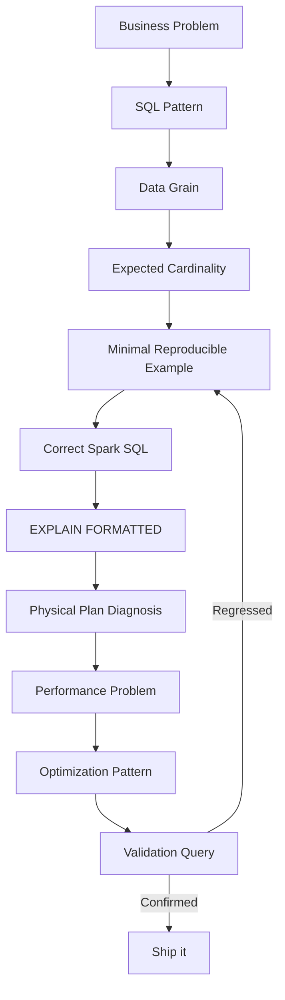

# :material-tune: Optimization Techniques

A practical checklist of Spark SQL optimisations ordered by impact and ease of application.

______________________________________________________________________

## :material-map-marker-path: The Problem-to-Validation Workflow

Before reaching for a specific technique below, work the problem through this pipeline —
skipping a stage is how "optimizations" silently change what the query returns instead
of just how fast it runs:



Worked end-to-end on a real recurring problem — "revenue per customer looks inflated" —
using pieces that are each Spark 4.2-verified elsewhere in this documentation:

| Stage                            | Concrete instance                                                                                                                      |
| -------------------------------- | -------------------------------------------------------------------------------------------------------------------------------------- |
| **Business Problem**             | "Total revenue per customer is higher than finance's numbers."                                                                         |
| **SQL Pattern**                  | Fact table (`orders`) joined to a one-to-many side (`payments`), then aggregated.                                                      |
| **Data Grain**                   | One row per **order**, not one row per **payment attempt** — the aggregate must be at order grain.                                     |
| **Expected Cardinality**         | `COUNT(DISTINCT order_id)` on `orders`, not the joined row count — see [Data Explosion](../querying/joins/issues/data-explosion.md).   |
| **Minimal Reproducible Example** | 3 orders, 5 payment rows (one order has 3 payment attempts) — small enough to eyeball by hand.                                         |
| **Correct Spark SQL**            | Pre-aggregate `payments` (or dedupe to one row per order) *before* joining — never `SUM` a fact column straight out of a fan-out join. |
| **`EXPLAIN FORMATTED`**          | Read the numbered physical plan top-down (see [Join Debugging Workflow](../querying/joins/issues/debugging-workflow.md), step 9).      |
| **Physical Plan Diagnosis**      | Confirm the join happens **before** or **after** the `HashAggregate` — that ordering is the whole bug.                                 |
| **Performance Problem**          | Aggregating after the join processes every raw payment row through the join *and* the aggregate — wasted shuffle and compute.          |
| **Optimization Pattern**         | Pre-aggregate before joining — see [Join Order: Pre-Aggregate](../querying/joins/issues/join-order-optimizer.md).                      |
| **Validation Query**             | Reconcile the metric independently of the join — see [Metric Reconciliation Guardrail](../querying/joins/issues/data-explosion.md).    |

!!! tip "The pipeline is symptom-agnostic"

    The same eleven stages apply whether the underlying issue is a fan-out join, an
    unpruned partition scan, a recomputed CTE, or an unsupported correlated subquery —
    only the middle three stages (SQL Pattern / Physical Plan Diagnosis / Optimization
    Pattern) change per problem. Treat "Validation Query" as mandatory, not optional:
    a fix that isn't re-checked against the expected cardinality/metric is a guess, not
    a fix.

### :material-checkbox-multiple-marked-outline: The Six-Axis Quality Rubric

SQL syntax alone doesn't tell you whether a Spark SQL solution is good — a query can be
syntactically valid and still be silently wrong or silently slow. Judge every query
against all six axes, not just the ones that happen to be easy to check:

|  #  | Axis                    | Question to ask                                                                                    | Verified example                                                                                                                                                                |
| :-: | ----------------------- | -------------------------------------------------------------------------------------------------- | ------------------------------------------------------------------------------------------------------------------------------------------------------------------------------- |
|  1  | **Logical correctness** | Does the query express the actual business rule (join type, `ON` vs `WHERE`, NULL handling)?       | [Outer Join Filter Pitfall](../querying/joins/issues/outer-join-filter-pitfall.md), [ON vs WHERE](../querying/joins/issues/predicate-vs-filter.md)                              |
|  2  | **Cardinality**         | Does the output row count match the grain you expect — 1:1, 1:N, or N:M?                           | [Data Explosion](../querying/joins/issues/data-explosion.md), [Duplicate-Key Explosion](../querying/joins/issues/duplicate-key-explosion.md)                                    |
|  3  | **Physical plan**       | What does `EXPLAIN FORMATTED` actually choose — `BroadcastHashJoin`, `SortMergeJoin`, nested loop? | [Join Debugging Workflow](../querying/joins/issues/debugging-workflow.md) (step 9), [Duplicate-Key Explosion](../querying/joins/issues/duplicate-key-explosion.md) (Example 3b) |
|  4  | **Shuffle**             | How many `Exchange` nodes are in the plan, and how much data moves through each?                   | [Shuffling](shuffling.md), [Join Order / Optimizer](../querying/joins/issues/join-order-optimizer.md)                                                                           |
|  5  | **Data distribution**   | Is one key's duplication or skew hiding inside an average or a small test dataset?                 | [Skewed Join Keys](../querying/joins/issues/skewed-keys.md)                                                                                                                     |
|  6  | **Memory**              | Would the broadcast side, the exploded join output, or a spilling shuffle actually fit?            | [Broadcast Join Pitfalls](../querying/joins/issues/broadcast-pitfalls.md)                                                                                                       |

!!! danger "Passing one axis says nothing about the others"

    A query with perfect logical correctness can still explode in cardinality
    (Example: a clean `ON` clause joined against a duplicated dimension). A query with
    the right cardinality can still pick a disastrous physical plan (a non-equi
    condition forcing `CartesianProduct`). Verifying only the axis that's failing
    today, and shipping, is how the *other* five axes' bugs surface later in
    production — check all six before calling a fix done.

### :material-file-document-outline: Deep-Dive Page Template

Every issue deep-dive in this documentation (the pages linked from the rubric above)
follows the same twelve-part structure — use it both to write new pages and to review
whether an existing one is complete. [Duplicate-Key Explosion](../querying/joins/issues/duplicate-key-explosion.md)
is a fully worked reference implementation of all twelve parts:

|  #  | Section                                      | Reference implementation                                                                              |
| :-: | -------------------------------------------- | ----------------------------------------------------------------------------------------------------- |
|  1  | **Realistic business scenario**              | Overview + Common Symptoms — clicks/purchases and customer/orders framed as real business data        |
|  2  | **Sample tables/data**                       | Setup — small, hand-checkable `INSERT`s                                                               |
|  3  | **Runnable Spark SQL**                       | Every example is a complete, copy-pasteable query, not a fragment                                     |
|  4  | **Wrong/problematic SQL**                    | Example 1 — The Bug                                                                                   |
|  5  | **Correct SQL**                              | Example 3 / Example 4 — the fixed queries                                                             |
|  6  | **Diagnostic query**                         | Example 2 — cardinality check on both sides                                                           |
|  7  | **`EXPLAIN FORMATTED` pattern**              | Example 2b / Example 3b — verified plan shapes and what each token means                              |
|  8  | **Root cause**                               | The `N x M` explanation in the page intro and Example 1's narrative                                   |
|  9  | **Resolution**                               | Examples 3 and 4 — reduce each side to its true grain before joining                                  |
| 10  | **Performance optimization**                 | Example 2b's note on where the shuffle cost actually lands (downstream, not in the join itself)       |
| 11  | **Common anti-patterns**                     | The `!!! danger` callouts — `SELECT DISTINCT` doesn't fix it; one-sided dedup under-fixes it          |
| 12  | **Databricks/Spark-specific considerations** | The dedicated section — `MERGE INTO`'s duplicate-source guard, and why `OPTIMIZE`/`ZORDER` don't help |

!!! tip "Not every page needs all twelve in equal depth"

    A simple, low-risk issue (e.g. a straightforward type mismatch) may cover several
    parts in one short example. Reserve the full twelve-part treatment for issues that
    are easy to get subtly wrong or that recur often in production — exactly the kind
    this documentation set is built to prevent.

______________________________________________________________________

## :material-magnify: I/O Optimisations

### Column Pruning — select only what you need

```sql
-- Bad: reads all columns from Parquet
SELECT * FROM orders WHERE region = 'US';

-- Good: only 3 columns read from storage
SELECT order_id, amount, region FROM orders WHERE region = 'US';
```

### :material-animation-play: Interactive Visualization — Pushdown vs UDF-Blocked Filter

<div id="viz-pushdown-compare" class="ts-viz"></div>

Toggle between a direct column filter and a UDF-wrapped filter to see the `PushedFilters`
difference, verified against a real `EXPLAIN FORMATTED` run on PySpark 4.2.

### Predicate Pushdown — filter early

```sql
-- Predicate pushed to Parquet row-group scan — reads far less data
SELECT order_id, amount
FROM orders
WHERE region = 'US' AND amount > 500 AND order_date >= '2024-01-01';

-- UDFs BLOCK pushdown — avoid in WHERE when predicates can be expressed in SQL
-- Bad:
SELECT * FROM orders WHERE my_udf(region) = 'US';
-- Good:
SELECT * FROM orders WHERE region = 'US';
```

### Partition Pruning

```sql
-- Partitioned table: filter on partition column skips entire directories
SELECT * FROM events
WHERE event_date = '2024-06-01'   -- partition prune
  AND event_type = 'click';        -- row-group filter

-- Avoid functions on partition columns — they break pruning
-- Bad:  WHERE YEAR(event_date) = 2024
-- Good: WHERE event_date >= '2024-01-01' AND event_date < '2025-01-01'
```

### Use Columnar Formats

```sql
-- Create table in Parquet or Delta — columnar, compressed, splittable
CREATE TABLE analytics.orders
USING DELTA
PARTITIONED BY (order_date);

-- Avoid CSV for large production tables — no column pruning, no stats
```

______________________________________________________________________

## :material-lan-connect: Join Optimizations

### Broadcast Small Dimension Tables

```sql
-- Hint: force broadcast even if table is above autoBroadcastJoinThreshold
SELECT /*+ BROADCAST(d) */ f.order_id, d.region_name
FROM fact_orders f
JOIN dim_region d ON f.region_id = d.id;

-- Config: raise global threshold (100 MB)
SET spark.sql.autoBroadcastJoinThreshold = 104857600;
```

### Collect Statistics for Cost-Based Optimiser (CBO)

```sql
-- Without stats, Catalyst uses defaults — may choose wrong join order
ANALYZE TABLE orders COMPUTE STATISTICS;
ANALYZE TABLE customers COMPUTE STATISTICS FOR COLUMNS id, region, status;

-- Enable CBO (default in Spark 3.x)
SET spark.sql.cbo.enabled = true;
SET spark.sql.cbo.joinReorder.enabled = true;
```

### Avoid Cartesian / Cross Joins

```sql
-- Dangerous — every row × every row
SELECT * FROM a, b;           -- implicit cross join
SELECT * FROM a CROSS JOIN b; -- explicit cross join

-- Always specify a join condition
SELECT a.*, b.name FROM a JOIN b ON a.id = b.id;
```

### Pre-filter Before Joining

```sql
-- Filter each side before the join to minimise shuffle data
SELECT f.order_id, d.quarter
FROM (SELECT * FROM fact_orders WHERE order_date >= '2024-01-01') f
JOIN (SELECT * FROM dim_date WHERE year = 2024) d
  ON f.order_date = d.date_key;
```

______________________________________________________________________

## :material-sigma: Aggregation Optimisations

### Partial Aggregation (Map-Side Combine)

Spark automatically applies partial aggregation before the shuffle for `SUM`,
`COUNT`, `MIN`, `MAX`. Ensure you do not suppress this with `DISTINCT` inside aggregates
unless needed.

```sql
-- Good: partial agg reduces shuffle data
SELECT region, SUM(amount) FROM orders GROUP BY region;

-- Expensive: COUNT DISTINCT forces a full shuffle with no partial reduction
SELECT region, COUNT(DISTINCT customer_id) FROM orders GROUP BY region;

-- Alternative: approximate distinct count (faster, slight inaccuracy)
SELECT region, APPROX_COUNT_DISTINCT(customer_id) FROM orders GROUP BY region;
```

### Filter Before GROUP BY

```sql
-- Push filters to WHERE, not HAVING, to reduce rows in the aggregation
-- Bad (HAVING filters after aggregation):
SELECT region, SUM(amount) AS total
FROM orders
GROUP BY region
HAVING region = 'US';

-- Good (WHERE filters before aggregation):
SELECT region, SUM(amount) AS total
FROM orders
WHERE region = 'US'
GROUP BY region;
```

______________________________________________________________________

## :material-scale-unbalanced: Skew Handling

```sql
-- AQE handles most skew automatically — ensure it is enabled
SET spark.sql.adaptive.enabled = true;
SET spark.sql.adaptive.skewJoin.enabled = true;

-- For extreme skew (single key with billions of rows), use key salting
-- Step 1: Add random salt to hot key
WITH salted AS (
    SELECT
        CONCAT(CAST(customer_id AS STRING), '_',
               CAST(FLOOR(RAND() * 10) AS STRING)) AS salted_key,
        amount
    FROM orders
    WHERE customer_id = 12345   -- the hot key
    UNION ALL
    SELECT CAST(customer_id AS STRING), amount
    FROM orders
    WHERE customer_id != 12345
)
SELECT SPLIT(salted_key, '_')[0] AS customer_id, SUM(amount)
FROM salted
GROUP BY SPLIT(salted_key, '_')[0];
```

______________________________________________________________________

## :material-database-arrow-down: Storage Optimisations

```sql
-- [Databricks] Compact small files in a partition
OPTIMIZE sales WHERE order_date >= '2024-01-01';

-- [Databricks] Z-ORDER for multi-column skipping within a partition
OPTIMIZE sales ZORDER BY (region, product_id);

-- [Databricks] Remove old file versions
VACUUM sales RETAIN 168 HOURS;  -- keep 7 days

-- Bucketing: co-locate join keys — eliminates shuffle for repeated joins
CREATE TABLE orders_bucketed
USING PARQUET
CLUSTERED BY (customer_id) INTO 200 BUCKETS
AS SELECT * FROM orders;
```

______________________________________________________________________

## :material-cached: Reuse Optimisations

```sql
-- Cache a heavy subquery used in multiple downstream queries
CACHE TABLE clean_orders AS
SELECT order_id, LOWER(TRIM(region)) AS region, amount, order_date
FROM raw_orders
WHERE order_id IS NOT NULL;

-- Use CTEs to prevent repeated evaluation
WITH monthly_totals AS (
    SELECT DATE_TRUNC('month', order_date) AS month, SUM(amount) AS total
    FROM orders
    GROUP BY 1
)
SELECT month, total, total / SUM(total) OVER () AS share
FROM monthly_totals;
```

______________________________________________________________________

## :material-brain: Optimisation Checklist

| #   | Check                                         | Action                                  |
| --- | --------------------------------------------- | --------------------------------------- |
| 1   | Selecting only needed columns?                | Remove `SELECT *`                       |
| 2   | Filters on partition columns?                 | Use partition column in `WHERE`         |
| 3   | No functions on partition columns in `WHERE`? | Replace `YEAR(col)` with range          |
| 4   | Small dimension tables broadcast?             | Use hint or raise threshold             |
| 5   | Table statistics collected?                   | `ANALYZE TABLE … COMPUTE STATISTICS`    |
| 6   | No UDFs blocking pushdown?                    | Rewrite as SQL                          |
| 7   | AQE enabled?                                  | `SET spark.sql.adaptive.enabled = true` |
| 8   | Output file sizes reasonable (64–256 MB)?     | Use `REBALANCE` or `OPTIMIZE`           |
| 9   | Repeated subquery moved to CTE or cache?      | Use CTE or `CACHE TABLE`                |
| 10  | Skew visible in Spark UI?                     | Lower AQE skew thresholds               |
