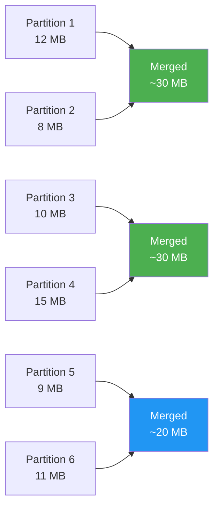

# :material-table-merge-cells: COALESCE

`COALESCE(n)` reduces the number of output partitions by merging adjacent
partitions **without a full shuffle**. It is the cheapest way to reduce the
number of output files when you do not need even distribution.

---

## :material-pin: Syntax

```sql
-- Reduce to n partitions (hint form — SQL only)
SELECT /*+ COALESCE(n) */ columns FROM table [WHERE ...];
```

---

## :material-sitemap: How COALESCE Works



COALESCE **only merges** — it never splits or moves data across executor
boundaries. This means it is O(n) in data movement, not O(n log n) like a shuffle.

---

## :material-flask-outline: Examples

### Reduce output files after a large scan

```sql
-- Without hint: 200 output files (spark.sql.shuffle.partitions default)
-- With COALESCE(10): 10 output files, no shuffle
SELECT /*+ COALESCE(10) */
    region,
    order_date,
    SUM(amount) AS total
FROM orders
WHERE order_date = '2024-06-01'
GROUP BY region, order_date;
```

### Write a single consolidated file

```sql
-- Export as a single CSV (use carefully on large datasets)
SELECT /*+ COALESCE(1) */
    order_id, customer, amount
FROM orders
WHERE region = 'US'
ORDER BY order_date;
```

### Reduce files before writing to Delta

```sql
INSERT INTO analytics.daily_summary
SELECT /*+ COALESCE(5) */
    order_date,
    region,
    COUNT(*)         AS order_count,
    SUM(amount)      AS revenue
FROM orders
WHERE order_date = current_date() - INTERVAL 1 DAY
GROUP BY order_date, region;
```

### COALESCE after a shuffle operation (CTE pattern)

```sql
WITH aggregated AS (
    SELECT region, SUM(amount) AS total
    FROM orders
    GROUP BY region          -- shuffle here
)
SELECT /*+ COALESCE(4) */ *  -- reduce before final write
FROM aggregated
ORDER BY total DESC;
```

---

## :material-compare: COALESCE vs REPARTITION vs REBALANCE

| Feature | `COALESCE(n)` | `REPARTITION(n)` | `REBALANCE` |
|---------|:-------------:|:----------------:|:-----------:|
| Shuffle | No | Yes | Yes (AQE-adaptive) |
| Can increase partitions | No | Yes | Yes |
| Handles skew | No | Yes (with key) | Yes |
| Output file uniformity | Low (may be skewed) | High | High |
| Cost | Cheap | Expensive | Medium |
| Best for | Reducing small files cheaply | Fixing skew | Balanced write under AQE |

---

## :material-magnify: Behavior Notes

1. **No shuffle** — COALESCE merges adjacent partitions on the same executor; no data crosses the network.
2. **Can produce skewed output** — if source partitions are uneven, merged partitions inherit the imbalance.
3. **Cannot increase partition count** — `COALESCE(500)` on a 10-partition dataset has no effect.
4. **Hint is advisory** — the optimizer may ignore the hint if it conflicts with a more efficient plan.
5. **`COALESCE(1)` is dangerous on large data** — all data ends up on one executor; use only for small exports.

---

## :material-brain: When to Use

| Scenario | Recommendation |
|----------|----------------|
| Reduce output file count cheaply | `COALESCE(n)` |
| Source data is already even | `COALESCE(n)` — safe choice |
| Source data is skewed | Prefer `REPARTITION(n, key)` or `REBALANCE` |
| Need to increase parallelism | Use `REPARTITION(n)` instead |
| Small daily partition export | `COALESCE(1)`–`COALESCE(5)` |
