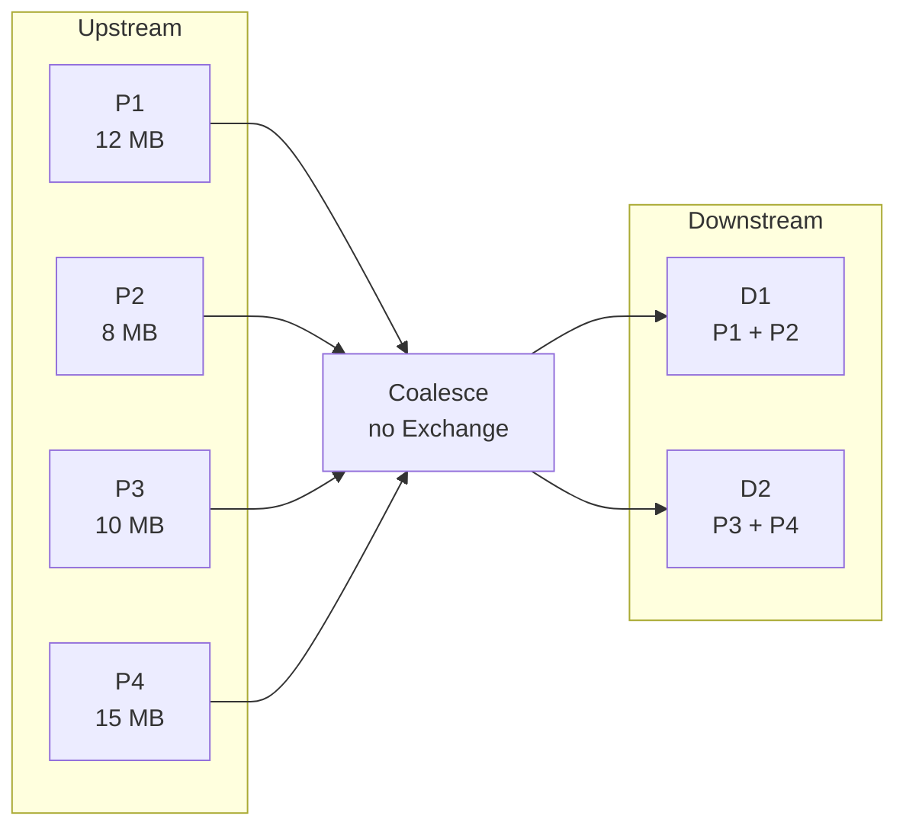

# :material-table-merge-cells: COALESCE

`COALESCE(n)` reduces the number of downstream partitions **without inserting a
full shuffle**. It is the cheapest partition hint when your goal is simply
"fewer tasks/files" rather than even redistribution.

______________________________________________________________________

### :material-animation-play: Interactive Visualization — Coalesce Without a Shuffle

<div id="viz-coalesce-merging" class="ts-viz"></div>

This demo shows several existing partitions collapsing into fewer downstream tasks while staying on the same side of the shuffle boundary.

______________________________________________________________________

## :material-pin: Syntax

```sql
SELECT /*+ COALESCE(n) */ *
FROM table_name;
```

______________________________________________________________________

## :material-check-decagram: Verified Spark 4.2 Findings

PySpark 4.2.0 confirms the following:

- `SELECT /*+ COALESCE(2) */ * FROM range(100)` produces a physical `Coalesce`
    node with **no `Exchange`**.
- `df.coalesce(n)` can only reduce partition count.
- Asking for more partitions than already exist does nothing.

### Verified partition counts

```python
>>> df = spark.range(0, 100, 1, 4)
>>> df.rdd.getNumPartitions()
4
>>> df.coalesce(2).rdd.getNumPartitions()
2
>>> df.coalesce(10).rdd.getNumPartitions()
4

>>> spark.sql("SELECT /*+ COALESCE(2) */ * FROM range(100)").rdd.getNumPartitions()
2
```

### Verified plan

```sql
EXPLAIN FORMATTED
SELECT /*+ COALESCE(2) */ * FROM range(100);

-- == Physical Plan ==
-- Coalesce (2)
-- +- Range (1)
```

That absence of `Exchange RoundRobinPartitioning(...)` or
`Exchange hashpartitioning(...)` is the key difference from `REPARTITION`.

______________________________________________________________________

## :material-sitemap: How COALESCE Works



`COALESCE` keeps a narrow dependency: fewer readers consume the already-created
upstream partitions instead of redistributing every row across the cluster.

______________________________________________________________________

## :material-flask-outline: Verified Examples

### Reduce partitions after a scan

```sql
SELECT /*+ COALESCE(2) */ *
FROM range(100);
```

Verified result in PySpark 4.2:

- Before: `4` partitions for `range(0, 100, 1, 4)`
- After: `2` partitions
- Physical plan: `Coalesce`, not `Exchange`

### `coalesce()` does not increase parallelism

```python
base = spark.range(0, 100, 1, 4)
base.coalesce(10).rdd.getNumPartitions()
# 4
```

Use `repartition(10)` instead when you need more parallel tasks.

### Reduce files after a shuffle you already needed

```sql
WITH aggregated AS (
    SELECT region, SUM(amount) AS total
    FROM orders
    GROUP BY region
)
SELECT /*+ COALESCE(4) */ *
FROM aggregated;
```

This pattern is common near the end of a query plan: let the real work happen,
then shrink the final fan-out before a write.

______________________________________________________________________

## :material-compare: COALESCE vs REPARTITION vs REBALANCE

| Feature                             | `COALESCE(n)` | `REPARTITION(n)` | `REBALANCE(...)`                               |
| ----------------------------------- | ------------- | ---------------- | ---------------------------------------------- |
| Full shuffle                        | No            | Yes              | Yes, when AQE is enabled                       |
| Can increase partitions             | No            | Yes              | Initial shuffle can, final AQE result may vary |
| Best for even distribution          | No            | Yes              | Yes                                            |
| Best for cheap file-count reduction | Yes           | No               | Sometimes, but costlier                        |
| Works without AQE                   | Yes           | Yes              | No meaningful effect                           |

______________________________________________________________________

## :material-magnify: Behavior Notes

1. `COALESCE(1)` is valid, but it serializes the final output into one task.
2. `COALESCE` does **not** fix skew; large upstream partitions stay large.
3. The hint is useful late in a plan, especially before a write.
4. If you need to both reduce and rebalance, prefer `REPARTITION` or
    `REBALANCE` instead.

______________________________________________________________________

## :material-brain: When to Use

| Scenario                                            | Recommendation                         |
| --------------------------------------------------- | -------------------------------------- |
| Reduce output file count cheaply                    | `COALESCE(n)`                          |
| Existing partitions are already reasonably balanced | `COALESCE(n)`                          |
| Need more parallelism                               | `REPARTITION(n)`                       |
| Need to correct skew as well as file count          | `REPARTITION(...)` or `REBALANCE(...)` |
| One small export file                               | `COALESCE(1)` only for small data      |
