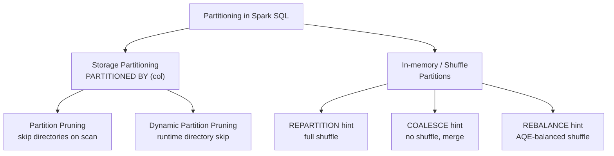

# :material-table-split-cell: Partitioning

Partitioning controls how Spark divides data into logical and physical chunks —
at the storage level (table partitions) and at the in-memory shuffle level
(RDD / DataFrame partitions). Getting partitioning right is the single biggest
lever for query performance and cost.

---

## :material-sitemap: Partitioning Strategies



---

## :material-compare: Strategy Comparison

| Strategy | Shuffle? | Skew-safe? | Use case |
|----------|:--------:|:----------:|----------|
| `PARTITIONED BY (col)` | N/A (storage) | Depends on cardinality | Filter-heavy time-series, regional data |
| `REPARTITION(n)` | Yes | Yes (with key) | Fix skew, pre-write redistribution |
| `COALESCE(n)` | No | No | Cheaply reduce output file count |
| `REBALANCE` | Yes (AQE-adaptive) | Yes | Balanced writes under AQE |

---

## :material-table-plus: Storage Partitioning — `PARTITIONED BY`

Table partitions map to subdirectories on disk. A predicate on the partition
column lets the planner skip entire directories (**partition pruning**).

```sql
-- Partition by date — common for time-series tables
CREATE TABLE sales (
    order_id   BIGINT,
    customer   STRING,
    amount     DOUBLE,
    region     STRING,
    order_date DATE
) USING DELTA
PARTITIONED BY (order_date);

-- Write: each distinct order_date gets its own directory
INSERT INTO sales
SELECT order_id, customer, amount, region, order_date
FROM staging_orders;

-- Read: only 2024-06-01 directory scanned
SELECT region, SUM(amount)
FROM sales
WHERE order_date = '2024-06-01'
GROUP BY region;
```

### Multi-column Partitioning

```sql
-- Partition by (year, region) — nested directory structure
CREATE TABLE events (
    event_id   BIGINT,
    event_type STRING,
    ts         TIMESTAMP
) USING PARQUET
PARTITIONED BY (year INT, region STRING);

-- Directory layout:
-- events/year=2024/region=US/
-- events/year=2024/region=EU/
-- events/year=2023/region=US/
```

### Partition Column Cardinality Guide

| Cardinality | Example | Verdict |
|-------------|---------|:-------:|
| Low (< 100 values) | `region`, `status` | Good partition key |
| Medium (100–10 000) | `country_code`, `product_id` | Use with caution |
| High (> 10 000) | `user_id`, `order_id`, `uuid` | Never partition by these |
| Date-based | `event_date` (daily) | Ideal for time-series |

!!! warning "High-cardinality partition columns"
    Partitioning by a high-cardinality column (e.g., `user_id`) creates thousands
    of tiny directories — causing metastore overload and slow file listing.
    Use **Z-ORDER** (Delta) or bucket joins instead.

---

## :material-lightning-bolt: Dynamic Partition Pruning (DPP)

DPP extends static pruning to runtime — partition directories are skipped based
on values discovered during a broadcast join.

```sql
-- DPP fires automatically when a large partitioned fact joins a small dimension
SELECT f.order_id, d.quarter
FROM fact_orders f                          -- large, partitioned by order_date
JOIN dim_date d ON f.order_date = d.date_key
WHERE d.year = 2024 AND d.quarter = 'Q2';
-- Spark broadcasts dim_date, then skips all fact_orders partitions not in Q2 2024
```

Verify in `EXPLAIN FORMATTED` — look for `DynamicPruningExpression` in the scan node.

---

## :material-file-multiple: Output File Count and the Small-File Problem

| Symptom | Cause | Fix |
|---------|-------|-----|
| Thousands of tiny files | Too many shuffle partitions × partition columns | `COALESCE` or `REBALANCE` before write |
| Slow metastore listing | High-cardinality partition column | Re-design partitioning strategy |
| Skewed output files | Uneven data distribution | `REPARTITION(key)` or `REBALANCE(key)` |
| Reads slow despite pruning | Tiny files inside partitions | `OPTIMIZE` (Delta) or periodic compaction |

```sql
-- Delta: compact small files inside each partition
OPTIMIZE sales WHERE order_date >= '2024-01-01';

-- Delta: Z-ORDER within a partition for column-level skipping
OPTIMIZE sales ZORDER BY (region);
```

---

## :material-brain: When to Use

| Scenario | Recommended strategy |
|----------|---------------------|
| Filter by date / region on every query | `PARTITIONED BY (date)` |
| Pre-write file count control (no skew) | `COALESCE(n)` |
| Fix data skew before write | `REPARTITION(n, key)` |
| AQE-managed balanced output | `REBALANCE` |
| High-cardinality column skipping | Z-ORDER (Delta) |
| Runtime partition skipping via join | Dynamic Partition Pruning |

---

## :material-book-open-variant: In This Section

| Page | Contents |
|------|----------|
| [Coalesce](coalesce.md) | `COALESCE` hint — reduce partitions, no shuffle |
| [Repartition](repartition/repartition_hint.md) | `REPARTITION` hint — shuffle, skew fix |
| [Rebalance](rebalance/rebalance.md) | `REBALANCE` hint — AQE-adaptive redistribution |
