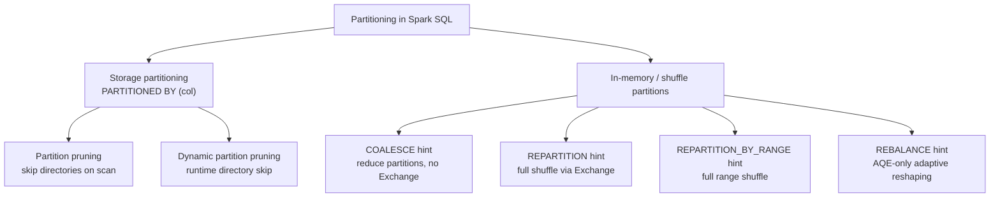

# :material-table-split-cell: Partitioning

Partitioning controls how Spark breaks work into parallel tasks. In this section,
**table partitioning** means directory layout on storage, while **DataFrame / SQL
partition hints** mean in-memory partition counts around exchanges and writes.

______________________________________________________________________

### :material-animation-play: Interactive Visualization — Partition Strategy Selector

<div id="viz-partition-strategy-selector" class="ts-viz"></div>

Use the selector to compare which strategies add a shuffle boundary, which ones can increase parallelism, and which ones rely on AQE to refine the final output.

______________________________________________________________________

## :material-sitemap: Partitioning Strategies



______________________________________________________________________

## :material-check-decagram: Verified Spark 4.2 Behavior

The table below was checked with PySpark 4.2.0 using `EXPLAIN FORMATTED` plus
`df.rdd.getNumPartitions()`.

| Strategy                       | Verified physical behavior                                  | Partition count behavior                                   | Best fit                                   |
| ------------------------------ | ----------------------------------------------------------- | ---------------------------------------------------------- | ------------------------------------------ |
| `COALESCE(n)`                  | `Coalesce` node, **no `Exchange`**                          | Can only reduce                                            | Cheaply reduce output tasks/files          |
| `REPARTITION(n)`               | `Exchange RoundRobinPartitioning(n)`                        | Can increase or decrease                                   | Even redistribution without a key          |
| `REPARTITION(col)`             | `Exchange hashpartitioning(col, 200)` by default            | Uses `spark.sql.shuffle.partitions` when no count is given | Group rows by key before downstream work   |
| `REPARTITION(n, col)`          | `Exchange hashpartitioning(col, n)`                         | Fixed initial shuffle width                                | Full shuffle with explicit partition count |
| `REPARTITION_BY_RANGE(n, col)` | `Exchange rangepartitioning(col ASC NULLS FIRST, n)`        | Fixed initial shuffle width                                | Ordered/range-oriented redistribution      |
| `REBALANCE(...)` with AQE on   | `AdaptiveSparkPlan` + `Exchange ... REBALANCE_PARTITIONS_*` | AQE may coalesce or split after the shuffle                | Final-write balancing                      |
| `REBALANCE(...)` with AQE off  | Hint is ignored; no rebalance operator appears              | Original partitioning stays in place                       | None — enable AQE first                    |

### Verified plan snippets

```sql
EXPLAIN FORMATTED SELECT /*+ COALESCE(2) */ * FROM range(100);
-- == Physical Plan ==
-- Coalesce
-- +- Range

EXPLAIN FORMATTED SELECT /*+ REPARTITION(2) */ * FROM range(100);
-- == Physical Plan ==
-- AdaptiveSparkPlan
-- +- Exchange
--    Arguments: RoundRobinPartitioning(2), REPARTITION_BY_NUM

EXPLAIN FORMATTED SELECT /*+ REPARTITION_BY_RANGE(5, id) */ * FROM range(100);
-- == Physical Plan ==
-- AdaptiveSparkPlan
-- +- Exchange
--    Arguments: rangepartitioning(id ASC NULLS FIRST, 5)
```

______________________________________________________________________

## :material-table-plus: Storage Partitioning — `PARTITIONED BY`

Storage partitioning writes data into directory trees on disk. Filters on the
partition column let Spark skip entire directories before it reads file data.

```sql
CREATE TABLE sales (
    order_id BIGINT,
    customer STRING,
    amount DOUBLE,
    region STRING,
    order_date DATE
) USING PARQUET
PARTITIONED BY (order_date);

SELECT region, SUM(amount)
FROM sales
WHERE order_date = DATE '2024-06-01'
GROUP BY region;
```

### Partition column cardinality guide

| Cardinality | Example                       | Verdict            |
| ----------- | ----------------------------- | ------------------ |
| Low         | `region`, `status`            | Good partition key |
| Medium      | `country_code`, `store_id`    | Use with caution   |
| High        | `user_id`, `order_id`, `uuid` | Avoid              |
| Time-based  | `event_date`                  | Common best choice |

!!! warning "High-cardinality partition columns"

    High-cardinality partition columns create too many directories and too much
    file-listing overhead. Prefer a coarser partition key, then use clustering,
    sorting, or file compaction for the remaining selectivity.

______________________________________________________________________

## :material-lightning-bolt: Dynamic Partition Pruning (DPP)

Dynamic Partition Pruning applies storage pruning at runtime. Spark can learn a
small set of partition values from one side of a join, then skip unrelated
partitions on the larger side.

```sql
SELECT f.order_id, d.quarter
FROM fact_orders AS f
JOIN dim_date AS d
    ON f.order_date = d.date_key
WHERE d.year = 2024
  AND d.quarter = 'Q2';
```

Check `EXPLAIN FORMATTED` for `DynamicPruningExpression` inside the scan.

______________________________________________________________________

## :material-file-multiple: Choosing the Right Tool for File Count

| Goal                                 | Recommended strategy           | Why                                       |
| ------------------------------------ | ------------------------------ | ----------------------------------------- |
| Fewer files, minimal cost            | `COALESCE(n)`                  | Narrow dependency, no full shuffle        |
| Evenly sized output                  | `REPARTITION(n)`               | Round-robin shuffle evens work out        |
| Balance skewed final output with AQE | `REBALANCE`                    | AQE can coalesce and split shuffle output |
| Preserve key grouping                | `REPARTITION(n, key)`          | Hash partitioning by the key              |
| Preserve key order ranges            | `REPARTITION_BY_RANGE(n, key)` | Range partitioning                        |

!!! note "[Databricks] Delta maintenance"

    Commands such as `OPTIMIZE` and `ZORDER` are Databricks-specific follow-up
    tools for compacting files after the write path.

______________________________________________________________________

## :material-brain: When to Use

| Scenario                                                       | Recommendation              |
| -------------------------------------------------------------- | --------------------------- |
| Query filters always hit a date/region column                  | Table `PARTITIONED BY`      |
| Need fewer tasks/files and existing partitioning is acceptable | `COALESCE(n)`               |
| Need a true reshuffle                                          | `REPARTITION(...)`          |
| Need balanced write output under AQE                           | `REBALANCE(...)`            |
| Need range-based partitioning                                  | `REPARTITION_BY_RANGE(...)` |

______________________________________________________________________

## :material-book-open-variant: In This Section

| Page                                           | Contents                                 |
| ---------------------------------------------- | ---------------------------------------- |
| [Coalesce](coalesce.md)                        | `COALESCE` hint and `df.coalesce()`      |
| [Repartition](repartition/repartition-hint.md) | `REPARTITION` and `REPARTITION_BY_RANGE` |
| [Rebalance](rebalance/rebalance.md)            | `REBALANCE` with AQE                     |
