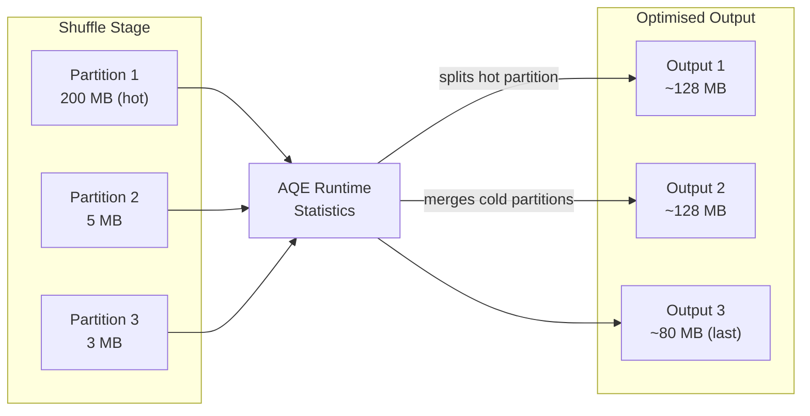

# :material-scale-balance: REBALANCE

`REBALANCE` is an AQE-powered hint that shuffles data into **optimally-sized,
evenly-distributed partitions** at runtime — balancing between `REPARTITION`
(explicit shuffle) and `COALESCE` (no shuffle) by letting the Adaptive Query
Engine decide the final partition count and sizes.

!!! note "Requires AQE"
    `REBALANCE` only takes effect when `spark.sql.adaptive.enabled = true`
    (default in Spark 3.2+). Without AQE it falls back to a standard shuffle.

---

## :material-pin: Syntax

```sql
-- Rebalance without a key — uniform distribution
SELECT /*+ REBALANCE */ * FROM table;

-- Rebalance into n target partitions
SELECT /*+ REBALANCE(n) */ * FROM table;

-- Rebalance by column — co-locate rows with the same key
SELECT /*+ REBALANCE(col) */ * FROM table;

-- Rebalance by count + column
SELECT /*+ REBALANCE(n, col1, col2) */ * FROM table;
```

---

## :material-sitemap: How REBALANCE Works



AQE collects runtime statistics after the shuffle and then coalesces small
partitions and splits large ones to hit the target partition size
(`spark.sql.adaptive.advisoryPartitionSizeInBytes`, default 64 MB).

---

## :material-flask-outline: Examples

### Balanced write without specifying a count

```sql
-- AQE decides how many output files to write
INSERT INTO analytics.orders
SELECT /*+ REBALANCE */
    order_id, customer, amount, region, order_date
FROM staging_orders;
```

### Target a specific file count

```sql
-- Aim for ~20 output partitions; AQE adjusts based on actual data size
SELECT /*+ REBALANCE(20) */
    order_id, region, amount
FROM orders
WHERE order_date = '2024-06-01';
```

### Co-locate by key for downstream joins

```sql
-- Rebalance so all rows for the same customer_id are in the same partition
-- Reduces shuffle in the subsequent join
WITH rebalanced AS (
    SELECT /*+ REBALANCE(customer_id) */
        order_id, customer_id, amount
    FROM orders
)
SELECT r.order_id, c.name, r.amount
FROM rebalanced r
JOIN customers c ON r.customer_id = c.customer_id;
```

### Fix skewed aggregation output

```sql
-- Large regions (US) bloat a single partition; REBALANCE splits them
SELECT /*+ REBALANCE(region) */
    region,
    product_id,
    SUM(amount)  AS revenue,
    COUNT(*)     AS order_count
FROM sales
GROUP BY region, product_id;
```

### Balanced Delta table write (recommended pattern)

```sql
-- Write balanced files into a Delta table — avoid small-file accumulation
INSERT INTO delta.`/mnt/delta/orders/`
SELECT /*+ REBALANCE */
    order_id, customer, amount, region, order_date
FROM staging
WHERE order_date = current_date() - INTERVAL 1 DAY;
```

---

## :material-cog: Relevant Configuration

| Property | Default | Description |
|----------|---------|-------------|
| `spark.sql.adaptive.enabled` | `true` | Must be enabled for REBALANCE to work |
| `spark.sql.adaptive.advisoryPartitionSizeInBytes` | `64m` | Target size per output partition |
| `spark.sql.adaptive.coalescePartitions.minPartitionSize` | `1m` | Minimum partition size after coalescing |
| `spark.sql.adaptive.coalescePartitions.enabled` | `true` | Enable AQE partition coalescing |

```sql
-- Check current advisory partition size
SET spark.sql.adaptive.advisoryPartitionSizeInBytes;

-- Increase target to 128 MB for large writes
SET spark.sql.adaptive.advisoryPartitionSizeInBytes = 134217728;
```

---

## :material-compare: REBALANCE vs REPARTITION vs COALESCE

| Feature | `REBALANCE` | `REPARTITION(n)` | `COALESCE(n)` |
|---------|:-----------:|:----------------:|:-------------:|
| Shuffle | Yes (AQE) | Yes (full) | No |
| Partition count decided at | Runtime | Planning | Planning |
| Handles skew | Yes | Yes (with key) | No |
| Splits large partitions | Yes | Yes | No |
| Merges small partitions | Yes | No | Yes |
| Requires AQE | Yes | No | No |
| Cost | Medium | High | Low |

---

## :material-magnify: Behavior Notes

1. **AQE-only** — without AQE, `REBALANCE` behaves like `REPARTITION(n)` with a fixed count.
2. **Advisory size, not guaranteed** — AQE targets `advisoryPartitionSizeInBytes` but the actual size varies with data distribution.
3. **Key-based REBALANCE preserves locality** — `REBALANCE(col)` groups identical key values but may split a single key across partitions if it exceeds the advisory size.
4. **Better than REPARTITION for Delta writes** — produces near-optimal file sizes without over-specifying a partition count.

---

## :material-brain: When to Use

| Scenario | Recommendation |
|----------|----------------|
| Write balanced files to Delta / Parquet | `REBALANCE` (no count needed) |
| AQE is enabled and you want hands-off tuning | `REBALANCE` |
| Skewed aggregation output | `REBALANCE(key)` |
| Need deterministic, fixed partition count | `REPARTITION(n)` |
| Cheaply reduce files on uniform data | `COALESCE(n)` |
