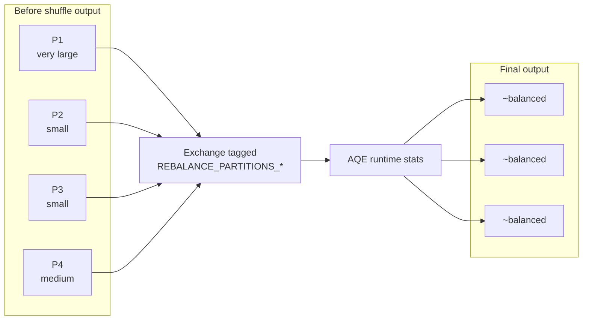

# :material-scale-balance: REBALANCE

`REBALANCE` is an AQE-aware partition hint for reshaping final output after a
shuffle. In Spark 4.2 it is most useful near writes, where AQE can merge small
shuffle partitions and split skewed ones into more practical output chunks.

!!! note "AQE is required"

    In PySpark 4.2, `REBALANCE` only has an effect when
    `spark.sql.adaptive.enabled = true`. With AQE disabled, Spark ignores the
    hint entirely rather than falling back to a normal repartition shuffle.

______________________________________________________________________

### :material-animation-play: Interactive Visualization — REBALANCE With AQE On vs Off

<div id="viz-rebalance-aqe" class="ts-viz"></div>

Toggle AQE to compare a skewed input layout with the adaptive outcome Spark is trying to produce for a write-friendly final stage.

______________________________________________________________________

## :material-pin: Syntax

```sql
SELECT /*+ REBALANCE */ * FROM table_name;
SELECT /*+ REBALANCE(4) */ * FROM table_name;
SELECT /*+ REBALANCE(key_col) */ * FROM table_name;
SELECT /*+ REBALANCE(4, key_col) */ * FROM table_name;
```

______________________________________________________________________

## :material-check-decagram: Verified Spark 4.2 Findings

These checks were run with PySpark 4.2.0.

### With AQE enabled

```sql
EXPLAIN FORMATTED
SELECT /*+ REBALANCE(4) */ * FROM range(100);

-- == Physical Plan ==
-- AdaptiveSparkPlan
-- +- Exchange
--    Arguments: RoundRobinPartitioning(4), REBALANCE_PARTITIONS_BY_NONE
```

```sql
EXPLAIN FORMATTED
SELECT /*+ REBALANCE(4, id) */ * FROM range(100);

-- == Physical Plan ==
-- AdaptiveSparkPlan
-- +- Exchange
--    Arguments: hashpartitioning(id, 4), REBALANCE_PARTITIONS_BY_COL
```

### With AQE disabled

```sql
EXPLAIN FORMATTED
SELECT /*+ REBALANCE(4) */ * FROM range(100);

-- == Physical Plan ==
-- Range
```

No rebalance exchange appears at all. That corrects a common misconception:
`REBALANCE` is **not** a synonym for `REPARTITION` when AQE is off.

### Final plan after execution

On a skewed test dataset, the executed plan finished as an
`AdaptiveSparkPlan isFinalPlan=true` with `AQEShuffleRead skewed` or
`AQEShuffleRead coalesced and skewed`, confirming that AQE can rewrite the
post-shuffle read side after the rebalance exchange is inserted.

______________________________________________________________________

## :material-sitemap: How REBALANCE Works



The hint inserts a rebalance-style shuffle, then AQE decides whether the read
side should be coalesced, split for skew, or both.

______________________________________________________________________

## :material-flask-outline: Verified Examples

### Rebalance without a key

```sql
SELECT /*+ REBALANCE */ *
FROM range(100);
```

Verified initial plan under AQE:

- `AdaptiveSparkPlan`
- `Exchange RoundRobinPartitioning(200), REBALANCE_PARTITIONS_BY_NONE`

The `200` comes from `spark.sql.shuffle.partitions` when no count is supplied.

### Rebalance by key

```sql
SELECT /*+ REBALANCE(4, id) */ *
FROM range(100);
```

Verified initial plan under AQE:

- `AdaptiveSparkPlan`
- `Exchange hashpartitioning(id, 4), REBALANCE_PARTITIONS_BY_COL`

### Why `REBALANCE(4)` is not a fixed output guarantee

A larger skewed test query produced final executed plans such as:

```text
AdaptiveSparkPlan isFinalPlan=true
+- ResultQueryStage
   +- AQEShuffleRead skewed
      +- ShuffleQueryStage
         +- Exchange RoundRobinPartitioning(4), REBALANCE_PARTITIONS_BY_NONE
```

That is the important contract: `4` controls the initial exchange width, but AQE
can still reshape the final read side.

______________________________________________________________________

## :material-cog: Relevant Configuration

| Property                                          | Typical effect                              |
| ------------------------------------------------- | ------------------------------------------- |
| `spark.sql.adaptive.enabled`                      | Must be `true` for the hint to matter       |
| `spark.sql.shuffle.partitions`                    | Default width when `REBALANCE` has no count |
| `spark.sql.adaptive.advisoryPartitionSizeInBytes` | Guides AQE's target output chunk size       |
| `spark.sql.adaptive.coalescePartitions.enabled`   | Lets AQE merge small shuffle partitions     |

```sql
SET spark.sql.adaptive.enabled = true;
SET spark.sql.adaptive.advisoryPartitionSizeInBytes = 134217728;
```

______________________________________________________________________

## :material-compare: REBALANCE vs REPARTITION vs COALESCE

| Feature                             | `REBALANCE(...)`     | `REPARTITION(...)`                 | `COALESCE(n)`                      |
| ----------------------------------- | -------------------- | ---------------------------------- | ---------------------------------- |
| Full shuffle inserted               | Yes, when AQE is on  | Yes                                | No                                 |
| Works with AQE off                  | No meaningful effect | Yes                                | Yes                                |
| Final partition count deterministic | No                   | Usually yes for the exchange       | Yes for the coalesce target        |
| Skew handling help                  | Yes, via AQE         | Only via the shuffle you requested | No                                 |
| Good near writes                    | Yes                  | Sometimes                          | Yes, when data is already balanced |

______________________________________________________________________

## :material-brain: When to Use

| Scenario                                         | Recommendation                              |
| ------------------------------------------------ | ------------------------------------------- |
| AQE-enabled write path needs balanced files      | `REBALANCE`                                 |
| Need a strict, predictable shuffle width         | `REPARTITION(...)`                          |
| Only need fewer partitions and no redistribution | `COALESCE(n)`                               |
| AQE disabled                                     | Do not use `REBALANCE`; choose another hint |
