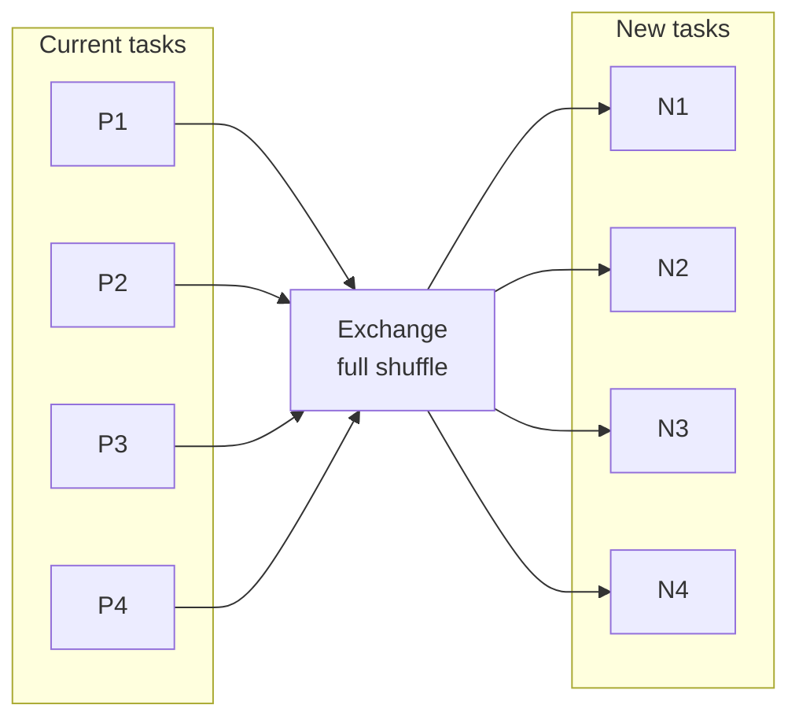

# :material-shuffle-variant: REPARTITION

`REPARTITION` forces a **full shuffle**. Use it when you need a genuine
redistribution step: more partitions, fewer partitions with evenness, or a
specific partitioning rule such as round-robin, hash, or range.

______________________________________________________________________

### :material-animation-play: Interactive Visualization — Repartition Shuffle Modes

<div id="viz-repartition-shuffle" class="ts-viz"></div>

Switch between round-robin, hash, and range modes to see which physical exchange Spark 4.2 builds for each repartition strategy.

______________________________________________________________________

## :material-pin: Syntax

```sql
SELECT /*+ REPARTITION(4) */ * FROM table_name;
SELECT /*+ REPARTITION(key_col) */ * FROM table_name;
SELECT /*+ REPARTITION(4, key_col) */ * FROM table_name;
SELECT /*+ REPARTITION_BY_RANGE(4, key_col) */ * FROM table_name;
```

______________________________________________________________________

## :material-check-decagram: Verified Spark 4.2 Findings

The exact exchange depends on which variant you use.

| Hint                          | Verified exchange in `EXPLAIN FORMATTED`            | Meaning                            |
| ----------------------------- | --------------------------------------------------- | ---------------------------------- |
| `REPARTITION(4)`              | `Exchange RoundRobinPartitioning(4)`                | Even reshuffle without a key       |
| `REPARTITION(id)`             | `Exchange hashpartitioning(id, 200)`                | Hash by key, default shuffle width |
| `REPARTITION(5, id)`          | `Exchange hashpartitioning(id, 5)`                  | Hash by key with explicit width    |
| `REPARTITION_BY_RANGE(5, id)` | `Exchange rangepartitioning(id ASC NULLS FIRST, 5)` | Range-based shuffle                |

Two corrections that matter in practice:

1. `REPARTITION(n)` is **round-robin**, not hash, when no columns are supplied.
2. Column-only `REPARTITION(col)` uses the default shuffle partition count unless
    you also pass an explicit `n`.

______________________________________________________________________

## :material-sitemap: How REPARTITION Works



Every row is eligible to move to a different downstream partition, which is why
`REPARTITION` is more expensive than `COALESCE`.

______________________________________________________________________

## :material-flask-outline: Verified Examples

### Round-robin repartition

```sql
EXPLAIN FORMATTED
SELECT /*+ REPARTITION(2) */ * FROM range(100);

-- == Physical Plan ==
-- AdaptiveSparkPlan
-- +- Exchange
--    Arguments: RoundRobinPartitioning(2), REPARTITION_BY_NUM
```

### Hash repartition by key

```sql
EXPLAIN FORMATTED
SELECT /*+ REPARTITION(5, id) */ * FROM range(100);

-- == Physical Plan ==
-- AdaptiveSparkPlan
-- +- Exchange
--    Arguments: hashpartitioning(id, 5), REPARTITION_BY_NUM
```

### Range repartition by key

```sql
EXPLAIN FORMATTED
SELECT /*+ REPARTITION_BY_RANGE(5, id) */ * FROM range(100);

-- == Physical Plan ==
-- AdaptiveSparkPlan
-- +- Exchange
--    Arguments: rangepartitioning(id ASC NULLS FIRST, 5), REPARTITION_BY_NUM
```

### DataFrame API comparison

```python
>>> df = spark.range(0, 100, 1, 4)
>>> df.repartition(2).rdd.getNumPartitions()
2
>>> df.repartition(10).rdd.getNumPartitions()
10
```

Unlike `coalesce()`, `repartition()` can both decrease and increase partition
count because it inserts a shuffle.

______________________________________________________________________

## :material-compare: REPARTITION vs COALESCE vs REBALANCE

| Feature                                 | `REPARTITION(...)`              | `COALESCE(n)` | `REBALANCE(...)`             |
| --------------------------------------- | ------------------------------- | ------------- | ---------------------------- |
| Full shuffle                            | Yes                             | No            | Yes, when AQE is enabled     |
| Can increase partitions                 | Yes                             | No            | Initial shuffle can          |
| Even redistribution                     | Yes                             | No            | Usually yes                  |
| Deterministic initial partitioning rule | Yes                             | Yes           | Less deterministic after AQE |
| Range partitioning option               | Yes, via `REPARTITION_BY_RANGE` | No            | No separate range variant    |

______________________________________________________________________

## :material-magnify: Behavior Notes

1. `REPARTITION(1)` is allowed, but it forces a full shuffle into one task.
2. `REPARTITION(col)` is often a good pre-join or pre-write choice when a key
    matters more than exact row ordering.
3. `REPARTITION_BY_RANGE` is the better fit when downstream logic benefits from
    ordered key ranges instead of hash buckets.
4. `EXPLAIN FORMATTED` is the fastest way to confirm which exchange Spark chose.

______________________________________________________________________

## :material-brain: When to Use

| Scenario                                               | Recommendation                              |
| ------------------------------------------------------ | ------------------------------------------- |
| Need more parallelism                                  | `REPARTITION(n)`                            |
| Need fewer partitions but still want an even reshuffle | `REPARTITION(n)`                            |
| Need key-based grouping                                | `REPARTITION(n, key)` or `REPARTITION(key)` |
| Need range-partitioned output                          | `REPARTITION_BY_RANGE(n, key)`              |
| Need the cheapest reduction only                       | `COALESCE(n)`                               |
