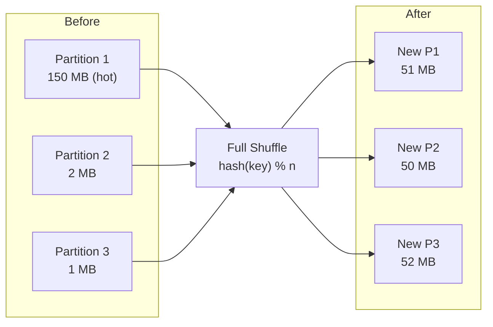

# :material-shuffle-variant: REPARTITION

`REPARTITION(n)` or `REPARTITION(n, col)` forces a **full shuffle** to redistribute
data evenly or by a specific key. It is more expensive than `COALESCE` but is the
correct tool for fixing data skew and pre-partitioning data before joins or writes.

---

## :material-pin: Syntax

```sql
-- By count only — hash-partition into n buckets
SELECT /*+ REPARTITION(n) */ * FROM table;

-- By column — hash-partition on one or more columns
SELECT /*+ REPARTITION(col) */ * FROM table;

-- By count + column — n partitions, partitioned by col hash
SELECT /*+ REPARTITION(n, col) */ * FROM table;

-- Multiple columns
SELECT /*+ REPARTITION(n, col1, col2) */ * FROM table;
```

---

## :material-sitemap: How REPARTITION Works



---

## :material-flask-outline: Examples

### Fix data skew — repartition by a key

```sql
-- Skewed table: most rows have region='US'
-- After REPARTITION(region), data is spread by hash(region)
SELECT /*+ REPARTITION(200, region) */
    region,
    product_id,
    SUM(amount) AS total
FROM sales
GROUP BY region, product_id;
```

### Increase parallelism before a heavy join

```sql
SELECT /*+ REPARTITION(400, f.customer_id), REPARTITION(400, d.customer_id) */
    f.order_id,
    d.segment
FROM fact_orders f
JOIN dim_customer d ON f.customer_id = d.customer_id;
```

### Pre-partition before writing to a partitioned table

```sql
-- Ensures each executor writes to exactly one partition directory
INSERT INTO analytics.orders PARTITION (order_date)
SELECT /*+ REPARTITION(order_date) */
    order_id, customer, amount, region, order_date
FROM staging_orders;
```

### Repartition into fewer partitions (controlled redistribution)

```sql
-- Redistribute 1000 partitions into 50 evenly
SELECT /*+ REPARTITION(50) */
    event_id, event_type, ts
FROM events
WHERE event_date = '2024-06-01';
```

### Skew join hint (alternative to REPARTITION)

```sql
-- Tell Spark that the 'orders' side is skewed on customer_id
SELECT /*+ SKEW_JOIN(orders, customer_id) */
    o.order_id, c.name
FROM orders o
JOIN customers c ON o.customer_id = c.customer_id;
```

---

## :material-compare: REPARTITION vs COALESCE vs REBALANCE

| Feature | `REPARTITION(n)` | `COALESCE(n)` | `REBALANCE` |
|---------|:----------------:|:-------------:|:-----------:|
| Shuffle | Yes (full) | No | Yes (AQE) |
| Can increase partitions | Yes | No | Yes |
| Fixes skew | Yes (with key) | No | Yes |
| Output uniformity | High | Low | High |
| Control over partition key | Yes | No | Yes (optional) |
| Cost | High | Low | Medium |

---

## :material-magnify: Behavior Notes

1. **Full shuffle always occurs** — every row crosses the network; this is expensive on large datasets.
2. **Hash partitioning** — rows are assigned to partitions by `hash(key) % n`; identical keys always land in the same partition.
3. **Hint is advisory** — the optimizer may ignore it if a better plan exists (e.g., a broadcast join eliminates the need).
4. **Verify in EXPLAIN** — look for `Exchange hashpartitioning` in the physical plan.
5. **`REPARTITION(1)`** — valid but puts all data on one task; use only for tiny exports.

```sql
-- Verify repartition hint was applied
EXPLAIN FORMATTED
SELECT /*+ REPARTITION(200, region) */ region, SUM(amount)
FROM sales
GROUP BY region;
-- Physical plan should show: Exchange hashpartitioning(region#..., 200)
```

---

## :material-brain: When to Use

| Scenario | Recommendation |
|----------|----------------|
| Skewed data before aggregation | `REPARTITION(n, key)` |
| Pre-partition before join on a column | `REPARTITION(n, join_key)` |
| Increase parallelism (too few partitions) | `REPARTITION(n)` |
| Write to a partitioned table cleanly | `REPARTITION(partition_col)` |
| Reduce files on balanced data | Prefer `COALESCE` — cheaper |
