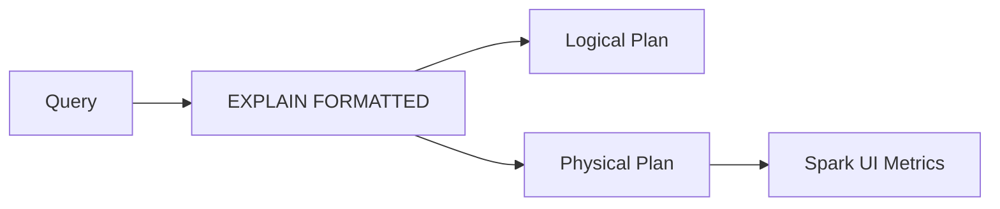

# :material-chart-timeline-variant: Profiling Queries

Profiling helps identify bottlenecks in Spark SQL queries using `EXPLAIN`,
Spark UI, and runtime metrics.

### :material-sitemap: Overview



---

## :material-pin: Key Tools

| Tool | Purpose |
|------|---------|
| `EXPLAIN` | View logical and physical plans |
| Spark UI | Stage/task metrics |
| Event logs | Offline analysis |

---

## :material-flask-outline: Example

```sql
EXPLAIN FORMATTED
SELECT * FROM orders WHERE amount > 1000;
```

---

## :material-magnify: What to Look For

1. Large shuffles
2. Skewed tasks
3. Missing predicate pushdown

---

## :material-brain: When to Use

| Scenario | Recommendation |
|----------|----------------|
| Slow queries | Start with `EXPLAIN` |
| Large joins | Check shuffle metrics |
| Repeated workloads | Enable event logs |
