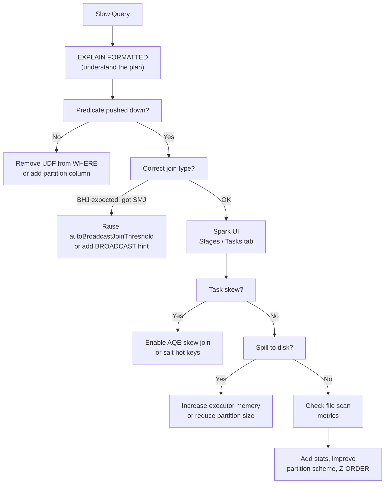

# :material-chart-timeline-variant: Profiling Queries

Profiling identifies bottlenecks before you tune. Start with `EXPLAIN`, then inspect
the Spark UI for stage-level evidence.

---

## :material-sitemap: Profiling Workflow



---

## :material-text-box-outline: EXPLAIN Modes

```sql
-- Default: abbreviated physical plan
EXPLAIN SELECT order_id, SUM(amount) FROM orders GROUP BY order_id;

-- Extended: logical plan + all plan stages
EXPLAIN EXTENDED
SELECT order_id, SUM(amount) FROM orders GROUP BY order_id;

-- Formatted: numbered node tree — easiest to read
EXPLAIN FORMATTED
SELECT o.order_id, c.name, SUM(o.amount)
FROM orders o JOIN customers c ON o.customer_id = c.id
GROUP BY o.order_id, c.name;

-- Cost: adds estimated row counts and sizes (requires ANALYZE TABLE)
EXPLAIN COST
SELECT * FROM orders JOIN customers ON orders.customer_id = customers.id;

-- Codegen: shows generated Java code for WholeStageCodegen nodes
EXPLAIN CODEGEN
SELECT SUM(amount) FROM orders;
```

---

## :material-magnify: Reading EXPLAIN FORMATTED Output

```
== Physical Plan ==
AdaptiveSparkPlan (1)                     ← AQE wraps the plan
+- == Final Plan ==
   HashAggregate (2)                       ← partial agg result merge
   +- Exchange (3)                         ← SHUFFLE — look at estimated size
      +- HashAggregate (4)                 ← map-side partial aggregation
         +- Project (5)                    ← column pruning applied
            +- Filter (6)                  ← predicate pushed here
               +- FileScan parquet (7)     ← storage layer
                  PartitionFilters: ...    ← partition pruning? check here
                  PushedFilters: ...       ← row-group filters
                  ReadSchema: ...          ← columns actually read
```

!!! tip "What to check in `FileScan`"
    - **`PartitionFilters`** non-empty → partition pruning is working.
    - **`PushedFilters`** non-empty → predicate pushed to Parquet reader.
    - **`ReadSchema`** only has needed columns → column pruning active.

---

## :material-eye: Spark UI — Stage Metrics

Navigate to **Stages** → click a stage → **Tasks**.

| Metric | Normal | Warning |
|--------|--------|---------|
| Duration (Median vs Max) | Close | Max > 3× Median → skew |
| Shuffle Write Size | — | Single task > 1 GB → investigate |
| Shuffle Read Size | — | Much larger than write → amplification |
| Spill (Memory) | 0 | Any → executor memory too low |
| Spill (Disk) | 0 | Any → critical, job will be slow |
| GC Time | < 5% of task time | > 10% → reduce heap pressure |
| Input Size per Task | Balanced | High variance → uneven partitioning |

---

## :material-table-search: Useful Diagnostic Queries

```sql
-- View table statistics (after ANALYZE TABLE)
DESCRIBE EXTENDED orders;
DESCRIBE EXTENDED orders PARTITION (order_date = '2024-06-01');

-- View column statistics
DESCRIBE EXTENDED orders order_id;

-- Check what is cached
SHOW TABLES IN spark_catalog.default LIKE '*';

-- Verify AQE coalescing happened (look for FinalStage with fewer partitions)
EXPLAIN FORMATTED
SELECT region, SUM(amount) FROM orders GROUP BY region;
```

---

## :material-run-fast: ANALYZE TABLE — Feed the Optimiser

```sql
-- Collect table-level stats (row count, total size)
ANALYZE TABLE orders COMPUTE STATISTICS;

-- Collect column histograms (enables better join ordering and filter estimates)
ANALYZE TABLE orders COMPUTE STATISTICS FOR COLUMNS
    order_id, customer_id, region, amount, order_date;

-- Partitioned table: analyze a specific partition
ANALYZE TABLE events PARTITION (event_date = '2024-06-01')
COMPUTE STATISTICS;

-- Verify stats were collected
DESCRIBE EXTENDED orders;
```

!!! note "When stats matter most"
    CBO uses stats to reorder multi-way joins. Without stats, Catalyst uses
    `spark.sql.defaultSizeInBytes` (default 1 GB per table) — almost always wrong.

---

## :material-clipboard-list: Bottleneck Identification Checklist

| Symptom | Likely Cause | First Fix |
|---------|-------------|-----------|
| Long `FileScan` stage | No partition/predicate pruning | Check `EXPLAIN` filters |
| Long shuffle stage | Wrong join strategy | Add `BROADCAST` hint |
| One task much slower | Data skew | Enable AQE skew join |
| OOM / spill | Partition too large | Lower shuffle partitions or increase memory |
| High GC time | Too much heap fragmentation | Use off-heap memory or smaller executor |
| Many tiny tasks | Too many shuffle partitions | Reduce `shuffle.partitions` or enable AQE |
| Stage succeeds but is slow | UDF overhead | Replace with SQL built-ins |
