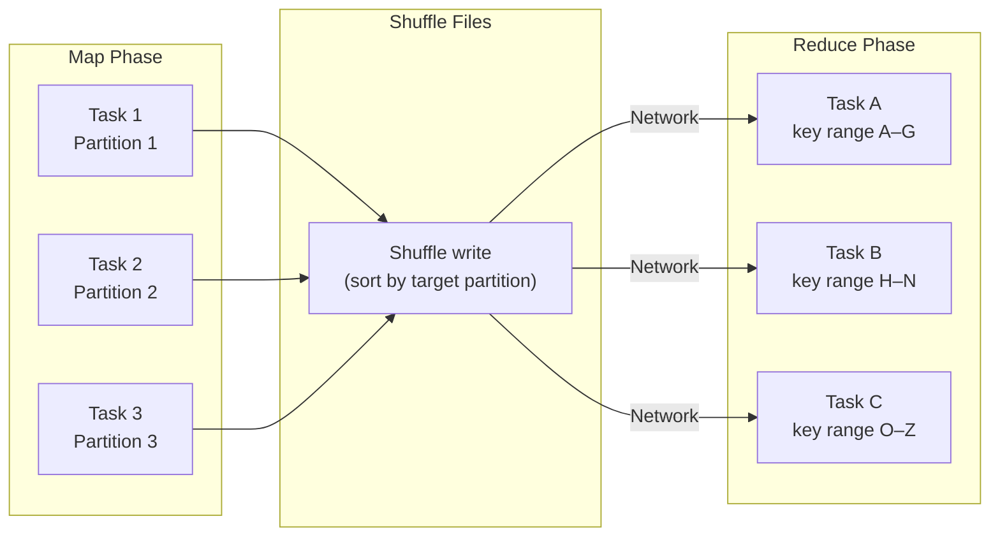

# :material-shuffle-variant: Shuffling

A **shuffle** is the redistribution of data across partitions — rows with the same key must be
moved to the same partition before aggregation or joining can proceed. Shuffles are the single
biggest source of latency in Spark jobs.

---

## :material-sitemap: Shuffle Mechanics



---

## :material-alert-circle: Operations That Trigger Shuffles

| Operation | Shuffle type |
|-----------|-------------|
| `GROUP BY` / `DISTINCT` | Hash / sort-based aggregation |
| `JOIN` (non-broadcast) | Sort-merge or shuffled hash |
| `ORDER BY` (global sort) | Total sort shuffle |
| `REPARTITION(n)` | Full shuffle |
| `COALESCE(n)` (narrow) | **No shuffle** — narrow dependency |
| `REBALANCE` | AQE-adaptive (may or may not shuffle) |
| Window function (different `PARTITION BY`) | Shuffle per window spec |

---

## :material-currency-usd: Shuffle Cost Model

| Factor | Effect |
|--------|--------|
| High shuffle write bytes | Slow write phase, large spill risk |
| High shuffle read bytes | Slow network transfer |
| Many partitions | High task scheduling overhead |
| Few partitions (large) | Long GC pauses, spill to disk |
| Skewed partitions | One task dominates stage time |

!!! tip "Ideal partition size"
    Target **64 MB – 256 MB** per partition after a shuffle.
    Use AQE (`spark.sql.adaptive.coalescePartitions.enabled = true`) to auto-size.

---

## :material-wrench: Reducing Shuffles

### 1 — Broadcast small tables (eliminates join shuffle)

```sql
-- No shuffle at all — dim is broadcast to each executor
SELECT /*+ BROADCAST(d) */ f.order_id, d.category
FROM fact_orders f
JOIN dim_product d ON f.product_id = d.id;
```

### 2 — Pre-aggregate before joining

```sql
-- Aggregate first, then join — much smaller shuffle data
WITH daily_sales AS (
    SELECT product_id, SUM(amount) AS daily_total
    FROM orders
    WHERE order_date = '2024-06-01'
    GROUP BY product_id
)
SELECT d.name, s.daily_total
FROM dim_product d JOIN daily_sales s ON d.id = s.product_id;
```

### 3 — Use bucketed tables for repeated joins

```sql
-- Both tables bucketed on customer_id with the same bucket count
-- → Spark skips the shuffle entirely (bucket-to-bucket join)
CREATE TABLE orders_bkt
USING PARQUET CLUSTERED BY (customer_id) INTO 100 BUCKETS
AS SELECT * FROM orders;

CREATE TABLE customers_bkt
USING PARQUET CLUSTERED BY (customer_id) INTO 100 BUCKETS
AS SELECT * FROM customers;
```

### 4 — Tune shuffle partition count

```sql
-- Default: 200 (often too many for small data, too few for large data)
SET spark.sql.shuffle.partitions = 400;  -- large datasets

-- Or let AQE decide automatically
SET spark.sql.adaptive.enabled = true;
SET spark.sql.adaptive.coalescePartitions.enabled = true;
```

### 5 — Avoid sorting when not required

```sql
-- Global ORDER BY forces a total sort shuffle — expensive
SELECT * FROM orders ORDER BY amount DESC;

-- Often only the top-N is needed — use LIMIT to short-circuit
SELECT * FROM orders ORDER BY amount DESC LIMIT 100;
```

---

## :material-compare: Join Strategy Shuffle Cost

| Strategy | Shuffle | When Used |
|----------|:-------:|-----------|
| Broadcast Hash Join (BHJ) | None | Small table ≤ `autoBroadcastJoinThreshold` |
| Shuffled Hash Join (SHJ) | Both sides | Medium tables, low distinct keys |
| Sort-Merge Join (SMJ) | Both sides | Large tables, sort-based |
| Broadcast Nested Loop (BNLJ) | None (but slow) | Non-equi joins with small table |

---

## :material-monitor: Diagnosing Shuffle Problems in Spark UI

| Metric | Where | Warning sign |
|--------|-------|-------------|
| Shuffle write size | Stages tab | Single stage > 100 GB |
| Shuffle read size | Stages tab | Much larger than write (amplification) |
| Task duration variance | Stages tab | Max >> Median → skew |
| Spill (memory) | Tasks tab | Any spill → increase executor memory |
| Spill (disk) | Tasks tab | Any spill → critical, raise `spark.executor.memory` |

```sql
-- Check estimated shuffle in query plan
EXPLAIN COST
SELECT customer_id, SUM(amount)
FROM orders
GROUP BY customer_id;
```
