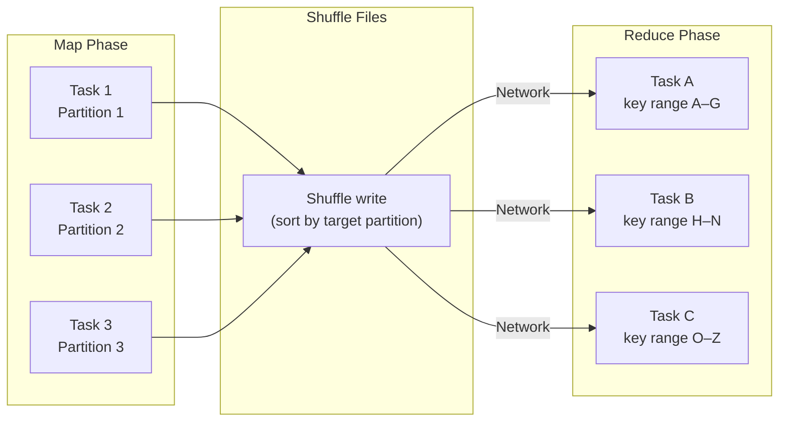

# :material-shuffle-variant: Shuffling

A **shuffle** is the redistribution of data across partitions — rows with the same key must be moved to the same partition before aggregation or joining can proceed. Shuffles are the single biggest source of latency in Spark jobs.

---

## :material-sitemap: Shuffle Mechanics



---

## :material-information-outline: Behavior

1. A shuffle is introduced whenever two stages need data co-located by the same key: `GROUP BY`,
   `JOIN` (non-broadcast), `DISTINCT`, and `ORDER BY` all require shuffles.
2. Spark hashes each row's partition key, writes output to local shuffle files, and then each
   downstream task reads its assigned hash buckets from every upstream executor.
3. The number of shuffle partitions is controlled by `spark.sql.shuffle.partitions`
   (default **200**). With AQE enabled, this is adjusted at runtime.
4. `REPARTITION(n)` forces a new hash shuffle into exactly `n` partitions.
5. `COALESCE(n)` merges partitions locally **without** a shuffle — it narrows the partition
   count but may produce skewed partitions.
6. `REPARTITION(n, col)` hash-partitions by `col` — useful before joins or aggregations on
   that column to pre-shuffle the data.
7. `SORT BY` sorts rows within each partition without changing the number of partitions or
   shuffling data between executors.

---

## :material-alert-circle: Operations That Trigger Shuffles

| Operation | Exchange type | Notes |
|-----------|---------------|-------|
| `GROUP BY` | `hashpartitioning` | Two-phase aggregation: partial aggregate, then shuffle, then final aggregate |
| `DISTINCT` | `hashpartitioning` | Equivalent to grouping by all projected columns |
| `JOIN` (non-broadcast) | `hashpartitioning` | Sort-merge and shuffled-hash joins typically shuffle both sides |
| `ORDER BY` | `rangepartitioning` | Global sort requires repartitioning by range and may collapse to one final ordered result |
| `UNION` | `hashpartitioning` | `UNION DISTINCT` deduplication introduces a shuffle; `UNION ALL` alone does not |
| `REPARTITION(n)` / `REPARTITION(n, col)` | `hashpartitioning` | Explicit full shuffle to rebalance or co-locate data |
| `COALESCE(n)` | None | Narrow dependency that reduces partition count without a shuffle |
| `REBALANCE` | Adaptive | AQE may insert a shuffle to smooth uneven output partition sizes |
| Window function with `PARTITION BY` | `hashpartitioning` | Rows are shuffled to group each partition key together before window evaluation |

---

## :material-code-tags: Syntax

```sql
-- Control shuffle partition count for the session
SET spark.sql.shuffle.partitions = 50;

-- Repartition into N partitions (hash shuffle)
SELECT /*+ REPARTITION(50) */ *
FROM large_table;

-- Repartition by column (co-locate by key, then aggregate or join)
SELECT /*+ REPARTITION(50, customer_id) */ *
FROM orders;

-- Coalesce without shuffle (reduce partition count only)
SELECT /*+ COALESCE(10) */ *
FROM small_result;

-- Sort rows within each partition without a global shuffle
SELECT region, order_date, amount
FROM sales
SORT BY order_date;
```

---

## :material-flask-outline: Practical Examples

### Tune shuffle partitions

```sql
-- Default 200 is too many for a small dataset — causes overhead
SET spark.sql.shuffle.partitions = 20;

SELECT region, SUM(amount) AS total
FROM daily_sales
GROUP BY region;

-- Reset to default
SET spark.sql.shuffle.partitions = 200;
```

### Pre-partition before join

```sql
-- Pre-partition both sides on the join key when the same layout is reused downstream
CREATE OR REPLACE TEMP VIEW orders_repartitioned AS
SELECT /*+ REPARTITION(100, customer_id) */ *
FROM orders;

CREATE OR REPLACE TEMP VIEW customers_repartitioned AS
SELECT /*+ REPARTITION(100, customer_id) */ *
FROM customers;

SELECT
    c.name,
    SUM(o.amount) AS lifetime_value
FROM orders_repartitioned AS o
JOIN customers_repartitioned AS c
    ON o.customer_id = c.customer_id
GROUP BY c.name;
```

### Reduce partitions after filtering

```sql
-- After filtering to a small subset, coalesce avoids writing many tiny files
INSERT INTO summary_table
SELECT /*+ COALESCE(4) */
    region,
    SUM(amount) AS total
FROM sales
WHERE order_date = CURRENT_DATE()
GROUP BY region;
```

### Identify shuffles with EXPLAIN

```sql
EXPLAIN
SELECT customer_id, COUNT(*) AS order_count
FROM orders
GROUP BY customer_id;
```

```text
*(2) HashAggregate(keys=[customer_id#1], ...)
+- Exchange hashpartitioning(customer_id#1, 200)    ← shuffle here
   +- *(1) HashAggregate(keys=[customer_id#1], ...) ← partial agg (no shuffle)
      +- *(1) FileScan parquet [customer_id#1]
```

### Sort within partitions

```sql
-- Produces sorted rows per partition without a global sort
SELECT /*+ REPARTITION(10, region) */
    region,
    order_date,
    order_id,
    amount
FROM sales
SORT BY order_date;
```

### Avoid ORDER BY on large tables

```sql
-- Avoid a full global sort when you only need top rows per group
SELECT region, order_id, amount
FROM (
    SELECT
        region,
        order_id,
        amount,
        RANK() OVER (PARTITION BY region ORDER BY amount DESC) AS rnk
    FROM orders
)
WHERE rnk <= 10;
```

---

## :material-swap-horizontal: REPARTITION vs COALESCE

| Aspect | `REPARTITION(n)` | `COALESCE(n)` |
|--------|------------------|---------------|
| Shuffle | Yes — full hash shuffle | No — local merge only |
| Can increase partitions | Yes | No |
| Partition balance | Balanced after redistribution | May produce skewed partitions |
| Use case | Before joins, aggregations, or balanced output writes | Reduce small result sets before writing |

---

## :material-currency-usd: Shuffle Cost Model

| Factor | Effect |
|--------|--------|
| High shuffle write bytes | Slow write phase, large spill risk |
| High shuffle read bytes | Slow network transfer |
| Many partitions | High task scheduling overhead |
| Few partitions (large) | Long GC pauses, spill to disk |
| Skewed partitions | One task dominates stage time |

!!! tip "Ideal partition size"
    Target **64 MB – 256 MB** per partition after a shuffle.
    Use AQE (`spark.sql.adaptive.coalescePartitions.enabled = true`) to auto-size.

---

## :material-wrench: Reducing Shuffles

### 1 — Broadcast small tables (eliminates join shuffle)

```sql
-- No shuffle at all — dim is broadcast to each executor
SELECT /*+ BROADCAST(d) */ f.order_id, d.category
FROM fact_orders f
JOIN dim_product d ON f.product_id = d.id;
```

### 2 — Pre-aggregate before joining

```sql
-- Aggregate first, then join — much smaller shuffle data
WITH daily_sales AS (
    SELECT product_id, SUM(amount) AS daily_total
    FROM orders
    WHERE order_date = '2024-06-01'
    GROUP BY product_id
)
SELECT d.name, s.daily_total
FROM dim_product d JOIN daily_sales s ON d.id = s.product_id;
```

### 3 — Use bucketed tables for repeated joins

```sql
-- Both tables bucketed on customer_id with the same bucket count
-- → Spark skips the shuffle entirely (bucket-to-bucket join)
CREATE TABLE orders_bkt
USING PARQUET CLUSTERED BY (customer_id) INTO 100 BUCKETS
AS SELECT * FROM orders;

CREATE TABLE customers_bkt
USING PARQUET CLUSTERED BY (customer_id) INTO 100 BUCKETS
AS SELECT * FROM customers;
```

### 4 — Tune shuffle partition count

```sql
-- Default: 200 (often too many for small data, too few for large data)
SET spark.sql.shuffle.partitions = 400;

-- Or let AQE decide automatically
SET spark.sql.adaptive.enabled = true;
SET spark.sql.adaptive.coalescePartitions.enabled = true;
```

### 5 — Avoid sorting when not required

```sql
-- Global ORDER BY forces a total sort shuffle — expensive
SELECT * FROM orders ORDER BY amount DESC;

-- Often only the top-N is needed — use LIMIT to short-circuit
SELECT * FROM orders ORDER BY amount DESC LIMIT 100;
```

---

## :material-compare: Join Strategy Shuffle Cost

| Strategy | Shuffle | When Used |
|----------|:-------:|-----------|
| Broadcast Hash Join (BHJ) | None | Small table ≤ `autoBroadcastJoinThreshold` |
| Shuffled Hash Join (SHJ) | Both sides | Medium tables, low distinct keys |
| Sort-Merge Join (SMJ) | Both sides | Large tables, sort-based |
| Broadcast Nested Loop (BNLJ) | None (but slow) | Non-equi joins with small table |

---

## :material-monitor: Diagnosing Shuffle Problems in Spark UI

| Metric | Where | Warning sign |
|--------|-------|--------------|
| Shuffle write size | Stages tab | Single stage > 100 GB |
| Shuffle read size | Stages tab | Much larger than write (amplification) |
| Task duration variance | Stages tab | Max >> Median → skew |
| Spill (memory) | Tasks tab | Any spill → increase executor memory |
| Spill (disk) | Tasks tab | Any spill → critical, raise `spark.executor.memory` |

```sql
-- Check estimated shuffle in query plan
EXPLAIN COST
SELECT customer_id, SUM(amount)
FROM orders
GROUP BY customer_id;
```

---

## :material-lightbulb-outline: When to Tune Shuffles

| Scenario | Recommendation |
|----------|----------------|
| `spark.sql.shuffle.partitions = 200` on a small dataset | Lower it to roughly `4 × executor_count` |
| AQE is enabled | Keep a higher default and let Spark coalesce partitions at runtime |
| Many downstream operations share the same join key | Pre-repartition into a cached view |
| Writing a partitioned table creates too many small files | Use `COALESCE` or `REPARTITION` before `INSERT` |
| Shuffle spill to disk slows the query | Increase executor memory or reduce shuffle partition sizes |

!!! tip "Let AQE handle shuffle partitions"
    With Adaptive Query Execution (`spark.sql.adaptive.enabled = true`) enabled, Spark can
    automatically coalesce small shuffle partitions at runtime. A higher initial partition count
    is often safer than starting too low and creating oversized partitions.
