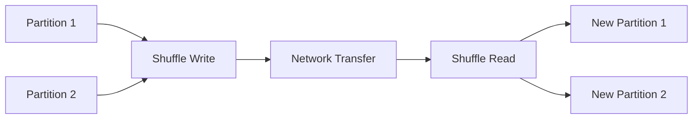

# :material-shuffle: Shuffling

Shuffle is the redistribution of data across partitions. It is expensive and
should be minimized.

### :material-sitemap: Overview



---

## :material-pin: Causes of Shuffle

- Joins on non-partitioned keys
- `GROUP BY` on high-cardinality columns
- Repartition operations

---

## :material-flask-outline: Example

```sql
SELECT customer_id, SUM(amount)
FROM orders
GROUP BY customer_id;
```

---

## :material-brain: When to Optimize

| Scenario | Recommendation |
|----------|----------------|
| Large shuffles | Repartition or broadcast |
| Skewed keys | Use salting or AQE |
| Too many partitions | Coalesce |
