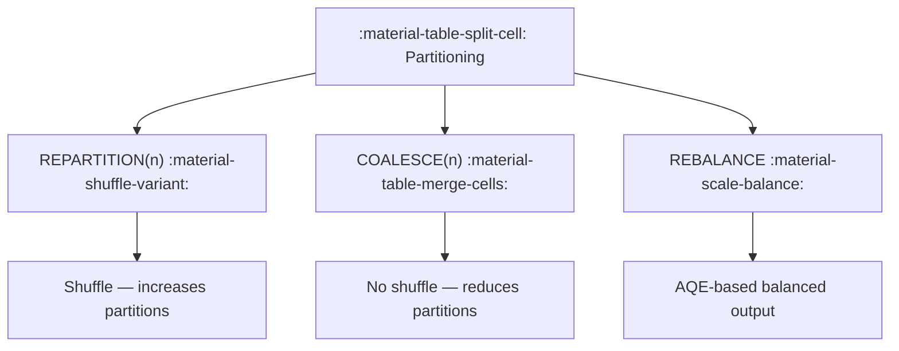

# :material-table-split-cell: Partitioning Overview

Partitioning divides table data into directories by one or more columns.
Good partitioning improves filter performance and reduces I/O.

### :material-sitemap: Overview



---

## 📌 Key Concepts

| Concept | Description |
|---------|-------------|
| Partition column | Column used to split data |
| Partition pruning | Skip partitions using filters |
| Over-partitioning | Too many small files and directories |

---

## 🧪 Example

```sql
CREATE TABLE sales (
  order_id BIGINT,
  order_date DATE,
  amount DOUBLE
) USING PARQUET
PARTITIONED BY (order_date);
```

---

## 🧠 When to Use

| Scenario | Recommendation |
|----------|----------------|
| Time-series data | Partition by date |
| High-cardinality fields | Avoid as partitions |
| Frequent filters | Partition by filter column |

---

### :material-table-split-cell: Related Guides

- [Coalesce Partitions](coalesce.md)
- [Rebalance](rebalance/rebalance.md)
- [Partitioned Managed Tables](../table/partition/partition_managed_table.md)
