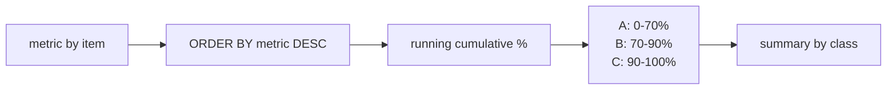

# :material-sort-variant: ABC Classification

Segment items into A (high-value), B (medium-value), and C (low-value) classes based on cumulative contribution — a structured extension of Pareto analysis for inventory management, customer tiering, and resource allocation.

---

## :material-sitemap: Execution Flow



---

## :material-code-tags: Syntax

```sql
WITH thresholds AS (
    SELECT
        70.0 AS a_cutoff_pct,
        90.0 AS b_cutoff_pct
),
ranked AS (
    SELECT
        item_id,
        metric_value,
        SUM(metric_value) OVER () AS total_metric,
        SUM(metric_value) OVER (
            ORDER BY metric_value DESC, item_id
            ROWS BETWEEN UNBOUNDED PRECEDING AND CURRENT ROW
        ) AS cumulative_metric
    FROM source_table
),
classified AS (
    SELECT
        r.item_id,
        r.metric_value,
        ROUND(r.cumulative_metric * 100.0 / r.total_metric, 2) AS cumulative_pct,
        CASE
            WHEN r.cumulative_metric * 100.0 / r.total_metric <= t.a_cutoff_pct THEN 'A'
            WHEN r.cumulative_metric * 100.0 / r.total_metric <= t.b_cutoff_pct THEN 'B'
            ELSE 'C'
        END AS abc_class
    FROM ranked r
    CROSS JOIN thresholds t
)
SELECT
    abc_class,
    COUNT(*) AS item_count,
    ROUND(SUM(metric_value), 2) AS class_metric
FROM classified
GROUP BY abc_class
ORDER BY CASE abc_class
    WHEN 'A' THEN 1
    WHEN 'B' THEN 2
    ELSE 3
END;
```

| Element | Purpose |
|---------|---------|
| `ORDER BY metric_value DESC, item_id` | Sorts highest-contribution rows first and makes ties deterministic. |
| `SUM(metric_value) OVER ()` | Computes the total metric for percentage math. |
| Running `SUM(...) OVER (...)` | Builds the cumulative contribution curve. |
| `CASE` thresholds | Converts cumulative contribution into `A`, `B`, or `C`. |
| Final `GROUP BY abc_class` | Produces the class-level summary after row-level classification. |

---

## :material-magnify: Behavior

1. **Threshold sensitivity** — small cutoff changes such as `70/90` to `80/95` can move several rows into a different class even when the underlying values stay the same.
2. **Boundary ties** — if multiple rows share the same metric near the cutoff, the deterministic tie-breaker column decides which row crosses the class boundary first.
3. **Multi-criteria expansion** — combining value class and frequency class creates a 3 × 3 matrix (`AA` through `CC`) that is more expressive but harder to operationalize.
4. **Re-classification cadence** — stable portfolios can be reviewed monthly or quarterly, while volatile demand or spend patterns may require more frequent refreshes.

---

## :material-database: Sample Data

### Dataset 1: Inventory items

```sql
CREATE OR REPLACE TEMP VIEW inventory_items AS
SELECT * FROM VALUES
    ('SKU-1001', 'Industrial Laser Sensor', 'Automation',        850.00,   400, 340000.00),
    ('SKU-1002', 'Servo Motor Assembly',    'Automation',        620.00,   420, 260400.00),
    ('SKU-1003', 'Stainless Valve Kit',     'Fluid Control',     150.00,  1200, 180000.00),
    ('SKU-1004', 'Hydraulic Pump',          'Fluid Control',     980.00,   150, 147000.00),
    ('SKU-1005', 'PLC Controller',          'Automation',        430.00,   250, 107500.00),
    ('SKU-1006', 'Conveyor Belt Roll',      'Material Handling',  90.00,   900,  81000.00),
    ('SKU-1007', 'Bearing Set',             'Maintenance',        35.00,  1800,  63000.00),
    ('SKU-1008', 'Safety Glove Pack',       'Safety',             12.00,  4200,  50400.00),
    ('SKU-1009', 'Label Ribbon',            'Packaging',           4.00,  9000,  36000.00),
    ('SKU-1010', 'Fastener Kit',            'Maintenance',         2.00, 15000,  30000.00)
AS t(sku, item_name, category, unit_cost, annual_units, annual_value);
```

### Dataset 2: Customer accounts

```sql
CREATE OR REPLACE TEMP VIEW customer_accounts AS
SELECT * FROM VALUES
    ('C001', 'Northstar Retail',    'Retail',               420000.00, 180),
    ('C002', 'Apex Manufacturing',  'Manufacturing',        315000.00,  96),
    ('C003', 'BluePeak Health',     'Healthcare',           240000.00,  64),
    ('C004', 'Horizon Logistics',   'Logistics',            195000.00,  72),
    ('C005', 'Summit Foods',        'Consumer Goods',       150000.00,  88),
    ('C006', 'Cedar Finance',       'Financial Services',   105000.00,  40),
    ('C007', 'Beacon Telecom',      'Telecommunications',    85000.00,  31),
    ('C008', 'GreenLeaf Energy',    'Energy',                70000.00,  26),
    ('C009', 'Orbit Media',         'Media',                 45000.00,  18),
    ('C010', 'Terra Labs',          'Biotech',               30000.00,  14)
AS t(customer_id, company_name, industry, annual_spend, order_count);
```

### Dataset 3: Product defects

```sql
CREATE OR REPLACE TEMP VIEW product_defects AS
SELECT * FROM VALUES
    ('Calibration Drift',    'Sensor',      85, 120.00, 10200.00),
    ('Seal Leakage',         'Assembly',    52, 180.00,  9360.00),
    ('Sensor Misalignment',  'Sensor',      40, 210.00,  8400.00),
    ('Wiring Fault',         'Electrical',  28, 260.00,  7280.00),
    ('Surface Scratch',      'Cosmetic',   140,  35.00,  4900.00),
    ('Documentation Error',  'Process',     75,  20.00,  1500.00),
    ('Packaging Dent',       'Packaging',   60,  18.00,  1080.00),
    ('Label Mismatch',       'Packaging',   48,  12.00,   576.00),
    ('Minor Paint Blemish',  'Cosmetic',    90,   5.00,   450.00)
AS t(defect_type, defect_category, occurrence_count, avg_repair_cost, total_cost);
```

---

## :material-flask-outline: Practical Examples

### 1 — Basic ABC for inventory value

```sql
WITH ranked AS (
    SELECT
        sku,
        item_name,
        annual_value,
        SUM(annual_value) OVER () AS total_value,
        SUM(annual_value) OVER (
            ORDER BY annual_value DESC, sku
            ROWS BETWEEN UNBOUNDED PRECEDING AND CURRENT ROW
        ) AS cumulative_value
    FROM inventory_items
),
classified AS (
    SELECT
        sku,
        item_name,
        annual_value,
        ROUND(cumulative_value * 100.0 / total_value, 2) AS cumulative_pct,
        CASE
            WHEN cumulative_value * 100.0 / total_value <= 70 THEN 'A'
            WHEN cumulative_value * 100.0 / total_value <= 90 THEN 'B'
            ELSE 'C'
        END AS abc_class
    FROM ranked
)
SELECT
    sku,
    item_name,
    annual_value,
    cumulative_pct,
    abc_class
FROM classified
ORDER BY annual_value DESC, sku;
```

??? success "Expected output"

    | sku | item_name | annual_value | cumulative_pct | abc_class |
    |-----|-----------|--------------|----------------|-----------|
    | SKU-1001 | Industrial Laser Sensor | 340000.00 | 26.25 | A |
    | SKU-1002 | Servo Motor Assembly | 260400.00 | 46.35 | A |
    | SKU-1003 | Stainless Valve Kit | 180000.00 | 60.25 | A |
    | SKU-1004 | Hydraulic Pump | 147000.00 | 71.60 | B |
    | SKU-1005 | PLC Controller | 107500.00 | 79.90 | B |
    | SKU-1006 | Conveyor Belt Roll | 81000.00 | 86.15 | B |
    | SKU-1007 | Bearing Set | 63000.00 | 91.01 | C |
    | SKU-1008 | Safety Glove Pack | 50400.00 | 94.90 | C |
    | SKU-1009 | Label Ribbon | 36000.00 | 97.68 | C |
    | SKU-1010 | Fastener Kit | 30000.00 | 100.00 | C |

### 2 — ABC with class summary

```sql
WITH ranked AS (
    SELECT
        sku,
        annual_value,
        SUM(annual_value) OVER () AS total_value,
        SUM(annual_value) OVER (
            ORDER BY annual_value DESC, sku
            ROWS BETWEEN UNBOUNDED PRECEDING AND CURRENT ROW
        ) AS cumulative_value
    FROM inventory_items
),
classified AS (
    SELECT
        sku,
        annual_value,
        CASE
            WHEN cumulative_value * 100.0 / total_value <= 70 THEN 'A'
            WHEN cumulative_value * 100.0 / total_value <= 90 THEN 'B'
            ELSE 'C'
        END AS abc_class
    FROM ranked
)
SELECT
    abc_class,
    COUNT(*) AS item_count,
    ROUND(SUM(annual_value), 2) AS total_annual_value,
    ROUND(AVG(annual_value), 2) AS avg_annual_value
FROM classified
GROUP BY abc_class
ORDER BY CASE abc_class
    WHEN 'A' THEN 1
    WHEN 'B' THEN 2
    ELSE 3
END;
```

??? success "Expected output"

    | abc_class | item_count | total_annual_value | avg_annual_value |
    |-----------|------------|--------------------|------------------|
    | A | 3 | 780400.00 | 260133.33 |
    | B | 3 | 335500.00 | 111833.33 |
    | C | 4 | 179400.00 | 44850.00 |

### 3 — ABC with custom thresholds (80 / 95 / 100)

```sql
WITH thresholds AS (
    SELECT
        80.0 AS a_cutoff_pct,
        95.0 AS b_cutoff_pct
),
ranked AS (
    SELECT
        sku,
        item_name,
        annual_value,
        SUM(annual_value) OVER () AS total_value,
        SUM(annual_value) OVER (
            ORDER BY annual_value DESC, sku
            ROWS BETWEEN UNBOUNDED PRECEDING AND CURRENT ROW
        ) AS cumulative_value
    FROM inventory_items
),
classified AS (
    SELECT
        r.sku,
        r.item_name,
        ROUND(r.cumulative_value * 100.0 / r.total_value, 2) AS cumulative_pct,
        CASE
            WHEN r.cumulative_value * 100.0 / r.total_value <= t.a_cutoff_pct THEN 'A'
            WHEN r.cumulative_value * 100.0 / r.total_value <= t.b_cutoff_pct THEN 'B'
            ELSE 'C'
        END AS abc_class
    FROM ranked r
    CROSS JOIN thresholds t
)
SELECT
    sku,
    item_name,
    cumulative_pct,
    abc_class
FROM classified
ORDER BY cumulative_pct, sku;
```

??? success "Expected output"

    | sku | item_name | cumulative_pct | abc_class |
    |-----|-----------|----------------|-----------|
    | SKU-1001 | Industrial Laser Sensor | 26.25 | A |
    | SKU-1002 | Servo Motor Assembly | 46.35 | A |
    | SKU-1003 | Stainless Valve Kit | 60.25 | A |
    | SKU-1004 | Hydraulic Pump | 71.60 | A |
    | SKU-1005 | PLC Controller | 79.90 | A |
    | SKU-1006 | Conveyor Belt Roll | 86.15 | B |
    | SKU-1007 | Bearing Set | 91.01 | B |
    | SKU-1008 | Safety Glove Pack | 94.90 | B |
    | SKU-1009 | Label Ribbon | 97.68 | C |
    | SKU-1010 | Fastener Kit | 100.00 | C |

### 4 — Multi-criteria ABC by value and frequency

```sql
WITH value_ranked AS (
    SELECT
        sku,
        item_name,
        annual_value,
        annual_units,
        SUM(annual_value) OVER () AS total_value,
        SUM(annual_value) OVER (
            ORDER BY annual_value DESC, sku
            ROWS BETWEEN UNBOUNDED PRECEDING AND CURRENT ROW
        ) AS cumulative_value
    FROM inventory_items
),
value_classified AS (
    SELECT
        sku,
        item_name,
        annual_value,
        annual_units,
        CASE
            WHEN cumulative_value * 100.0 / total_value <= 70 THEN 'A'
            WHEN cumulative_value * 100.0 / total_value <= 90 THEN 'B'
            ELSE 'C'
        END AS value_class
    FROM value_ranked
),
frequency_ranked AS (
    SELECT
        sku,
        SUM(annual_units) OVER () AS total_units,
        SUM(annual_units) OVER (
            ORDER BY annual_units DESC, sku
            ROWS BETWEEN UNBOUNDED PRECEDING AND CURRENT ROW
        ) AS cumulative_units
    FROM inventory_items
),
frequency_classified AS (
    SELECT
        sku,
        CASE
            WHEN cumulative_units * 100.0 / total_units <= 70 THEN 'A'
            WHEN cumulative_units * 100.0 / total_units <= 90 THEN 'B'
            ELSE 'C'
        END AS frequency_class
    FROM frequency_ranked
)
SELECT
    v.sku,
    v.item_name,
    v.value_class,
    f.frequency_class,
    CONCAT(v.value_class, f.frequency_class) AS combined_class,
    v.annual_value,
    v.annual_units
FROM value_classified v
INNER JOIN frequency_classified f
    ON v.sku = f.sku
ORDER BY v.annual_value DESC, v.sku;
```

??? success "Expected output"

    | sku | item_name | value_class | frequency_class | combined_class | annual_value | annual_units |
    |-----|-----------|-------------|-----------------|----------------|--------------|--------------|
    | SKU-1001 | Industrial Laser Sensor | A | C | AC | 340000.00 | 400 |
    | SKU-1002 | Servo Motor Assembly | A | C | AC | 260400.00 | 420 |
    | SKU-1003 | Stainless Valve Kit | A | C | AC | 180000.00 | 1200 |
    | SKU-1004 | Hydraulic Pump | B | C | BC | 147000.00 | 150 |
    | SKU-1005 | PLC Controller | B | C | BC | 107500.00 | 250 |
    | SKU-1006 | Conveyor Belt Roll | B | C | BC | 81000.00 | 900 |
    | SKU-1007 | Bearing Set | C | C | CC | 63000.00 | 1800 |
    | SKU-1008 | Safety Glove Pack | C | B | CB | 50400.00 | 4200 |
    | SKU-1009 | Label Ribbon | C | B | CB | 36000.00 | 9000 |
    | SKU-1010 | Fastener Kit | C | A | CA | 30000.00 | 15000 |

### 5 — Customer tiering by annual spend

```sql
WITH ranked AS (
    SELECT
        customer_id,
        company_name,
        annual_spend,
        SUM(annual_spend) OVER () AS total_spend,
        SUM(annual_spend) OVER (
            ORDER BY annual_spend DESC, customer_id
            ROWS BETWEEN UNBOUNDED PRECEDING AND CURRENT ROW
        ) AS cumulative_spend
    FROM customer_accounts
),
classified AS (
    SELECT
        customer_id,
        company_name,
        annual_spend,
        ROUND(cumulative_spend * 100.0 / total_spend, 2) AS cumulative_pct,
        CASE
            WHEN cumulative_spend * 100.0 / total_spend <= 70 THEN 'A'
            WHEN cumulative_spend * 100.0 / total_spend <= 90 THEN 'B'
            ELSE 'C'
        END AS abc_class
    FROM ranked
)
SELECT
    customer_id,
    company_name,
    annual_spend,
    cumulative_pct,
    abc_class
FROM classified
ORDER BY annual_spend DESC, customer_id;
```

??? success "Expected output"

    | customer_id | company_name | annual_spend | cumulative_pct | abc_class |
    |-------------|--------------|--------------|----------------|-----------|
    | C001 | Northstar Retail | 420000.00 | 25.38 | A |
    | C002 | Apex Manufacturing | 315000.00 | 44.41 | A |
    | C003 | BluePeak Health | 240000.00 | 58.91 | A |
    | C004 | Horizon Logistics | 195000.00 | 70.69 | B |
    | C005 | Summit Foods | 150000.00 | 79.76 | B |
    | C006 | Cedar Finance | 105000.00 | 86.10 | B |
    | C007 | Beacon Telecom | 85000.00 | 91.24 | C |
    | C008 | GreenLeaf Energy | 70000.00 | 95.47 | C |
    | C009 | Orbit Media | 45000.00 | 98.19 | C |
    | C010 | Terra Labs | 30000.00 | 100.00 | C |

### 6 — ABC with class migration between periods

```sql
CREATE OR REPLACE TEMP VIEW inventory_period_values AS
SELECT * FROM VALUES
    ('prior',   'SKU-1001', 'Industrial Laser Sensor', 260000.00),
    ('prior',   'SKU-1002', 'Servo Motor Assembly',    220000.00),
    ('prior',   'SKU-1003', 'Stainless Valve Kit',     210000.00),
    ('prior',   'SKU-1004', 'Hydraulic Pump',          160000.00),
    ('prior',   'SKU-1005', 'PLC Controller',          120000.00),
    ('prior',   'SKU-1006', 'Conveyor Belt Roll',      110000.00),
    ('prior',   'SKU-1007', 'Bearing Set',              80000.00),
    ('current', 'SKU-1001', 'Industrial Laser Sensor', 350000.00),
    ('current', 'SKU-1002', 'Servo Motor Assembly',    275000.00),
    ('current', 'SKU-1003', 'Stainless Valve Kit',     140000.00),
    ('current', 'SKU-1004', 'Hydraulic Pump',          155000.00),
    ('current', 'SKU-1005', 'PLC Controller',          130000.00),
    ('current', 'SKU-1006', 'Conveyor Belt Roll',       90000.00),
    ('current', 'SKU-1007', 'Bearing Set',              60000.00)
AS t(period_label, sku, item_name, annual_value);

WITH ranked AS (
    SELECT
        period_label,
        sku,
        item_name,
        annual_value,
        SUM(annual_value) OVER (PARTITION BY period_label) AS total_value,
        SUM(annual_value) OVER (
            PARTITION BY period_label
            ORDER BY annual_value DESC, sku
            ROWS BETWEEN UNBOUNDED PRECEDING AND CURRENT ROW
        ) AS cumulative_value
    FROM inventory_period_values
),
classified AS (
    SELECT
        period_label,
        sku,
        item_name,
        annual_value,
        CASE
            WHEN cumulative_value * 100.0 / total_value <= 70 THEN 'A'
            WHEN cumulative_value * 100.0 / total_value <= 90 THEN 'B'
            ELSE 'C'
        END AS abc_class,
        CASE
            WHEN cumulative_value * 100.0 / total_value <= 70 THEN 1
            WHEN cumulative_value * 100.0 / total_value <= 90 THEN 2
            ELSE 3
        END AS class_rank
    FROM ranked
),
prior_period AS (
    SELECT * FROM classified WHERE period_label = 'prior'
),
current_period AS (
    SELECT * FROM classified WHERE period_label = 'current'
)
SELECT
    p.sku,
    p.item_name,
    p.annual_value AS prior_value,
    c.annual_value AS current_value,
    p.abc_class AS prior_class,
    c.abc_class AS current_class,
    CASE
        WHEN c.class_rank < p.class_rank THEN 'Upgraded'
        WHEN c.class_rank > p.class_rank THEN 'Downgraded'
        ELSE 'Stable'
    END AS movement
FROM prior_period p
INNER JOIN current_period c
    ON p.sku = c.sku
ORDER BY p.sku;
```

??? success "Expected output"

    | sku | item_name | prior_value | current_value | prior_class | current_class | movement |
    |-----|-----------|-------------|---------------|-------------|---------------|----------|
    | SKU-1001 | Industrial Laser Sensor | 260000.00 | 350000.00 | A | A | Stable |
    | SKU-1002 | Servo Motor Assembly | 220000.00 | 275000.00 | A | A | Stable |
    | SKU-1003 | Stainless Valve Kit | 210000.00 | 140000.00 | A | B | Downgraded |
    | SKU-1004 | Hydraulic Pump | 160000.00 | 155000.00 | B | A | Upgraded |
    | SKU-1005 | PLC Controller | 120000.00 | 130000.00 | B | B | Stable |
    | SKU-1006 | Conveyor Belt Roll | 110000.00 | 90000.00 | C | C | Stable |
    | SKU-1007 | Bearing Set | 80000.00 | 60000.00 | C | C | Stable |

### 7 — Defect prioritization by total cost

```sql
WITH ranked AS (
    SELECT
        defect_type,
        defect_category,
        total_cost,
        SUM(total_cost) OVER () AS total_defect_cost,
        SUM(total_cost) OVER (
            ORDER BY total_cost DESC, defect_type
            ROWS BETWEEN UNBOUNDED PRECEDING AND CURRENT ROW
        ) AS cumulative_cost
    FROM product_defects
),
classified AS (
    SELECT
        defect_type,
        defect_category,
        total_cost,
        ROUND(cumulative_cost * 100.0 / total_defect_cost, 2) AS cumulative_pct,
        CASE
            WHEN cumulative_cost * 100.0 / total_defect_cost <= 70 THEN 'A'
            WHEN cumulative_cost * 100.0 / total_defect_cost <= 90 THEN 'B'
            ELSE 'C'
        END AS abc_class
    FROM ranked
)
SELECT
    defect_type,
    defect_category,
    total_cost,
    cumulative_pct,
    abc_class
FROM classified
ORDER BY total_cost DESC, defect_type;
```

??? success "Expected output"

    | defect_type | defect_category | total_cost | cumulative_pct | abc_class |
    |-------------|-----------------|------------|----------------|-----------|
    | Calibration Drift | Sensor | 10200.00 | 23.32 | A |
    | Seal Leakage | Assembly | 9360.00 | 44.71 | A |
    | Sensor Misalignment | Sensor | 8400.00 | 63.91 | A |
    | Wiring Fault | Electrical | 7280.00 | 80.56 | B |
    | Surface Scratch | Cosmetic | 4900.00 | 91.76 | C |
    | Documentation Error | Process | 1500.00 | 95.19 | C |
    | Packaging Dent | Packaging | 1080.00 | 97.65 | C |
    | Label Mismatch | Packaging | 576.00 | 98.97 | C |
    | Minor Paint Blemish | Cosmetic | 450.00 | 100.00 | C |

### 8 — ABC with percentage-of-total breakdown per class

```sql
WITH ranked AS (
    SELECT
        sku,
        annual_value,
        SUM(annual_value) OVER () AS total_value,
        SUM(annual_value) OVER (
            ORDER BY annual_value DESC, sku
            ROWS BETWEEN UNBOUNDED PRECEDING AND CURRENT ROW
        ) AS cumulative_value
    FROM inventory_items
),
classified AS (
    SELECT
        sku,
        annual_value,
        total_value,
        CASE
            WHEN cumulative_value * 100.0 / total_value <= 70 THEN 'A'
            WHEN cumulative_value * 100.0 / total_value <= 90 THEN 'B'
            ELSE 'C'
        END AS abc_class
    FROM ranked
)
SELECT
    abc_class,
    COUNT(*) AS item_count,
    ROUND(SUM(annual_value), 2) AS class_value,
    ROUND(SUM(annual_value) * 100.0 / MAX(total_value), 2) AS pct_of_total
FROM classified
GROUP BY abc_class
ORDER BY CASE abc_class
    WHEN 'A' THEN 1
    WHEN 'B' THEN 2
    ELSE 3
END;
```

??? success "Expected output"

    | abc_class | item_count | class_value | pct_of_total |
    |-----------|------------|-------------|--------------|
    | A | 3 | 780400.00 | 60.25 |
    | B | 3 | 335500.00 | 25.90 |
    | C | 4 | 179400.00 | 13.85 |

### 9 — Within-class ranking

```sql
WITH ranked AS (
    SELECT
        sku,
        item_name,
        annual_value,
        SUM(annual_value) OVER () AS total_value,
        SUM(annual_value) OVER (
            ORDER BY annual_value DESC, sku
            ROWS BETWEEN UNBOUNDED PRECEDING AND CURRENT ROW
        ) AS cumulative_value
    FROM inventory_items
),
classified AS (
    SELECT
        sku,
        item_name,
        annual_value,
        CASE
            WHEN cumulative_value * 100.0 / total_value <= 70 THEN 'A'
            WHEN cumulative_value * 100.0 / total_value <= 90 THEN 'B'
            ELSE 'C'
        END AS abc_class
    FROM ranked
),
ranked_within_class AS (
    SELECT
        abc_class,
        sku,
        item_name,
        annual_value,
        ROW_NUMBER() OVER (
            PARTITION BY abc_class
            ORDER BY annual_value DESC, sku
        ) AS class_rank
    FROM classified
)
SELECT
    abc_class,
    class_rank,
    sku,
    item_name,
    annual_value
FROM ranked_within_class
ORDER BY abc_class, class_rank;
```

??? success "Expected output"

    | abc_class | class_rank | sku | item_name | annual_value |
    |-----------|------------|-----|-----------|--------------|
    | A | 1 | SKU-1001 | Industrial Laser Sensor | 340000.00 |
    | A | 2 | SKU-1002 | Servo Motor Assembly | 260400.00 |
    | A | 3 | SKU-1003 | Stainless Valve Kit | 180000.00 |
    | B | 1 | SKU-1004 | Hydraulic Pump | 147000.00 |
    | B | 2 | SKU-1005 | PLC Controller | 107500.00 |
    | B | 3 | SKU-1006 | Conveyor Belt Roll | 81000.00 |
    | C | 1 | SKU-1007 | Bearing Set | 63000.00 |
    | C | 2 | SKU-1008 | Safety Glove Pack | 50400.00 |
    | C | 3 | SKU-1009 | Label Ribbon | 36000.00 |
    | C | 4 | SKU-1010 | Fastener Kit | 30000.00 |

### 10 — ABC over time with quarterly class stability

```sql
CREATE OR REPLACE TEMP VIEW quarterly_inventory_values AS
SELECT * FROM VALUES
    ('2024-Q1', 'SKU-1001', 'Industrial Laser Sensor', 120000.00),
    ('2024-Q1', 'SKU-1002', 'Servo Motor Assembly',    100000.00),
    ('2024-Q1', 'SKU-1003', 'Stainless Valve Kit',      80000.00),
    ('2024-Q1', 'SKU-1004', 'Hydraulic Pump',           60000.00),
    ('2024-Q1', 'SKU-1006', 'Conveyor Belt Roll',       40000.00),
    ('2024-Q2', 'SKU-1001', 'Industrial Laser Sensor', 125000.00),
    ('2024-Q2', 'SKU-1002', 'Servo Motor Assembly',     95000.00),
    ('2024-Q2', 'SKU-1003', 'Stainless Valve Kit',      85000.00),
    ('2024-Q2', 'SKU-1004', 'Hydraulic Pump',           55000.00),
    ('2024-Q2', 'SKU-1006', 'Conveyor Belt Roll',       40000.00),
    ('2024-Q3', 'SKU-1001', 'Industrial Laser Sensor', 110000.00),
    ('2024-Q3', 'SKU-1002', 'Servo Motor Assembly',     90000.00),
    ('2024-Q3', 'SKU-1003', 'Stainless Valve Kit',      70000.00),
    ('2024-Q3', 'SKU-1004', 'Hydraulic Pump',           88000.00),
    ('2024-Q3', 'SKU-1006', 'Conveyor Belt Roll',       42000.00),
    ('2024-Q4', 'SKU-1001', 'Industrial Laser Sensor', 115000.00),
    ('2024-Q4', 'SKU-1002', 'Servo Motor Assembly',     85000.00),
    ('2024-Q4', 'SKU-1003', 'Stainless Valve Kit',      60000.00),
    ('2024-Q4', 'SKU-1004', 'Hydraulic Pump',          100000.00),
    ('2024-Q4', 'SKU-1006', 'Conveyor Belt Roll',       40000.00)
AS t(quarter_label, sku, item_name, quarter_value);

WITH ranked AS (
    SELECT
        quarter_label,
        sku,
        item_name,
        quarter_value,
        SUM(quarter_value) OVER (PARTITION BY quarter_label) AS total_value,
        SUM(quarter_value) OVER (
            PARTITION BY quarter_label
            ORDER BY quarter_value DESC, sku
            ROWS BETWEEN UNBOUNDED PRECEDING AND CURRENT ROW
        ) AS cumulative_value
    FROM quarterly_inventory_values
),
classified AS (
    SELECT
        quarter_label,
        sku,
        item_name,
        CASE
            WHEN cumulative_value * 100.0 / total_value <= 70 THEN 'A'
            WHEN cumulative_value * 100.0 / total_value <= 90 THEN 'B'
            ELSE 'C'
        END AS abc_class
    FROM ranked
),
pivoted AS (
    SELECT
        sku,
        item_name,
        MAX(CASE WHEN quarter_label = '2024-Q1' THEN abc_class END) AS q1_class,
        MAX(CASE WHEN quarter_label = '2024-Q2' THEN abc_class END) AS q2_class,
        MAX(CASE WHEN quarter_label = '2024-Q3' THEN abc_class END) AS q3_class,
        MAX(CASE WHEN quarter_label = '2024-Q4' THEN abc_class END) AS q4_class
    FROM classified
    GROUP BY sku, item_name
),
scored AS (
    SELECT
        sku,
        item_name,
        q1_class,
        q2_class,
        q3_class,
        q4_class,
        CASE WHEN q1_class <=> q2_class THEN 0 ELSE 1 END
        + CASE WHEN q2_class <=> q3_class THEN 0 ELSE 1 END
        + CASE WHEN q3_class <=> q4_class THEN 0 ELSE 1 END AS class_changes
    FROM pivoted
)
SELECT
    sku,
    item_name,
    q1_class,
    q2_class,
    q3_class,
    q4_class,
    class_changes,
    CASE
        WHEN class_changes = 0 THEN 'Stable'
        WHEN class_changes = 1 THEN 'Changed once'
        ELSE 'Volatile'
    END AS stability
FROM scored
ORDER BY sku;
```

??? success "Expected output"

    | sku | item_name | q1_class | q2_class | q3_class | q4_class | class_changes | stability |
    |-----|-----------|----------|----------|----------|----------|---------------|-----------|
    | SKU-1001 | Industrial Laser Sensor | A | A | A | A | 0 | Stable |
    | SKU-1002 | Servo Motor Assembly | A | A | A | B | 1 | Changed once |
    | SKU-1003 | Stainless Valve Kit | B | B | B | B | 0 | Stable |
    | SKU-1004 | Hydraulic Pump | B | B | B | A | 1 | Changed once |
    | SKU-1006 | Conveyor Belt Roll | C | C | C | C | 0 | Stable |

---

## :material-shield-outline: Behavior Notes

!!! warning "Threshold sensitivity"
    ABC segmentation is policy-driven, not universal truth. A move from `70 / 90` to `80 / 95` can pull mid-tier rows into class `A`, so keep cutoffs aligned with service-level or budget decisions.

!!! note "Ties at class boundaries"
    When several rows have the same metric near the cutoff, add a secondary sort key such as `sku` or `customer_id` so the boundary is reproducible. If the business wants all tied rows in the same class, document that exception explicitly.

!!! warning "Multi-criteria complexity"
    A value class crossed with a frequency class creates nine segments. That extra precision is useful, but teams often need a follow-on rule to collapse `AA` through `CC` into a smaller action set.

!!! tip "Re-classification frequency"
    Recompute ABC classes on a business cadence that matches volatility. Quarterly can be enough for stable catalog value, while demand spikes, defects, or customer spend may need monthly or even weekly refreshes.

---

## :material-brain: When to Use

| Scenario | Approach |
|----------|----------|
| Inventory control by annual consumption value | Rank SKUs by `annual_value`, assign `A/B/C`, and tie replenishment policy to class. |
| Customer tiering for account coverage | Classify accounts by `annual_spend` to prioritize service levels and sales attention. |
| Supplier or part criticality review | Use spend, shortage cost, or downtime impact as the ABC metric for sourcing focus. |
| Quality defect triage | Rank defect types by `total_cost` or `occurrence_count` to focus corrective actions on the costliest issues first. |
| Warehouse slotting | Combine value class with movement frequency to decide which items belong in the most accessible locations. |
| Portfolio rationalization | Identify long-tail `C` items that consume operational effort but contribute little value. |
| Budget allocation | Use class summaries to apportion analyst time, safety stock, or audit effort by economic impact. |
| Service catalog prioritization | Segment tickets, products, or requests by cost, demand, or business usage before setting SLA targets. |
| Period-over-period monitoring | Recompute classes by month or quarter and track upgrades, downgrades, and stable segments. |
