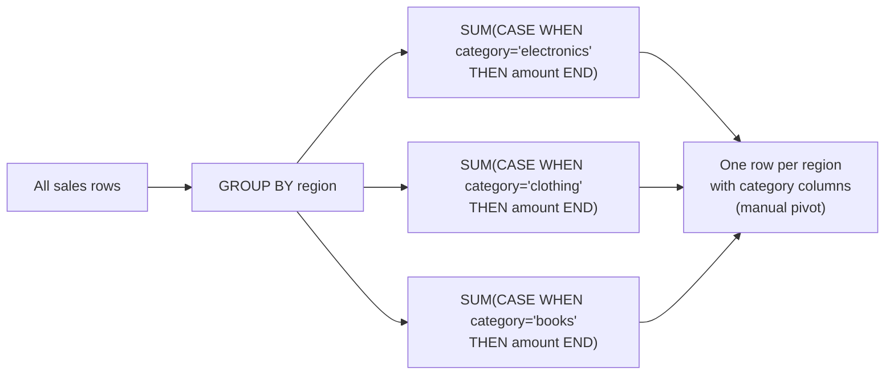

# :material-table-pivot: Conditional Aggregation

Aggregate data conditionally — computing separate totals, counts, or averages per category without `PIVOT` or multiple subqueries, using `SUM(CASE WHEN ...)` and `COUNT(IF(...))`.

______________________________________________________________________

## :material-sitemap: Execution Flow



______________________________________________________________________

## :material-animation-play: Interactive Demo

> Hover any bar to see the exact revenue and its percentage share of that region's total.

<div id="viz-conditional-agg" class="ts-viz"></div>

______________________________________________________________________

## :material-toy-brick: Sample Data

```sql
-- sales — transactions across regions and product categories
CREATE OR REPLACE TEMP VIEW sales AS
SELECT * FROM VALUES
  ('alice',  'APAC',  'electronics', 1200.00, DATE '2024-01-15'),
  ('bob',    'EMEA',  'clothing',      89.50, DATE '2024-01-22'),
  ('alice',  'APAC',  'books',         34.99, DATE '2024-02-03'),
  ('carol',  'APAC',  'electronics',  799.00, DATE '2024-02-14'),
  ('bob',    'EMEA',  'electronics',  249.00, DATE '2024-03-01'),
  ('alice',  'APAC',  'clothing',     125.00, DATE '2024-03-10'),
  ('carol',  'EMEA',  'books',         19.99, DATE '2024-04-05'),
  ('dave',   'AMER',  'electronics',  599.00, DATE '2024-04-18'),
  ('alice',  'APAC',  'electronics',  349.00, DATE '2024-05-02'),
  ('bob',    'EMEA',  'clothing',      67.00, DATE '2024-05-20'),
  ('dave',   'AMER',  'books',         45.00, DATE '2024-05-25'),
  ('carol',  'AMER',  'electronics',  899.00, DATE '2024-06-01')
AS t(customer, region, category, amount, sale_date);
```

| customer | region | category    | amount  | sale_date  |
| -------- | ------ | ----------- | ------- | ---------- |
| alice    | APAC   | electronics | 1200.00 | 2024-01-15 |
| bob      | EMEA   | clothing    | 89.50   | 2024-01-22 |
| carol    | APAC   | electronics | 799.00  | 2024-02-14 |
| dave     | AMER   | electronics | 599.00  | 2024-04-18 |
| …        | …      | …           | …       | …          |

______________________________________________________________________

## :material-numeric-1-circle: Pattern 1 — Revenue per category as separate columns (manual pivot)

```sql
SELECT
    region,
    ROUND(SUM(CASE WHEN category = 'electronics' THEN amount ELSE 0 END), 2) AS electronics_revenue,
    ROUND(SUM(CASE WHEN category = 'clothing'    THEN amount ELSE 0 END), 2) AS clothing_revenue,
    ROUND(SUM(CASE WHEN category = 'books'       THEN amount ELSE 0 END), 2) AS books_revenue,
    ROUND(SUM(amount), 2)                                                     AS total_revenue
FROM sales
GROUP BY region
ORDER BY total_revenue DESC;
-- Result:
-- region | electronics_revenue | clothing_revenue | books_revenue | total_revenue
-- -------|---------------------|------------------|---------------|---------------
-- APAC   | 2348.00             | 125.00           |  34.99        | 2507.99
-- AMER   | 1498.00             |   0.00           |  45.00        | 1543.00
-- EMEA   |  249.00             | 156.50           |  19.99        |  425.49
```

______________________________________________________________________

## :material-numeric-2-circle: Pattern 2 — Transaction count per category per region

```sql
SELECT
    region,
    COUNT(IF(category = 'electronics', 1, NULL)) AS electronics_orders,
    COUNT(IF(category = 'clothing',    1, NULL)) AS clothing_orders,
    COUNT(IF(category = 'books',       1, NULL)) AS books_orders,
    COUNT(*)                                      AS total_orders
FROM sales
GROUP BY region
ORDER BY region;
-- Result:
-- region | electronics_orders | clothing_orders | books_orders | total_orders
-- -------|--------------------|-----------------|--------------|-------------
-- AMER   | 2                  | 0               | 1            | 3
-- APAC   | 3                  | 1               | 1            | 5
-- EMEA   | 1                  | 2               | 1            | 4
```

______________________________________________________________________

## :material-numeric-3-circle: Pattern 3 — Percentage share per category

```sql
SELECT
    region,
    ROUND(SUM(CASE WHEN category = 'electronics' THEN amount END) / SUM(amount) * 100, 1) AS electronics_pct,
    ROUND(SUM(CASE WHEN category = 'clothing'    THEN amount END) / SUM(amount) * 100, 1) AS clothing_pct,
    ROUND(SUM(CASE WHEN category = 'books'       THEN amount END) / SUM(amount) * 100, 1) AS books_pct
FROM sales
GROUP BY region
ORDER BY region;
-- Result:
-- region | electronics_pct | clothing_pct | books_pct
-- -------|-----------------|--------------|----------
-- AMER   | 97.1            |  0.0         |  2.9
-- APAC   | 93.6            |  5.0         |  1.4
-- EMEA   | 58.5            | 36.8         |  4.7
```

______________________________________________________________________

## :material-numeric-4-circle: Pattern 4 — Conditional average (exclude zeros from denominator)

Using `SUM / NULLIF(COUNT, 0)` avoids division-by-zero and correctly excludes non-matching rows from the average.

```sql
SELECT
    region,
    -- Average electronics ticket (only electronics sales in denominator)
    ROUND(
        SUM(CASE WHEN category = 'electronics' THEN amount END)
        / NULLIF(COUNT(CASE WHEN category = 'electronics' THEN 1 END), 0),
    2) AS avg_electronics_ticket,
    -- Average clothing ticket
    ROUND(
        SUM(CASE WHEN category = 'clothing' THEN amount END)
        / NULLIF(COUNT(CASE WHEN category = 'clothing' THEN 1 END), 0),
    2) AS avg_clothing_ticket
FROM sales
GROUP BY region
ORDER BY region;
-- Result:
-- region | avg_electronics_ticket | avg_clothing_ticket
-- -------|------------------------|--------------------
-- AMER   | 749.00                 | NULL
-- APAC   | 782.67                 | 125.00
-- EMEA   | 249.00                 |  78.25
```

______________________________________________________________________

## :material-numeric-5-circle: Pattern 5 — Multi-period comparison (H1 vs H2)

```sql
SELECT
    customer,
    ROUND(SUM(CASE WHEN MONTH(sale_date) BETWEEN 1 AND 3 THEN amount ELSE 0 END), 2) AS q1_revenue,
    ROUND(SUM(CASE WHEN MONTH(sale_date) BETWEEN 4 AND 6 THEN amount ELSE 0 END), 2) AS q2_revenue,
    ROUND(SUM(amount), 2)                                                             AS total_revenue,
    ROUND(
        (SUM(CASE WHEN MONTH(sale_date) BETWEEN 4 AND 6 THEN amount END)
         - SUM(CASE WHEN MONTH(sale_date) BETWEEN 1 AND 3 THEN amount END))
        / NULLIF(SUM(CASE WHEN MONTH(sale_date) BETWEEN 1 AND 3 THEN amount END), 0) * 100,
    1)                                                                                AS q2_vs_q1_growth_pct
FROM sales
GROUP BY customer
ORDER BY total_revenue DESC;
-- Result:
-- customer | q1_revenue | q2_revenue | total_revenue | q2_vs_q1_growth_pct
-- ---------|------------|------------|---------------|--------------------
-- alice    | 1359.99    |  349.00    | 1708.99       | -74.3
-- carol    | 799.00     |  918.99    | 1717.99       |  15.0
-- dave     |   0.00     |  644.00    |  644.00       |  NULL
-- bob      |  338.50    |   67.00    |  405.50       | -80.2
```

______________________________________________________________________

## :material-numeric-6-circle: Pattern 6 — Boolean flags per condition

```sql
SELECT
    customer,
    MAX(CASE WHEN category = 'electronics' THEN 1 ELSE 0 END) AS bought_electronics,
    MAX(CASE WHEN category = 'clothing'    THEN 1 ELSE 0 END) AS bought_clothing,
    MAX(CASE WHEN category = 'books'       THEN 1 ELSE 0 END) AS bought_books,
    COUNT(DISTINCT category)                                   AS category_count
FROM sales
GROUP BY customer
ORDER BY customer;
-- Result:
-- customer | bought_electronics | bought_clothing | bought_books | category_count
-- ---------|--------------------|-----------------|--------------|--------------
-- alice    | 1                  | 1               | 1            | 3
-- bob      | 1                  | 1               | 0            | 2
-- carol    | 1                  | 0               | 1            | 2
-- dave     | 1                  | 0               | 1            | 2
```

______________________________________________________________________

## :material-numeric-7-circle: Pattern 7 — Conditional MAX/MIN of a real value (not just a flag)

Pattern 6 used `MAX(CASE WHEN ... THEN 1 ELSE 0 END)` as a boolean flag. `MAX`/`MIN` are
just as useful for finding the **largest or smallest matching value** per category —
the `CASE` expression should have **no `ELSE`**, so non-matching rows contribute `NULL`
(which `MAX`/`MIN` correctly ignore) instead of a real value like `0` that could win the
comparison by accident:

```sql
SELECT
    region,
    MAX(CASE WHEN category = 'electronics' THEN amount END) AS max_electronics_sale,
    MIN(CASE WHEN category = 'electronics' THEN amount END) AS min_electronics_sale,
    MAX(CASE WHEN category = 'clothing'    THEN amount END) AS max_clothing_sale
FROM sales
GROUP BY region
ORDER BY region;
-- Result:
-- region | max_electronics_sale | min_electronics_sale | max_clothing_sale
-- -------|-----------------------|-----------------------|-------------------
-- AMER   | 899.00                | 599.00                | NULL
-- APAC   | 1200.00               | 349.00                | 125.00
-- EMEA   | 249.00                | 249.00                | 89.50
```

`max_clothing_sale` is `NULL` for AMER because AMER never sold any clothing — exactly
the desired behavior. Had the `CASE` used `ELSE 0` (as in Pattern 1's `SUM`), `MAX` would
report `0` for a category with **zero matching rows**, which is misleading — `0` looks
like a real (if small) sale rather than "no data". `SUM`/`COUNT` are safe with `ELSE 0`
(zero is the correct identity for addition), but `MAX`/`MIN` should always omit the
`ELSE` and let non-matches fall through as `NULL`.

______________________________________________________________________

| Expression                         | Syntax                  | Use when                           |
| ---------------------------------- | ----------------------- | ---------------------------------- |
| `SUM(CASE WHEN cond THEN val END)` | ANSI SQL, portable      | Sum a value only for matching rows |
| `COUNT(IF(cond, 1, NULL))`         | Shorter, Spark-specific | Count matching rows                |
| `SUM(amount) FILTER (WHERE cond)`  | SQL standard extension  | Cleanest syntax — Spark 3.0+       |
| `COUNT(DISTINCT col)`              | No condition needed     | Distinct count across all rows     |

```sql
-- FILTER syntax (cleanest for simple conditions)
SELECT
    region,
    SUM(amount) FILTER (WHERE category = 'electronics') AS electronics_revenue,
    SUM(amount) FILTER (WHERE category = 'clothing')    AS clothing_revenue,
    SUM(amount) FILTER (WHERE category = 'books')       AS books_revenue
FROM sales
GROUP BY region
ORDER BY region;
-- region | electronics_revenue | clothing_revenue | books_revenue
-- -------|----------------------|------------------|---------------
-- AMER   | 1498.00              | NULL             | 45.00
-- APAC   | 2348.00              | 125.00           | 34.99
-- EMEA   | 249.00               | 156.50           | 19.99
```

!!! warning "FILTER returns NULL for zero matching rows, not 0 like Pattern 1"

    `SUM(amount) FILTER (WHERE category = 'clothing')` for `AMER` is `NULL`, not `0.00`
    — `AMER` sold zero clothing, and `SUM` over zero rows is `NULL` (the standard SQL
    aggregate identity). Pattern 1's `SUM(CASE WHEN ... THEN amount ELSE 0 END)`
    reports `0.00` instead, because its `ELSE 0` supplies a real value for every row
    that reaches the aggregate. The two are **not** interchangeable when a category has
    zero rows for a group — wrap `FILTER` in `COALESCE(..., 0)` if you need the `0.00`
    behavior for downstream arithmetic (e.g. further `SUM`s or `ORDER BY`).

______________________________________________________________________

## :material-numeric-8-circle: Pattern 8 — Multi-Condition Presence/Absence (Retention-Style Filtering)

The patterns above all *report* a value per category. A different, equally common
class of problem *filters entities* based on a combination of per-period presence and
absence — "customers who purchased in January, February, and March, but never in
April." `COUNT(DISTINCT CASE WHEN ... THEN key END)` inside `HAVING` answers this in a
**single pass over the table**, one clause per required condition:

```sql
SELECT customer
FROM orders
GROUP BY customer
HAVING
    COUNT(DISTINCT CASE WHEN month = 1 THEN order_id END) > 0   -- (1)!
    AND COUNT(DISTINCT CASE WHEN month = 2 THEN order_id END) > 0
    AND COUNT(DISTINCT CASE WHEN month = 3 THEN order_id END) > 0
    AND COUNT(DISTINCT CASE WHEN month = 4 THEN order_id END) = 0  -- (2)!
ORDER BY customer;
```

1. `> 0` means "at least one order in this month" — presence.
2. `= 0` means "zero orders in this month" — absence. `COUNT` never returns
    `NULL` (unlike `SUM`/`MAX` on all-`NULL` input), so comparing directly to
    `0` is safe with no `COALESCE` needed.

??? success "Expected output (verified on Spark 4.2)"

    | customer |
    | -------- |
    | alice    |

    Given `alice` (Jan, Feb, Mar), `bob` (Jan, Feb, **Apr**), `carol` (Jan, Mar only —
    missing Feb), and `dave` (Jan, Feb, Mar, **Apr**) — only `alice` satisfies "present
    in Jan/Feb/Mar, absent in Apr." `bob` and `dave` are excluded by the April
    condition; `carol` is excluded by the missing-February condition.

`COUNT(DISTINCT ...)` — not plain `COUNT(...)` — matters here: with `COUNT(order_id)`
a customer with duplicate/re-billed order rows in the same month would still pass the
`> 0` check correctly, but `COUNT(DISTINCT order_id)` is what makes the count itself
meaningful if you also project it (e.g. `AS jan_order_count`) rather than just testing
it against zero.

### Why this beats the join-per-month alternative

The same question can be expressed as one self-join (or `IN`/`EXISTS` subquery) per
month — a join to confirm presence in January, another for February, another for
March, and a `NOT IN`/anti-join for April. Verified via `EXPLAIN FORMATTED`: the
conditional-aggregation form above scans `orders` **once**, expanding the four `CASE`
conditions through Spark's `Expand` operator ahead of a single `HashAggregate`/`GROUP BY customer`. The multi-join alternative scans `orders` **four separate times** (once
per month filter) and chains three `BroadcastHashJoin Inner` + one `BroadcastHashJoin LeftAnti` on top. For a small dimension table both plans finish quickly, but the
conditional-aggregation form is the one whose cost doesn't multiply by the number of
periods being checked — checking 12 months of presence/absence is still one scan, not
twelve.

!!! tip "Generalizes beyond months"

    The same shape solves "logged in every day this week but didn't renew," "shipped
    from every warehouse but never returned," or "active in every quarter this year" —
    any question of the form "present in all of {set A}, absent from all of {set B}"
    collapses to one `COUNT(DISTINCT CASE WHEN ... END)` clause per condition inside a
    single `HAVING`.

______________________________________________________________________

## :material-database-search: [Databricks] Real-World Example — System Tables

!!! note "[Databricks] Unity Catalog system tables"

    `system.billing.usage` is a built-in Unity Catalog table (no sample data setup
    needed) that records real billable usage at the account and workspace level. An
    account admin must `GRANT USE CATALOG, USE SCHEMA, SELECT ON SCHEMA system.billing TO <principal>` before these queries will return rows.

### 9 — Daily usage split into environment buckets

```sql
-- [Databricks] Requires SELECT on system.billing.usage
SELECT
    workspace_id,
    usage_date,
    SUM(CASE WHEN custom_tags['Env'] = 'prod' THEN usage_quantity ELSE 0 END) AS prod_usage,
    SUM(CASE WHEN custom_tags['Env'] = 'dev' THEN usage_quantity ELSE 0 END) AS dev_usage,
    SUM(CASE WHEN custom_tags['Env'] = 'staging' THEN usage_quantity ELSE 0 END) AS staging_usage,
    SUM(CASE WHEN custom_tags['Env'] IS NULL THEN usage_quantity ELSE 0 END) AS unlabeled_usage
FROM system.billing.usage
WHERE usage_date >= DATE_SUB(CURRENT_DATE(), 7)
GROUP BY workspace_id, usage_date
ORDER BY workspace_id, usage_date;
-- Result (illustrative):
-- workspace_id | usage_date  | prod_usage | dev_usage | staging_usage | unlabeled_usage
-- -------------|-------------|------------|-----------|---------------|----------------
-- 123456789    | 2024-07-01  | 812.4      | 155.0     | 48.2          | 12.0
-- 123456789    | 2024-07-02  | 845.7      | 162.6     | 39.5          | 0.0
-- 987654321    | 2024-07-01  | 214.3      | 91.8      | 0.0           | 7.1
```

!!! tip "Same pattern, production cost buckets"

    The same `SUM(CASE WHEN ... THEN usage_quantity ELSE 0 END)` shape works for any
    real cost-allocation dimension in `system.billing.usage`: `Env`, `Tenant`,
    `Team`, `CostCenter`, or even `sku_name` families. Only the bucket conditions
    change; the conditional aggregation pattern stays identical.

______________________________________________________________________

## :material-lightbulb-outline: When to Use

| Scenario                                                            | Pattern                                                                                                |
| ------------------------------------------------------------------- | ------------------------------------------------------------------------------------------------------ |
| Pivot N known categories into columns                               | `SUM(CASE WHEN cat = 'X' THEN val END)`                                                                |
| Count occurrences per category                                      | `COUNT(IF(cat = 'X', 1, NULL))`                                                                        |
| Percentage share per category                                       | `SUM(IF) / SUM(total) * 100`                                                                           |
| Average excluding non-matching rows                                 | `SUM(IF) / NULLIF(COUNT(IF), 0)`                                                                       |
| Period comparison in one row                                        | `SUM(CASE WHEN period = 'H1' ...)`                                                                     |
| Boolean presence flags                                              | `MAX(CASE WHEN cond THEN 1 ELSE 0 END)`                                                                |
| Largest/smallest matching value per category                        | `MAX`/`MIN(CASE WHEN cond THEN val END)` — omit `ELSE` so non-matches are `NULL`, not `0`              |
| Dynamic categories (unknown at query time)                          | Use `PIVOT` clause — CASE approach requires knowing categories upfront                                 |
| Present in every period of set A, absent from every period of set B | `HAVING COUNT(DISTINCT CASE WHEN ... END) > 0 / = 0` per condition — one scan, not one join per period |
