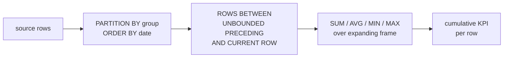

# :material-arrow-expand-right: Slowly Growing Window

Compute cumulative KPIs where the window frame starts at a fixed point and expands one row at a time — `ROWS BETWEEN UNBOUNDED PRECEDING AND CURRENT ROW`. Unlike fixed-size sliding windows (moving averages), a growing window never drops older rows, making it ideal for year-to-date totals, progressive ratios, and expanding baselines.

---

## :material-sitemap: Execution Flow



---

## :material-pin: Syntax

```sql
agg_func(value) OVER (
    PARTITION BY group_col
    ORDER BY order_col
    ROWS BETWEEN UNBOUNDED PRECEDING AND CURRENT ROW
) AS cumulative_metric
```

| Frame type | Behaviour | Use case |
|------------|-----------|----------|
| `ROWS BETWEEN UNBOUNDED PRECEDING AND CURRENT ROW` | Grows by 1 row each step; never shrinks | Running total, YTD sum, cumulative average |
| `ROWS BETWEEN N PRECEDING AND CURRENT ROW` | Fixed-size sliding window of N+1 rows | Moving average, sliding sum |
| `ROWS BETWEEN UNBOUNDED PRECEDING AND UNBOUNDED FOLLOWING` | Entire partition (constant) | Partition-level total for ratio calculations |

!!! note "Default frame with ORDER BY"
    When `ORDER BY` is present but no explicit frame clause, Spark uses `RANGE BETWEEN UNBOUNDED PRECEDING AND CURRENT ROW`. This groups ties together, which can produce unexpected jumps. Always specify `ROWS BETWEEN` explicitly for deterministic row-by-row expansion.

---

## :material-magnify: Behavior

1. **Monotonic growth** — the frame always includes every row from the partition start through the current row; it never shrinks or resets (unless a new partition begins).
2. **Partition reset** — `PARTITION BY` restarts the growing window for each group. Omitting it produces a single global expanding aggregate.
3. **NULL handling** — `SUM`, `AVG`, `MIN`, `MAX` all ignore `NULL` values within the frame. The cumulative metric stays flat when a row has a `NULL` contribution.
4. **Deterministic ordering** — if multiple rows share the same `ORDER BY` value, add a tie-breaker column to guarantee repeatable row-by-row accumulation.

---

## :material-database: Sample Data

### Dataset 1: Monthly regional sales (YTD tracking)

```sql
CREATE OR REPLACE TEMP VIEW monthly_sales AS
SELECT * FROM VALUES
    ('APAC',  DATE '2024-01-01',  42000),
    ('APAC',  DATE '2024-02-01',  38500),
    ('APAC',  DATE '2024-03-01',  51200),
    ('APAC',  DATE '2024-04-01',  47800),
    ('APAC',  DATE '2024-05-01',  55000),
    ('APAC',  DATE '2024-06-01',  49500),
    ('EMEA',  DATE '2024-01-01',  31000),
    ('EMEA',  DATE '2024-02-01',  29500),
    ('EMEA',  DATE '2024-03-01',  35000),
    ('EMEA',  DATE '2024-04-01',  33000),
    ('EMEA',  DATE '2024-05-01',  37500),
    ('EMEA',  DATE '2024-06-01',  34200)
AS t(region, sale_month, revenue);
```

### Dataset 2: Daily website metrics

```sql
CREATE OR REPLACE TEMP VIEW daily_metrics AS
SELECT * FROM VALUES
    (DATE '2024-07-01', 12500, 375,  4200.00),
    (DATE '2024-07-02', 13200, 410,  4650.00),
    (DATE '2024-07-03', 11800, 340,  3800.00),
    (DATE '2024-07-04',  8500, 220,  2100.00),
    (DATE '2024-07-05',  9200, 255,  2800.00),
    (DATE '2024-07-06', 14100, 480,  5200.00),
    (DATE '2024-07-07', 15300, 520,  5800.00),
    (DATE '2024-07-08', 13800, 430,  4900.00),
    (DATE '2024-07-09', 14500, 465,  5100.00),
    (DATE '2024-07-10', 12900, 390,  4300.00)
AS t(dt, visits, signups, revenue);
```

### Dataset 3: Quarterly employee performance scores

```sql
CREATE OR REPLACE TEMP VIEW quarterly_scores AS
SELECT * FROM VALUES
    ('Engineering', 'Alice', 'Q1', 88),
    ('Engineering', 'Alice', 'Q2', 92),
    ('Engineering', 'Alice', 'Q3', 85),
    ('Engineering', 'Alice', 'Q4', 95),
    ('Engineering', 'Bob',   'Q1', 76),
    ('Engineering', 'Bob',   'Q2', 82),
    ('Engineering', 'Bob',   'Q3', 79),
    ('Engineering', 'Bob',   'Q4', 88),
    ('Sales',       'Carol', 'Q1', 91),
    ('Sales',       'Carol', 'Q2', 87),
    ('Sales',       'Carol', 'Q3', 93),
    ('Sales',       'Carol', 'Q4', 89),
    ('Sales',       'Dave',  'Q1', 72),
    ('Sales',       'Dave',  'Q2', 78),
    ('Sales',       'Dave',  'Q3', 85),
    ('Sales',       'Dave',  'Q4', 90)
AS t(department, employee, quarter, score);
```

---

## :material-flask-outline: Practical Examples

### 1 — Year-to-date revenue per region

```sql
SELECT
    region,
    sale_month,
    revenue,
    SUM(revenue) OVER (
        PARTITION BY region
        ORDER BY sale_month
        ROWS BETWEEN UNBOUNDED PRECEDING AND CURRENT ROW
    ) AS ytd_revenue
FROM monthly_sales
ORDER BY region, sale_month;
```

??? success "Expected output"

    | region | sale_month | revenue | ytd_revenue |
    |--------|------------|---------|-------------|
    | APAC | 2024-01-01 | 42000 | 42000 |
    | APAC | 2024-02-01 | 38500 | 80500 |
    | APAC | 2024-03-01 | 51200 | 131700 |
    | APAC | 2024-04-01 | 47800 | 179500 |
    | APAC | 2024-05-01 | 55000 | 234500 |
    | APAC | 2024-06-01 | 49500 | 284000 |
    | EMEA | 2024-01-01 | 31000 | 31000 |
    | EMEA | 2024-02-01 | 29500 | 60500 |
    | EMEA | 2024-03-01 | 35000 | 95500 |
    | EMEA | 2024-04-01 | 33000 | 128500 |
    | EMEA | 2024-05-01 | 37500 | 166000 |
    | EMEA | 2024-06-01 | 34200 | 200200 |

### 2 — Cumulative average with trend indicator

```sql
SELECT
    region,
    sale_month,
    revenue,
    ROUND(AVG(revenue) OVER (
        PARTITION BY region
        ORDER BY sale_month
        ROWS BETWEEN UNBOUNDED PRECEDING AND CURRENT ROW
    ), 0) AS cumulative_avg,
    CASE
        WHEN revenue > AVG(revenue) OVER (
            PARTITION BY region
            ORDER BY sale_month
            ROWS BETWEEN UNBOUNDED PRECEDING AND CURRENT ROW
        ) THEN 'ABOVE_TREND'
        ELSE 'BELOW_TREND'
    END AS vs_trend
FROM monthly_sales
ORDER BY region, sale_month;
```

??? success "Expected output"

    | region | sale_month | revenue | cumulative_avg | vs_trend |
    |--------|------------|---------|----------------|----------|
    | APAC | 2024-01-01 | 42000 | 42000 | BELOW_TREND |
    | APAC | 2024-02-01 | 38500 | 40250 | BELOW_TREND |
    | APAC | 2024-03-01 | 51200 | 43900 | ABOVE_TREND |
    | APAC | 2024-04-01 | 47800 | 44875 | ABOVE_TREND |
    | APAC | 2024-05-01 | 55000 | 46900 | ABOVE_TREND |
    | APAC | 2024-06-01 | 49500 | 47333 | ABOVE_TREND |
    | EMEA | 2024-01-01 | 31000 | 31000 | BELOW_TREND |
    | EMEA | 2024-02-01 | 29500 | 30250 | BELOW_TREND |
    | EMEA | 2024-03-01 | 35000 | 31833 | ABOVE_TREND |
    | EMEA | 2024-04-01 | 33000 | 32125 | ABOVE_TREND |
    | EMEA | 2024-05-01 | 37500 | 33200 | ABOVE_TREND |
    | EMEA | 2024-06-01 | 34200 | 33367 | ABOVE_TREND |

### 3 — Cumulative conversion rate (expanding funnel)

```sql
SELECT
    dt,
    visits,
    signups,
    SUM(visits) OVER w AS cum_visits,
    SUM(signups) OVER w AS cum_signups,
    ROUND(SUM(signups) OVER w * 100.0 / SUM(visits) OVER w, 2) AS cum_conversion_pct,
    ROUND(signups * 100.0 / visits, 2) AS daily_conversion_pct
FROM daily_metrics
WINDOW w AS (ORDER BY dt ROWS BETWEEN UNBOUNDED PRECEDING AND CURRENT ROW)
ORDER BY dt;
```

??? success "Expected output"

    | dt | visits | signups | cum_visits | cum_signups | cum_conversion_pct | daily_conversion_pct |
    |-----|--------|---------|------------|-------------|--------------------|-----------------------|
    | 2024-07-01 | 12500 | 375 | 12500 | 375 | 3.00 | 3.00 |
    | 2024-07-02 | 13200 | 410 | 25700 | 785 | 3.05 | 3.11 |
    | 2024-07-03 | 11800 | 340 | 37500 | 1125 | 3.00 | 2.88 |
    | 2024-07-04 | 8500 | 220 | 46000 | 1345 | 2.92 | 2.59 |
    | 2024-07-05 | 9200 | 255 | 55200 | 1600 | 2.90 | 2.77 |
    | 2024-07-06 | 14100 | 480 | 69300 | 2080 | 3.00 | 3.40 |
    | 2024-07-07 | 15300 | 520 | 84600 | 2600 | 3.07 | 3.40 |
    | 2024-07-08 | 13800 | 430 | 98400 | 3030 | 3.08 | 3.12 |
    | 2024-07-09 | 14500 | 465 | 112900 | 3495 | 3.10 | 3.21 |
    | 2024-07-10 | 12900 | 390 | 125800 | 3885 | 3.09 | 3.02 |

!!! tip "Stabilising metric"
    The cumulative conversion rate smooths out daily noise. By day 10, it has stabilised around 3.09% — far more reliable than any single day's rate.

### 4 — Cumulative min / max (high-water mark)

Track the all-time best and worst months alongside the running total:

```sql
SELECT
    region,
    sale_month,
    revenue,
    SUM(revenue) OVER w AS ytd_revenue,
    MIN(revenue) OVER w AS worst_month_so_far,
    MAX(revenue) OVER w AS best_month_so_far,
    revenue - AVG(revenue) OVER w AS vs_cumulative_avg
FROM monthly_sales
WINDOW w AS (
    PARTITION BY region
    ORDER BY sale_month
    ROWS BETWEEN UNBOUNDED PRECEDING AND CURRENT ROW
)
ORDER BY region, sale_month;
```

??? success "Expected output"

    | region | sale_month | revenue | ytd_revenue | worst_month_so_far | best_month_so_far | vs_cumulative_avg |
    |--------|------------|---------|-------------|--------------------|--------------------|-------------------|
    | APAC | 2024-01-01 | 42000 | 42000 | 42000 | 42000 | 0 |
    | APAC | 2024-02-01 | 38500 | 80500 | 38500 | 42000 | -1750 |
    | APAC | 2024-03-01 | 51200 | 131700 | 38500 | 51200 | 7300 |
    | APAC | 2024-04-01 | 47800 | 179500 | 38500 | 51200 | 2925 |
    | APAC | 2024-05-01 | 55000 | 234500 | 38500 | 55000 | 8100 |
    | APAC | 2024-06-01 | 49500 | 284000 | 38500 | 55000 | 2167 |
    | EMEA | 2024-01-01 | 31000 | 31000 | 31000 | 31000 | 0 |
    | EMEA | 2024-02-01 | 29500 | 60500 | 29500 | 31000 | -750 |
    | EMEA | 2024-03-01 | 35000 | 95500 | 29500 | 35000 | 3167 |
    | EMEA | 2024-04-01 | 33000 | 128500 | 29500 | 35000 | 875 |
    | EMEA | 2024-05-01 | 37500 | 166000 | 29500 | 37500 | 4300 |
    | EMEA | 2024-06-01 | 34200 | 200200 | 29500 | 37500 | 833 |

### 5 — YTD revenue as percentage of annual target

```sql
SELECT
    region,
    sale_month,
    revenue,
    SUM(revenue) OVER (
        PARTITION BY region
        ORDER BY sale_month
        ROWS BETWEEN UNBOUNDED PRECEDING AND CURRENT ROW
    ) AS ytd_revenue,
    CASE region WHEN 'APAC' THEN 550000 WHEN 'EMEA' THEN 400000 END AS annual_target,
    ROUND(
        SUM(revenue) OVER (
            PARTITION BY region
            ORDER BY sale_month
            ROWS BETWEEN UNBOUNDED PRECEDING AND CURRENT ROW
        ) * 100.0 / CASE region WHEN 'APAC' THEN 550000 WHEN 'EMEA' THEN 400000 END
    , 1) AS pct_of_target,
    ROUND(
        ROW_NUMBER() OVER (PARTITION BY region ORDER BY sale_month) * 100.0 / 12
    , 1) AS pct_of_year_elapsed
FROM monthly_sales
ORDER BY region, sale_month;
```

??? success "Expected output"

    | region | sale_month | revenue | ytd_revenue | annual_target | pct_of_target | pct_of_year_elapsed |
    |--------|------------|---------|-------------|---------------|---------------|---------------------|
    | APAC | 2024-01-01 | 42000 | 42000 | 550000 | 7.6 | 8.3 |
    | APAC | 2024-02-01 | 38500 | 80500 | 550000 | 14.6 | 16.7 |
    | APAC | 2024-03-01 | 51200 | 131700 | 550000 | 23.9 | 25.0 |
    | APAC | 2024-04-01 | 47800 | 179500 | 550000 | 32.6 | 33.3 |
    | APAC | 2024-05-01 | 55000 | 234500 | 550000 | 42.6 | 41.7 |
    | APAC | 2024-06-01 | 49500 | 284000 | 550000 | 51.6 | 50.0 |
    | EMEA | 2024-01-01 | 31000 | 31000 | 400000 | 7.8 | 8.3 |
    | EMEA | 2024-02-01 | 29500 | 60500 | 400000 | 15.1 | 16.7 |
    | EMEA | 2024-03-01 | 35000 | 95500 | 400000 | 23.9 | 25.0 |
    | EMEA | 2024-04-01 | 33000 | 128500 | 400000 | 32.1 | 33.3 |
    | EMEA | 2024-05-01 | 37500 | 166000 | 400000 | 41.5 | 41.7 |
    | EMEA | 2024-06-01 | 34200 | 200200 | 400000 | 50.1 | 50.0 |

!!! tip "Pace indicator"
    Compare `pct_of_target` to `pct_of_year_elapsed`. APAC is slightly ahead of pace at mid-year (51.6% vs 50.0%); EMEA is right on track (50.1% vs 50.0%).

### 6 — Expanding standard deviation (variance stabilisation)

Track how the cumulative standard deviation converges as more data arrives:

```sql
SELECT
    dt,
    revenue,
    COUNT(*) OVER w AS n,
    ROUND(AVG(revenue) OVER w, 2) AS cum_avg,
    ROUND(STDDEV(revenue) OVER w, 2) AS cum_stddev,
    ROUND(
        STDDEV(revenue) OVER w / NULLIF(AVG(revenue) OVER w, 0) * 100, 1
    ) AS cv_pct
FROM daily_metrics
WINDOW w AS (ORDER BY dt ROWS BETWEEN UNBOUNDED PRECEDING AND CURRENT ROW)
ORDER BY dt;
```

??? success "Expected output"

    | dt | revenue | n | cum_avg | cum_stddev | cv_pct |
    |-----|---------|---|---------|------------|--------|
    | 2024-07-01 | 4200.00 | 1 | 4200.00 | NULL | NULL |
    | 2024-07-02 | 4650.00 | 2 | 4425.00 | 318.20 | 7.2 |
    | 2024-07-03 | 3800.00 | 3 | 4216.67 | 425.74 | 10.1 |
    | 2024-07-04 | 2100.00 | 4 | 3687.50 | 1090.53 | 29.6 |
    | 2024-07-05 | 2800.00 | 5 | 3510.00 | 1054.99 | 30.1 |
    | 2024-07-06 | 5200.00 | 6 | 3791.67 | 1131.07 | 29.8 |
    | 2024-07-07 | 5800.00 | 7 | 4078.57 | 1252.54 | 30.7 |
    | 2024-07-08 | 4900.00 | 8 | 4181.25 | 1195.27 | 28.6 |
    | 2024-07-09 | 5100.00 | 9 | 4283.33 | 1147.43 | 26.8 |
    | 2024-07-10 | 4300.00 | 10 | 4285.00 | 1089.73 | 25.4 |

!!! note "Coefficient of variation"
    The CV (stddev / mean * 100) measures relative variability. It starts erratic with few data points and stabilises as the window grows — a key signal that the metric is converging.

### 7 — Progressive percentile rank (expanding position)

Show where each month ranks within all months seen so far:

```sql
SELECT
    region,
    sale_month,
    revenue,
    SUM(revenue) OVER w AS ytd_revenue,
    COUNT(*) OVER w AS months_elapsed,
    ROUND(
        PERCENT_RANK() OVER (
            PARTITION BY region
            ORDER BY revenue
        ) * 100, 0
    ) AS percentile_rank_overall,
    RANK() OVER (
        PARTITION BY region
        ORDER BY revenue DESC
    ) AS rank_by_revenue
FROM monthly_sales
WINDOW w AS (
    PARTITION BY region
    ORDER BY sale_month
    ROWS BETWEEN UNBOUNDED PRECEDING AND CURRENT ROW
)
ORDER BY region, sale_month;
```

??? success "Expected output"

    | region | sale_month | revenue | ytd_revenue | months_elapsed | percentile_rank_overall | rank_by_revenue |
    |--------|------------|---------|-------------|----------------|-------------------------|-----------------|
    | APAC | 2024-01-01 | 42000 | 42000 | 1 | 20 | 5 |
    | APAC | 2024-02-01 | 38500 | 80500 | 2 | 0 | 6 |
    | APAC | 2024-03-01 | 51200 | 131700 | 3 | 60 | 2 |
    | APAC | 2024-04-01 | 47800 | 179500 | 4 | 40 | 4 |
    | APAC | 2024-05-01 | 55000 | 234500 | 5 | 100 | 1 |
    | APAC | 2024-06-01 | 49500 | 284000 | 6 | 80 | 3 |
    | EMEA | 2024-01-01 | 31000 | 31000 | 1 | 20 | 5 |
    | EMEA | 2024-02-01 | 29500 | 60500 | 2 | 0 | 6 |
    | EMEA | 2024-03-01 | 35000 | 95500 | 3 | 80 | 2 |
    | EMEA | 2024-04-01 | 33000 | 128500 | 4 | 40 | 4 |
    | EMEA | 2024-05-01 | 37500 | 166000 | 5 | 100 | 1 |
    | EMEA | 2024-06-01 | 34200 | 200200 | 6 | 60 | 3 |

### 8 — Cumulative score with moving benchmark

Track each employee's cumulative average score and compare against an expanding department benchmark:

```sql
SELECT
    department,
    employee,
    quarter,
    score,
    ROUND(AVG(score) OVER emp_w, 1) AS cum_avg_score,
    ROUND(AVG(score) OVER dept_w, 1) AS dept_cum_avg,
    score - ROUND(AVG(score) OVER dept_w, 1) AS vs_dept_benchmark
FROM quarterly_scores
WINDOW
    emp_w AS (
        PARTITION BY department, employee
        ORDER BY quarter
        ROWS BETWEEN UNBOUNDED PRECEDING AND CURRENT ROW
    ),
    dept_w AS (
        PARTITION BY department
        ORDER BY quarter
        ROWS BETWEEN UNBOUNDED PRECEDING AND CURRENT ROW
    )
ORDER BY department, employee, quarter;
```

??? success "Expected output"

    | department | employee | quarter | score | cum_avg_score | dept_cum_avg | vs_dept_benchmark |
    |------------|----------|---------|-------|---------------|--------------|-------------------|
    | Engineering | Alice | Q1 | 88 | 88.0 | 82.0 | 6.0 |
    | Engineering | Alice | Q2 | 92 | 90.0 | 84.5 | 7.5 |
    | Engineering | Alice | Q3 | 85 | 88.3 | 83.5 | 1.5 |
    | Engineering | Alice | Q4 | 95 | 90.0 | 85.0 | 10.0 |
    | Engineering | Bob | Q1 | 76 | 76.0 | 82.0 | -6.0 |
    | Engineering | Bob | Q2 | 82 | 79.0 | 84.5 | -2.5 |
    | Engineering | Bob | Q3 | 79 | 79.0 | 83.5 | -4.5 |
    | Engineering | Bob | Q4 | 88 | 81.3 | 85.0 | 3.0 |
    | Sales | Carol | Q1 | 91 | 91.0 | 81.5 | 9.5 |
    | Sales | Carol | Q2 | 87 | 89.0 | 82.0 | 5.0 |
    | Sales | Carol | Q3 | 93 | 90.3 | 84.3 | 8.7 |
    | Sales | Carol | Q4 | 89 | 90.0 | 85.6 | 3.4 |
    | Sales | Dave | Q1 | 72 | 72.0 | 81.5 | -9.5 |
    | Sales | Dave | Q2 | 78 | 75.0 | 82.0 | -4.0 |
    | Sales | Dave | Q3 | 85 | 78.3 | 84.3 | 0.7 |
    | Sales | Dave | Q4 | 90 | 81.3 | 85.6 | 4.4 |

!!! tip "Improvement tracking"
    Bob and Dave both start below the department benchmark but close the gap over time. The expanding window shows their cumulative trajectory, not just quarter-to-quarter noise.

### 9 — Cumulative distinct count (expanding unique visitors)

```sql
SELECT
    dt,
    visits,
    signups,
    SUM(visits)  OVER w AS cum_visits,
    SUM(signups) OVER w AS cum_signups,
    SUM(visits)  OVER w - LAG(SUM(visits) OVER w) OVER (ORDER BY dt) AS daily_visit_delta,
    ROUND(
        (SUM(signups) OVER w - COALESCE(LAG(SUM(signups) OVER w) OVER (ORDER BY dt), 0))
        * 100.0 / NULLIF(visits, 0), 2
    ) AS marginal_conversion_pct
FROM daily_metrics
WINDOW w AS (ORDER BY dt ROWS BETWEEN UNBOUNDED PRECEDING AND CURRENT ROW)
ORDER BY dt;
```

??? success "Expected output"

    | dt | visits | signups | cum_visits | cum_signups | daily_visit_delta | marginal_conversion_pct |
    |-----|--------|---------|------------|-------------|-------------------|-------------------------|
    | 2024-07-01 | 12500 | 375 | 12500 | 375 | NULL | 3.00 |
    | 2024-07-02 | 13200 | 410 | 25700 | 785 | 13200 | 3.11 |
    | 2024-07-03 | 11800 | 340 | 37500 | 1125 | 11800 | 2.88 |
    | 2024-07-04 | 8500 | 220 | 46000 | 1345 | 8500 | 2.59 |
    | 2024-07-05 | 9200 | 255 | 55200 | 1600 | 9200 | 2.77 |
    | 2024-07-06 | 14100 | 480 | 69300 | 2080 | 14100 | 3.40 |
    | 2024-07-07 | 15300 | 520 | 84600 | 2600 | 15300 | 3.40 |
    | 2024-07-08 | 13800 | 430 | 98400 | 3030 | 13800 | 3.12 |
    | 2024-07-09 | 14500 | 465 | 112900 | 3495 | 14500 | 3.21 |
    | 2024-07-10 | 12900 | 390 | 125800 | 3885 | 12900 | 3.02 |

### 10 — Growing window vs fixed window side by side

Compare the behaviour of an expanding frame against a 3-row sliding window:

```sql
SELECT
    region,
    sale_month,
    revenue,
    ROUND(AVG(revenue) OVER (
        PARTITION BY region
        ORDER BY sale_month
        ROWS BETWEEN UNBOUNDED PRECEDING AND CURRENT ROW
    ), 0) AS expanding_avg,
    ROUND(AVG(revenue) OVER (
        PARTITION BY region
        ORDER BY sale_month
        ROWS BETWEEN 2 PRECEDING AND CURRENT ROW
    ), 0) AS sliding_3m_avg,
    COUNT(*) OVER (
        PARTITION BY region
        ORDER BY sale_month
        ROWS BETWEEN UNBOUNDED PRECEDING AND CURRENT ROW
    ) AS expanding_window_size,
    COUNT(*) OVER (
        PARTITION BY region
        ORDER BY sale_month
        ROWS BETWEEN 2 PRECEDING AND CURRENT ROW
    ) AS sliding_window_size
FROM monthly_sales
ORDER BY region, sale_month;
```

??? success "Expected output"

    | region | sale_month | revenue | expanding_avg | sliding_3m_avg | expanding_window_size | sliding_window_size |
    |--------|------------|---------|---------------|----------------|-----------------------|---------------------|
    | APAC | 2024-01-01 | 42000 | 42000 | 42000 | 1 | 1 |
    | APAC | 2024-02-01 | 38500 | 40250 | 40250 | 2 | 2 |
    | APAC | 2024-03-01 | 51200 | 43900 | 43900 | 3 | 3 |
    | APAC | 2024-04-01 | 47800 | 44875 | 45833 | 4 | 3 |
    | APAC | 2024-05-01 | 55000 | 46900 | 51333 | 5 | 3 |
    | APAC | 2024-06-01 | 49500 | 47333 | 50767 | 6 | 3 |
    | EMEA | 2024-01-01 | 31000 | 31000 | 31000 | 1 | 1 |
    | EMEA | 2024-02-01 | 29500 | 30250 | 30250 | 2 | 2 |
    | EMEA | 2024-03-01 | 35000 | 31833 | 31833 | 3 | 3 |
    | EMEA | 2024-04-01 | 33000 | 32125 | 32500 | 4 | 3 |
    | EMEA | 2024-05-01 | 37500 | 33200 | 35167 | 5 | 3 |
    | EMEA | 2024-06-01 | 34200 | 33367 | 34900 | 6 | 3 |

!!! tip "Key difference"
    The expanding average becomes increasingly stable over time (harder to move with new data), while the sliding average remains responsive to recent changes. Choose expanding for YTD baselines; choose sliding for trend detection.

---

## :material-shield-outline: Behavior Notes

!!! warning "ROWS vs RANGE with ties"
    With `RANGE BETWEEN UNBOUNDED PRECEDING AND CURRENT ROW` (the default when `ORDER BY` is present), rows with the same `ORDER BY` value are grouped together in the frame, causing the cumulative metric to jump by multiple rows at once. Always use `ROWS BETWEEN` for strict row-by-row growth.

!!! warning "Growing window never shrinks"
    Unlike sliding windows, a growing window never drops old rows. For time-series data where old data should eventually age out, use a fixed-size window (`ROWS BETWEEN N PRECEDING`) or partition by year to reset annually.

!!! tip "Multiple named windows"
    Use `WINDOW w AS (...)` to define the growing frame once and reference `OVER w` in every aggregate. This prevents accidental inconsistencies when multiple columns use the same frame.

!!! tip "Combine with ROWS BETWEEN UNBOUNDED PRECEDING AND UNBOUNDED FOLLOWING"
    Use the full-partition frame for the denominator (total) and the growing frame for the numerator (cumulative) to compute expanding percentage-of-total: `SUM(x) OVER growing / SUM(x) OVER full_partition`.

---

## :material-brain: When to Use

| Scenario | Pattern |
|----------|---------|
| Year-to-date revenue / spend | `SUM(amount) OVER (PARTITION BY year ORDER BY month ROWS ...)` |
| Cumulative conversion rate | `SUM(signups) OVER w / SUM(visits) OVER w` |
| Expanding average (stabilising metric) | `AVG(value) OVER (... ROWS BETWEEN UNBOUNDED PRECEDING AND CURRENT ROW)` |
| All-time high / low watermark | `MAX()` / `MIN()` over growing frame |
| YTD vs annual target pacing | Cumulative sum / target, compared to % of year elapsed |
| Variance convergence tracking | Expanding `STDDEV` and coefficient of variation |
| Employee benchmark comparison | Expanding avg per person vs expanding avg per department |
| Growing vs sliding comparison | Side-by-side expanding and fixed-size frames |
| Cumulative percentage of total | Growing `SUM` / full-partition `SUM` |
| Marginal contribution analysis | `LAG(cumulative)` to isolate each row's incremental effect |
